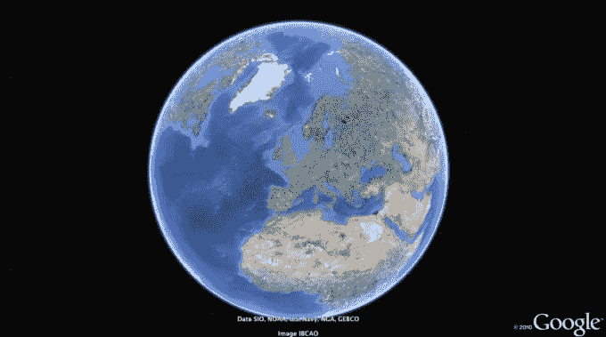

# 曾经一年 399 美元的谷歌地球专业版现在是免费的

> 原文：<https://web.archive.org/web/https://techcrunch.com/2015/01/31/once-399-a-year-google-earth-pro-is-now-free/>

# 曾经一年 399 美元的谷歌地球专业版现在是免费的

许多人已经尝试用谷歌地球在他们的社区里飞来飞去，或者在 3D 版的巴黎闲逛。但是有多少下降了 400 美元(每年！)进行专业版订阅？

看起来不是一吨。至少，还不足以让谷歌继续指望它成为收入来源。

谷歌刚刚取消了谷歌地球专业版的订阅费，从每年 400 美元降到完全免费。

你仍然需要从谷歌获得一个密钥来解锁 Pro 功能，但这是一个填写[快速表格的问题。](https://web.archive.org/web/20230325063101/https://geoauth.google.com/gev0/free_trial.html)(忽略网址中的“免费试用”位；新的免费许可证*应该*无限期工作。)然后你可以从这里下载免费的专业版客户端。

那么曾经一年 400 美元的 Google Earth Pro 有什么不同呢？它主要适用于项目规划和修补数据。这不是每个人都需要的东西，但是，嘿，现在它是免费的！

**下面是它能做的非专业版不能做的:**

*   以 4800×3200 打印图像；非 Pro 封顶 1000×1000。
*   一次自动导入几千个地址，并将其固定在地图上
*   捕捉屏幕上的高清视频。
*   使用线、路径、多边形、圆等测量距离/面积。非专业只能处理直线/路径。