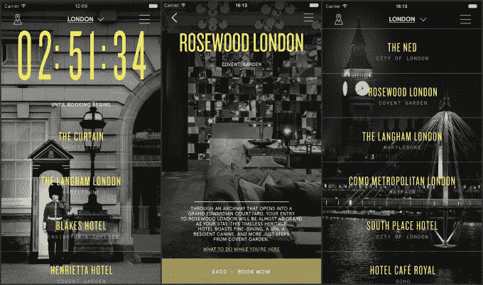

# 一夜，精品最后一分钟酒店应用程序，正在向伦敦进行国际扩张 

> 原文：<https://web.archive.org/web/https://techcrunch.com/2017/10/06/one-night-the-boutique-last-minute-hotel-app-is-expanding-internationally-to-london/>

# 一夜，精品最后一分钟酒店应用程序，正在向伦敦进行国际扩张

[One Night](https://web.archive.org/web/20221208211109/http://onenight.com/) 、精品酒店的[最后一分钟预订应用正在向国际扩张——今天从伦敦开始。](https://web.archive.org/web/20221208211109/https://beta.techcrunch.com/2016/09/20/the-company-behind-standard-hotels-is-launching-one-night-a-same-day-booking-app-to-rival-hotel-tonight/)

[一晚是由标准国际](https://web.archive.org/web/20221208211109/https://beta.techcrunch.com/2016/09/20/the-company-behind-standard-hotels-is-launching-one-night-a-same-day-booking-app-to-rival-hotel-tonight/)创立的，标准国际是标准酒店的母公司。最初，该公司推出了一款名为 One Night Standard 的应用，这是一种在 Standard properties 获得当天预订(从下午 3 点开始)优惠的方式。但在看到其他精品酒店寻求类似服务的需求后，该公司推出了 One Night，目前在美国 10 个城市和伦敦的酒店提供房间。

虽然总的前提是类似于现任酒店今晚，一个晚上把更大的重点放在确保只有高度策划的时尚酒店进行削减。例如，在伦敦，Soho House 的全新时尚独立酒店 Ned 将有空房。

虽然标准国际在伦敦的存在使其成为国际扩张的第一步，但标准国际首席执行官 Amar Lalvani 解释说，该团队已经“着眼于整个欧洲的其他关键市场。”

这款应用还有一些很酷的功能，比如每小时的城市指南，它会建议你在酒店附近每小时可以做的活动。随着该应用继续在国际上扩张，像这样的功能将特别有帮助，因为在国外度过时间的美国旅行者总是在寻找更好的活动和餐馆建议应用。

自一年多前仅在纽约和洛杉矶推出以来,“一夜”增长强劲。自 6 月份以来，平均每日预订量增长了 331%，活跃用户占总下载量的百分比(即有多少下载者实际使用该应用程序)增长到了 48%，几乎是去年的两倍。

