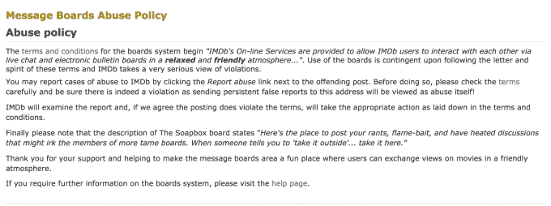

# 互联网上最糟糕的评论之一是关闭 

> 原文：<https://web.archive.org/web/https://techcrunch.com/2017/02/03/one-of-the-worst-comments-sections-on-the-internet-is-shutting-down/>

终于摆脱了互联网上最糟糕的社交场所之一。亚马逊旗下的 IMDb 今天宣布将在本月晚些时候关闭其讨论板，并关闭用户之间的私人信息交流。该公司声称，做出这一决定是因为这些主板“不再为我们全球每月超过 2.5 亿用户中的绝大多数提供积极、有用的体验。”

任何熟悉董事会的人都会说这是委婉的说法。像许多没有严格审核能力的大型互联网聚集地一样，IMDb 的版块没有像预期的那样为社区服务。也就是说，他们未能提供一个地方，就电影、表演、演员和娱乐业的其他成员进行富有成效的对话。

相反，众所周知，这些论坛会发表一些毫无意义、充满仇恨的评论。在很多情况下，他们被比作 YouTube 那种无拘无束的网络评论——换句话说，这些论坛充满了诱惑。事实上，关于这件事有一个完整的 Reddit [帖子](https://web.archive.org/web/20230117092542/https://www.reddit.com/r/movies/comments/3as1m8/anyone_else_find_the_imdb_message_board_horrible/)。

通常，留言板的存在似乎只是为了让人们抨击他人的不同意见，或者彻底地[抛弃正在讨论的电视或电影，无论这些电视或电影多么广受好评或普遍受欢迎。在最坏的情况下，他们会钻研其他种类的攻击性评论，甚至种族主义言论。](https://web.archive.org/web/20230117092542/http://www.ign.com/boards/threads/why-are-imdbs-user-reviews-filled-with-nothing-but-hate.453892189/)

显然，甚至 IMDb 也不再认为保留论坛有什么价值。根据其对此事的声明，该决定是“经过仔细考虑并基于数据和流量”做出的

或者，用人类的语言来解释:我们看到他们有多糟糕，看到他们没有为网站提供足够的流量，所以决定永远消灭他们。

鉴于当前的政治气候，由于特朗普总统的言论，攻击性语言和仇恨言论已经[正常化](https://web.archive.org/web/20230117092542/http://www.huffingtonpost.com/brittany-l-stalsburg-phd/trump-and-the-normalizati_b_10101492.html)，IMDb 希望进一步远离这场争斗也就不足为奇了。

关闭的部分原因是，现场评论不再是许多用户首选的话语方式。我们已经看到一些互联网出版商关闭评论，因为不值得花时间让他们远离垃圾邮件和节制。相反，讨论转移到了其他更大的社交网络，如脸书和推特。

IMDb 也注意到了这一点，他说越来越多的 IMDb 用户在他们的脸书页面和 Twitter 上发表评论，这两个页面加起来有超过 1000 万的粉丝。该公司还在 Snapchat、Pinterest、YouTube 和 Tumblr 上维护账户。

此外，IMDb 对亚马逊的价值并不真正在于业务的社交方面，而是数据库本身，它被用来为电影和电视节目的 X 射线等功能提供动力。这利用 IMDb 数据来帮助将关于演员简历、背景信息等信息带到亚马逊视频、Fire TV 和其他设备上。

虽然关于董事会关闭的公告是今天发布的，但在 2017 年 2 月 19 日关闭之前，论坛将继续在线两周以上。这将使用户有时间存档他们的对话，如果需要的话，或者通过私人信息联系任何他们希望在未来保持联系的人。然而，该公司没有提供任何类型的数据提取工具。

*h/t to [@TheFilmStage 的推特](https://web.archive.org/web/20230117092542/https://twitter.com/TheFilmStage/status/827582592073474051)账号发现新闻*