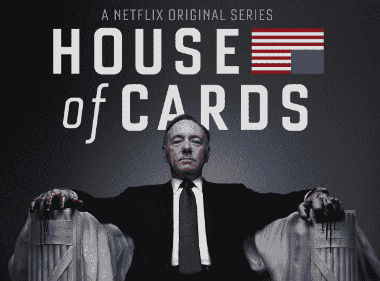

# 分拆的一小步，HBO TechCrunch 的一大步

> 原文：<https://web.archive.org/web/https://techcrunch.com/2015/03/10/one-small-step-for-unbundling-one-big-leap-for-hbo/>

本周，HBO 终于宣布了 HBO Now 的到来，这是一个每月 14.99 美元的 HBO 内容流媒体访问通行证。

它将在苹果电视上独家亮相三个月(第一个月对新用户免费)，然后扩展到其他平台。

经过多年的期待、辩论和审查，解开有线电视包装的过程终于真正开始了。这项服务将 HBO 从时代华纳有线电视公司(Time Warner Cable)和康卡斯特(Comcast)等有线电视提供商的掌控中解放出来，并将其直接交给消费者，无论他们是否为 200 个其他频道付费。

长期以来，媒体公司一直在努力摆脱有线电视。当 Aereo 通过一个可租赁的天线提供每月超过上限的电视直播时，21 世纪福克斯、NBC、ABC 和 Fox 等广播公司联合起来，通过漫长而最终致命的法律诉讼耗尽了该公司的资源。

但是随着像时代华纳有线和康卡斯特这样的公司随着宽带用户的增加而开始失去付费电视用户，这些媒体网络捆绑销售的论点正在减少。

## HBO Go。现在。首先。

HBO 处在一个独一无二的位置。首先，它拥有一些电视上最受欢迎和最赚钱的内容。客户已经证明，他们不仅会每月支付 15 美元来访问他们的内容，而且在某些情况下，他们还会支付 100 美元来访问这些内容，这是 HBO Now 发布之前所要求的。

HBO 多年来一直在测试独立 HBO 的病毒传播能力，现在推出了 HBO Go。对于媒体公司来说，过度内容的主要障碍之一是有线电视提供商不仅分发他们的内容，还提供客户服务，以及[内置营销](https://web.archive.org/web/20221007220736/http://recode.net/2015/03/10/hbo-wanted-more-leverage-with-the-cable-guys-apple-is-happy-to-help/)。有线电视套餐固有地提供了对客户可能尚未发现的频道的访问，更不用说为新的电视节目做广告的跨频道活动和对新服务等级的升级促销了。

HBO 不想牺牲有线电视作为自己内容的内置营销工具，但它也看到了密码在工作中的力量。

HBO 首席执行官 Richard Plepler 在 2014 年 1 月[的一次采访中表示，他将 HBO Go 密码的共享视为一种营销工具。](https://web.archive.org/web/20221007220736/https://beta.techcrunch.com/2014/01/20/hbo-doesnt-care-if-you-share-your-hbo-go-account-for-now/)

【YouTube https://www.youtube.com/watch?v=NLNNL98uFXM&w=640&h=360]

> Pleper: 对我们来说，这对下一代观众来说是一个极好的营销工具，对我们来说，它实际上对业务增长一点也不重要。
> 
> BuzzFeed: 所以策略是你现在忽略它，希望他们以后会订阅…
> 
> **普莱珀:**我们并没有忽视这一点，我们正在寻找不同的方式来影响密码共享。我只是告诉你:这不是一个根本性的问题，它的外部性是，它将品牌呈现给越来越多的人，并给他们一个机会，希望他们能对它上瘾。我们正在做的事情是培养上瘾者，培养视频上瘾者。我们这样做的方式是向越来越多的人展示我们的产品、我们的品牌、我们的节目。

他们一直在观察密码在全国传播的方式，从一个家庭到另一个家庭，从一个设备到另一个设备。他们看到了一个付费用户将 HBO 传播到他们的社交网络意味着什么。网飞有关于相同形式的口碑营销的数据，为每个账户提供多个用户档案。

虽然 HBO 不一定能向 HBO Now 的客户提供客户服务或账单，但苹果和潜在的亚马逊等分销合作伙伴可以帮助填补缺失的部分，HBO 可以向他们提供类似于他们向有线电视提供商支付的佣金。

这就是为什么 Plepler 鼓励宽带提供商加入进来，为纯宽带用户提供 HBO Now。

## 词汇检查

现在仅仅把康卡斯特或时代华纳有线这样的公司称为“多频道视频节目分销商”有点不准确。这是他们所做的的行业名称[，但考虑到他们的业务有多少是由宽带驱动的，这也是一个误称。](https://web.archive.org/web/20221007220736/http://www.wired.com/2014/08/the-internet-is-now-officially-more-popular-than-cable-in-the-u-s/)

毕竟，2013 年是宽带用户超过付费电视用户的第一年。两年来，时代华纳有线电视公司和康卡斯特公司都失去了付费电视用户，但是他们销售的宽带订阅数量却增长了。

但是不要烦恼，你可怜的灵魂对一个 ISP 感到一丝同情。这对“宽带提供商”来说并不是一件坏事，因为他们将从此为人所知。

随着视频内容涌入苹果电视、Rokus、智能电视、平板电脑、智能手机和笔记本电脑，对更多宽带服务的需求只会上升。当然，一些宽带提供商也拥有媒体资产，他们自己从有线电视套餐中受益，就像康卡斯特的媒体资产一样。

但是没有任何媒体资产的宽带提供商(如时代华纳有线电视公司)将从大拆分中受益。那些跟不上电视内容版权价格上涨的规模较小的本地宽带/有线电视提供商也是如此。

尽管一些宽带提供商拥有不同的媒体属性(不要低估[这个网络有多复杂](https://web.archive.org/web/20221007220736/http://www.freepress.net/ownership/chart)，但一个事实是相同的:这些家伙拥有管道。如果没有现在监管互联网接入的有线电视提供商的大量资本投资，网飞、HBO Go 或常规有线电视就不可能出现。

在[接受 Re/Code 的 Peter Kafka](https://web.archive.org/web/20221007220736/http://recode.net/2015/03/09/apples-hbo-now-deal-has-been-in-the-works-for-a-year/) 采访时，Plepler 向宽带提供商提出了他的观点:

> 这不是二进制的。这是多边的。没有人帮我们在他们的纯宽带服务中推出 HBO Now over-the-top 产品，而是选择增强他们自己的业务。所以我们试图进行逻辑论证，这是一个加法命题。我认为理性的商人和女人会认为这是真的。
> 
> 你在山里找到了金子。我们全力支持您发展业务。你为什么不加入我们？现在——如果你认为我们会被堵在门外，无法最大限度地灵活发展我们的品牌——恐怕这也是站不住脚的。

## 不是一个人

HBO 并不是唯一一家寻求向客户提供点播流媒体内容的媒体公司。

维亚康姆还宣布，它将为 Nickelodeon 提供独立的流媒体服务，由于来自网飞和亚马逊儿童流媒体服务的竞争，该公司在 Nickelodeon 的收视率略有下降。我们不能忘记给孩子们看的 YouTube。

维亚康姆处于一个有趣的位置，因为它在相对小众的类别中拥有优秀的节目，如音乐和喜剧。这一点很重要，因为从长远来看，如果媒体资产被迫(通过电缆切割)分拆并过度销售，它们将不再能够提供广度。现在，你几乎可以在电视上看到任何东西，从一个关于训狗师的节目到一个专门的电视购物频道，再到 24 小时天气预报。

这是通过捆绑包实现的。媒体公司有能力生产更多的电视节目，不管它有多贵，基于他们最需要的内容的价格。通过有线电视提供商的营销渠道，他们可以发展自己的品牌。这是可行的，除了消费者为他们不在乎观看的东西付费这一部分。

这给像维亚康姆这样的公司带来了更大的压力，它非常依赖有线电视提供商通过其他分销合作伙伴来建立自己的品牌。像 MTV 和 Nickelodeon 这样的有线电视频道拥有足够强大的品牌认知度，可以尽早进入高端市场，以测试定价、营销、广告和客户服务等障碍。

这些变化是缓慢的，但是你可以从已经存在的事物中看到一些暗示。有线电视订阅附带的流媒体服务 WatchESPN 目前也像 HBO Go 一样允许一些密码共享。YouTube 正在出租内容。 [DISH Network 正在推进其“任何设备、任何地方”的吊索服务](https://web.archive.org/web/20221007220736/http://www.slate.com/blogs/moneybox/2015/01/05/dish_network_sling_tv_announcement_at_ces_you_can_now_watch_espn_without.html)。它正在发生。

## 新领导人

截至 2014 年，网飞在美国的用户数量超过了 3900 万。从某种角度来看，康卡斯特[在 2014 年底拥有超过 2200 万有线电视用户](https://web.archive.org/web/20221007220736/http://www.bloomberg.com/news/articles/2015-02-24/comcast-s-earnings-trail-estimates-as-subscriber-increases-slow)。

通过蛮力，网飞向市场推出了另一种选择，在任何设备上一次提供大量内容，没有任何广告。并非没有牺牲，网飞模式已经证明了消费者对点播内容、狂欢季节和多平台便利的喜爱。作为内容分发的主要参与者，网飞在媒体创作方面开辟了自己的道路，如《橙色是新的黑色》和《纸牌屋》等。

与此同时，亚马逊正专注于通过以一种新的、更具成本效益的方式整合消费者选择来解决未来的问题。[早在 2012 年](https://web.archive.org/web/20221007220736/https://beta.techcrunch.com/2012/12/20/amazon-to-produce-6-original-comedy-series-pilots-viewers-decide-which-shows-survive/)，亚马逊影业就已经开发了几套系列试播节目，等待在完成本季开发之前评估消费者的兴趣和需求。

让我们不要忘记 Hulu，在某种程度上，它是[在一个新的、松散的世界里解决广告问题的](https://web.archive.org/web/20221007220736/http://adage.com/article/digital/hulu-ceo-viewability-debate-benefits/297078/)。由于广告构成了媒体网络的大部分收入，Hulu 提供可定制(因此更有针对性)广告的方法是消费者和媒体公司之间一个有趣的潜在妥协。

## 改善就是改变

[完美意味着经常改变。](https://web.archive.org/web/20221007220736/http://www.brainyquote.com/quotes/quotes/w/winstonchu138235.html)

这是媒体行业已经做了很多的事情。从无线电广播到有线电视再到宽带，我们看到了合并、收购、分拆和收购。这是一个缓慢的变化，但它总是在发生。

随着有线电视提供商不断失去视频用户，并转型为宽带公司，为我们提供消费这种媒体所需的越来越多的连接，我们作为消费者，开始采取平衡行动。

随着 HBO Now 的推出，HBO 在两种人口统计之间摇摆不定。像 TechCrunch 的母公司美国在线一样，其收入的很大一部分是通过拨号获得的，HBO 仍然拥有庞大的用户群，他们在通常的有线电视上支付额外的 15 美元来获得这项服务。

这些人(我们可以假设他们中的大多数来自老年人口)以他们一贯的方式看电视，也许录制一些他们最喜欢的节目以跳过商业广告。但我们也可以假设他们喜欢打开烹饪频道，或 CNN，或天气频道，[所有这些在 2014 年都没有 ESPN](https://web.archive.org/web/20221007220736/http://www.wsj.com/articles/pay-tvs-new-worry-shaving-the-cord-1412899121) 受欢迎，我们可以假设它迎合了老年人和年轻人的需求。

没有人能够一下子完成这一转变，但我们会继续观察传统有线电视提供商、媒体网络、新分销商(如网飞、亚马逊和苹果)和广告商在平衡我们自己的需求时进行测试和发展。

我们就是考验。每次点击。Watch ABC 或 Fox Now 或 WatchESPN 的每次下载。每个密码都是共享的。每一份有线电视账单都付了。

这篇预测 HBO 过度服务的文章特别有趣，因为它发表在 HBO 首席执行官 Richard Plepler 宣布 HBO Now 的 90 分钟前。