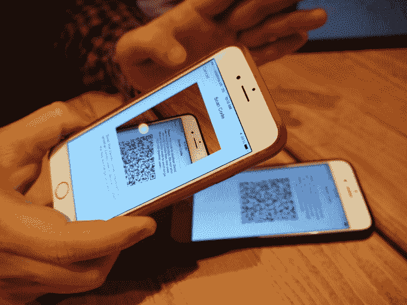
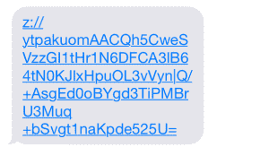
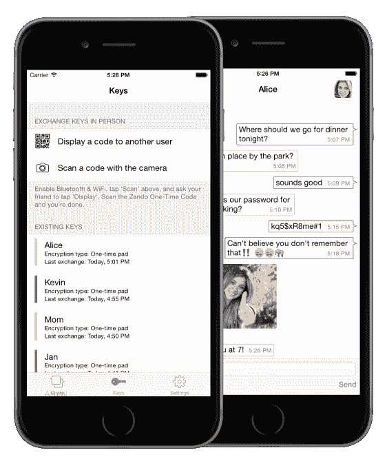

# Zendo 是我最喜欢的新安全消息应用程序

> 原文：<https://web.archive.org/web/https://techcrunch.com/2015/03/24/one-time-pads-ride-again/>

Psst。我能告诉你一些事吗？私人恩怨。完全保密吗？

这是 [Zendo](https://web.archive.org/web/20230228071425/https://itunes.apple.com/us/app/zendo/id870719833?ls=1&mt=8) ，我最喜欢的新消息应用。

现在你可能会问，谁还需要另一种方式来敲打、戳、戳或纠缠他们的朋友？答案很简单:任何关心隐私的人。

如果您认为隐私不重要，问问自己是否愿意与陌生人分享您的网上银行密码。或者你的社会保障号码。或者你的病史。或者你的实际地址。或者，ehem，你手机上的一些[个人/私密照片](https://web.archive.org/web/20230228071425/https://techcrunch.com/2014/09/01/heres-what-we-know-so-far-about-the-celebrity-photo-hack/) …

大多数人都关心保护许多类型的数据。甚至其他你可能认为不那么敏感的东西——你去哪里，你喜欢什么，你和谁说话，你买什么等等——也正在被主流社交媒体服务系统地整理和数据挖掘，以建立一个越来越详细的你和你的生活的档案，卖给广告商。

在互联网上被抵押贷款、婴儿用品或脱发膏的广告跟踪是相当乏味的——也是一种明显的侵犯隐私行为。但是无孔不入的被动监控是免费服务的代价，不是吗？

当然，这是一种商业模式。如果你使用像 Gmail 和脸书这样的通信产品，这是一种主导商业模式，这些产品的制造商的业务都是分析用户，将英特尔卖给广告商。具有替代理念的信息产品确实存在(例如[wicker](https://web.archive.org/web/20230228071425/https://techcrunch.com/2014/06/26/secure-messaging-app-wickr-raises-30-million-series-b/)、[3pa](https://web.archive.org/web/20230228071425/https://techcrunch.com/2014/02/21/bye-bye-whatsapp-germans-switch-to-threema-for-privacy-reasons/)、TextSecure、Silent Circle 的 Silent Message app)。

现在 [Zendo](https://web.archive.org/web/20230228071425/https://twitter.com/Zendo) 加入了刚刚在 [iOS](https://web.archive.org/web/20230228071425/https://itunes.apple.com/us/app/zendo/id870719833?ls=1&mt=8) 和 [Android](https://web.archive.org/web/20230228071425/https://play.google.com/store/apps/details?id=com.zendo.android.client) 上发布的名单，为规避侵入性的个人通信数据挖掘提供了另一条途径，以实现企业利润。

那么，一个新的安全消息应用程序如何在如此拥挤的空间中脱颖而出呢？因为安全性仍然是繁琐复杂的代名词，所以要做一些超级容易使用的东西。还使用了一种技术上无法破解的加密技术。

一些不受中间人攻击影响的东西。然而几十年来密码学家一直忽略了这一点。

# 一次性护垫再次骑行

Zendo 的联合创始人 Jack DeNeut 说:“这是消费者首次实现一次性密码本，一次性密码本是唯一不可破解的加密形式。”应该指出的是，Jack DeNeut 是 TC 的老朋友，近年来帮助组织了我们的 PragueCrunch 聚会。你还会在 TC 上找到他以前的一些帖子(比如[这篇](https://web.archive.org/web/20230228071425/https://techcrunch.com/2011/04/26/why-doesnt-volvo-want-android-users/))。DeNeut 以前是一名投资银行家，他离开华尔街去追逐 90 年代最初的互联网繁荣，投身于电子商务创业。紧随其后的是旅游指南网站 Nelso(他的 Nelso 应用程序已经获得了大约 400 万次下载)。

他的 Zendo 联合创始人、多年的朋友兼其他各种创业公司的商业伙伴汤姆·纽博尔德(Tom Newbold)也是一位住在布拉格的美国人，他有银行背景。这两个人在去年年初提出了 Zendo 的概念，当时他们正在思考如何利用[消息应用热潮](https://web.archive.org/web/20230228071425/https://techcrunch.com/2014/02/19/facebook-buying-whatsapp-for-16b-in-cash-and-stock-plus-3b-in-rsus/)——当时正在阅读尼尔·斯蒂芬森的 *Cryptonomicon* 的纽博尔德开玩笑说要使用一次性密码本来保护消息应用。

他们都笑了。

对于那些不熟悉密码历史的人来说，一次性密码本是老派间谍传奇的素材。用于信息编码的随机数字(或字母)的一次性书籍，每一页(pad)在销毁前只使用一次。烧掉它。或者吃掉它，对于陷入无比困境的幽灵来说。只要衬垫远离窥探的眼睛，并且只使用一次，它们的随机性就能确保密码不可破解。只有拥有相应密码对的人才能解码该消息。这在业内被称为“完美远期保密”。

一次性便笺簿的问题是它们不太实用。你必须定期与你的间谍伙伴聚在一起，共享便笺簿来对未来的信件进行编码，并就每条特定消息将使用哪个便笺簿达成一致。此外，由于使用后会被销毁，护垫会用完。所有这些都解释了为什么其他类型的加密——包括以各种方式管理密钥的远程交换——已经成为网络安全的标准。(这以及为满足这一需求而成长起来的整个密码行业。)以及为什么一次性护垫大多是历史的注脚。

> 一次性密码本是密码学中的独角兽。每个人都知道它们牢不可破，非常安全，但从历史上看，它们很难使用，只有间谍和外交官才会使用它们…

但在最初嘲笑了在消费者应用程序中实现一次性密码本的想法后，DeNeut 进行了更多的思考，并决定现代智能手机是消除将这种类型的加密带给普通消费者的障碍的完美工具——鉴于板载处理能力、充足的存储空间、安全传输技术、内置摄像头等等。所有这些无处不在的技术可能会突然使一次性密码本转移和管理变得切实可行。

“一次性密码本是密码学中的独角兽。每个人都知道它们牢不可破，非常安全，但历史上它们很难使用，只有间谍和外交官才会使用它们。因此，众所周知，它是如此的不实用，以至于消费者永远也不会使用它，”DeNeut 告诉 TechCrunch。

“上一次有人关注这个问题是在 20 世纪 90 年代。当时笔记本电脑几乎不存在。所以这个想法是，你把你的电脑带到我家，我们把它们连接起来，交换键盘材料，然后你把你的电脑带回家，然后我们可以安全地相互发送信息。当然，现在每个人的口袋里都有功能强大的计算机，它们有巨大的内存，安全的存储，可以生成大量的随机数据。”

为什么以前没有人想到将一次性垫和智能手机结合起来？“技术领域的很多事情都是这样，”他回答道。“只是有人想了想，然后说‘不要等了；那个旧的约束实际上已经不存在了。我们没有理由不能这样做。”

使用 Zendo 的一次性密码本加密的唯一要求是用户见面交换密码本。虽然这肯定是一个限制，但在某些方面也可以被视为一种好处。一个 USP。这是一个应用程序，可以在“完全保密”的情况下与你足够亲近的人交流，甚至在某个时候与他们相处过。比如你的密友和你的另一半。这也是一个受欢迎的对比，它与如今日益定义在线社交空间的通信过载形成鲜明对比，在这里，显然无限量的陌生人(可能是也可能不是人类)相互向对方的大致方向发送无语境的信件，而其他人则站在一旁评论和做笔记。Zendo 则相反。它必然是有选择性的，因此应用程序可以成为物质的过滤器；对于会话的重要性；对于需要你特别关注的人和话题。

你也不能通过 Zendo 收到垃圾邮件(就像你通过 iMessage 收到的那样)——除非你是垃圾邮件发送者的密友。如果你是一位担心你的孩子在网上与谁交流的家长，这款应用可能是一种向学校朋友和家人发送信息的方式。协同定位垫交换要求也是一个借口(不是说你应该需要一个)，让人们与他们的朋友见面，叙旧，并补充他们的垫。虽然名人厌倦了每隔几周就要更换他们的电话号码和短信 id，以防止联系信息泄露，但他们可能很欣赏物理垫交换的好处。因此，Zendo 的推销可以是培养亲密关系，以及保护隐私。

对于正在努力应对 BYOD 趋势给企业安全带来的持续挑战的企业来说，这也有一个明显的吸引力。虽然 Zendo 最初被定位为消费者应用程序，可以免费下载和使用，但 Newbold 认为，未来赚钱的一个途径可能是将该软件授权给希望使用它并运行自己的服务器的企业，而不是依赖 Zendo 的服务器(从而为企业提供更大的控制权)。

应用内购买高级功能可能是另一种盈利途径。但是他们并不着急。由于来自布拉格天使投资者的七位数投资，他们有足够的创业跑道，因此在敲定商业模式之前，他们完全专注于首先获得用户。

# Zendo 如何工作

在你下载应用程序并与你想发送消息的人在一起后，你们中的任何一个人选择应用程序内的选项来显示二维码，另一个人在 Zendo 内扫描它。这就启动了一次性密码本交换——通过 Multipeer(如果你使用的是 iOS)或 Android 上的 Wi-Fi Direct 进行。你需要通过 Zendo 的一次性密码与每一个你想发送信息的人进行这种交流，所以肯定会有一个加入的障碍，因为人们需要在 IRL 上遇到他们时逐渐添加他们的朋友。

“第一步始终是光学的，即交换 AES 256 位密钥和身份验证密钥，因此这些密钥用于加密一次性密码本，因为它是通过 multi peer[或 Wi-Fi Direct]无线传输的……使用光学交换的对称 AES 密钥。因此，即使有人在监听每一个数据包，甚至试图监听 Wi-Fi Direct 或 Multipeer，他们将获得的数据也是毫无意义的，因为这些数据是用光学交换密钥加密的，”Newbold 说。

“第一步始终是光学扫描，它不涉及通过任何无线电波传输的任何数据包。所以你不能包嗅它。如果有人想进入其中，他们真的必须用相机越过你的肩膀来捕捉代码，”他补充道。

交换 0.5MB 的 pad 需要几秒钟的时间，这对于两个用户之间的“数千条”消息来说已经足够了。据 Newbold 称，根据对平均短信长度的保守估计，超过 3000 条。你也可以交换多个便笺簿来储存更多的兆字节，以备将来更多的信件。(需要明确的是，如果用户用完了 pad，该应用程序默认为 AES 加密，因此消息永远不会以未加密的形式发送——它只是逐步降低到行业标准的安全级别。)

照片也可以通过 Zendo 发送，这些照片使用一次性 AES 256 位密钥和 HMAC 密钥(用于认证)加密，然后使用一次性密码本加密发送，因此照片通过 OTP 得到保护，无需使用太多密码本即可发送。相同的方法将用于加密和发送视频、音频和文档/附件——文件传输功能将在未来的应用更新中推出。

另一件需要注意的事情是 Zendo 的使用是完全匿名的。他们没有注册数据(没有电子邮件，没有电话号码等)。用户仅仅被分配随机标识符。“我们看到的是附在某个随机名称上的无法破解的加密内容”是 DeNeut 如何总结他们对流经其服务器的数据的看法。

他们确实能看到 IP 地址，但他指出，他们不会记录或存储这些地址。“我们要扔掉所有的原木……这样我们就不用把它们翻过来。我们没有*有*他们来翻身，”他继续说道。“我们认为执法部门很有可能会提出要求。但他们会很快吸取教训。”

“我们认为它几乎会立刻在中国被禁止，”他补充道。“如果它能持续几天而不被防火长城屏蔽，我会很兴奋的。”

一个巧妙的功能是允许应用程序的用户通过另一个消息应用程序发送加密的 Zendo 消息。因此，在 Zendo 中编写消息后，有一个选项允许用户选择不同的消息应用程序来传送消息，比如 iMessage(如下例所示)，然后加密的消息在另一个应用程序中显示为 Zendo 链接。当收件人点击它时，它们会自动转移到 Zendo 应用程序，现在他们可以在那里查看未加密的信息。

Newbold 说，如果 Zendo 自己的服务器受到攻击，这个功能可能是有用的——作为用户获取信息的一种变通方法。要点是:一旦你交换了密码本，加密的信息就可以以多种方式传递——如果你想变得真正守旧派恐怖，它们甚至可以发布到 Twitter 或发表在报纸的分类版面上——而接收者所要做的就是将加密的文本复制/粘贴到 Zendo 中，将密码转换回纯文本。

# 安全有多安全？

Zendo 目前不是开源的，所以他们要求用户相信他们的声明，因为没有社区代码审查的选项。但是他们已经将源代码开放给一个独立的安全审查人员进行审核([Geoff Roy Couprie](https://web.archive.org/web/20230228071425/http://geoffroycouprie.com/))——他们描述这个人总体上是满意的，只是提出了一些修改的建议。

“我没有发现很多(有问题的)东西，因为应用程序的设计——协议——非常简单，”当我联系他寻求评论时，Couprie 说。“基本上，许多消息应用程序都存在远程信任问题。也就是说，在某些时候，如果你想和某人安全地交流，你必须建立一个安全的通道，而这在某种程度上是做不到的。Zendo 提供的是你亲自见面，你进行交流，然后你有一个安全的渠道，所以风险比另一个(消息)应用程序小得多。”

“一次性密码本很简单，密钥交换也很简单，这使得它易于审计和使用，”他补充道。

DeNeut 补充说:“任何人在使用他们的设备时对其进行数据包嗅探并看到我们没有密钥服务器，我们没有包含您的电子邮件地址或类似信息的注册服务器，因此进行密钥交换并在您使用应用程序时嗅探数据包并看到密钥没有被发送，这是微不足道的。”。

“该应用程序在内部做什么是一回事，但所有其他有男性参与的系统的最大问题是，他们必须通过网络交换密钥。任何研究人员都可以进行数据包嗅探，看看设备之间相互发送了什么。”

如何看待创造真正的随机数几乎是不可能的这一事实？这会削弱一次性密码本的坚固性吗？DeNeut 认为，这实际上是一个理论上的限制。“如果随机性中存在一些缺陷，你将需要在我们的系统中收集数十亿条消息，甚至可能尝试确定我们的随机数生成器中的一些缺陷，”他说。

纽博尔德还指出，大多数手机短信的简洁性很可能增加了在随机性中识别可利用模式的挑战——因为没有太多的原始资料可供黑客使用，至少最初没有。

你也可能会对二维码的安全性产生担忧——因为它有可能将恶意代码注入条形码，从而成为在光交换点危及应用安全性的一个途径。然而，你仍然在扫描一个你足够了解的人的二维码，并想和他交换拍纸簿，所以你应该信任他。因此，人类信任层有助于减少相关的风险。

更大的问题是，能否说服在线聊天阶层在他们的手机主屏幕上添加另一个消息应用程序——尤其是一个如此深奥的应用程序。去掉 OTP 功能，Zendo 是一个极简主义的消息应用程序，它要么整洁，要么功能精简，这取决于你的偏好。Buzzy 广播 app *du jour，* [Meerkat](https://web.archive.org/web/20230228071425/https://techcrunch.com/tag/meerkat/) ，这不。

虽然如果你喜欢间谍类型的小说，一次性密码本很酷，但主流可能对加密优势感到困惑(尽管该团队制作了一个可爱的视频，以尽可能简单的方式传达他们的信息)。

“谁是我们的竞争对手？基本上每个人。我一秒钟也没想到一次性密码本如此不同寻常，以至于意味着我们没有竞争对手。DeNeut 说，“Wickr，Threema，TextSecure，在一定程度上还有 iMessage，Silent Circle，”他列举了多个支持隐私的竞争对手，然后再次提到 Zendo 的 OTP USP。"据我们所知，没有一个人亲自参与密钥交换过程."

尽管 Threema 使用非对称加密技术，因此需要公钥并有一个公钥目录，但它实际上为面对面的交流提供了二维码扫描选项，尽管这不涉及实际加密密钥的交换(相反，这是验证的公钥确认步骤)。另外，鉴于它不是一次性密码本，Threema 不能声称自己是任何“密码独角兽”。

“他们都遭受这种中间人风险，”纽博尔特补充道。“对我们来说，一个东西是光学组件，二维码，对我们来说，这是整个过程中非常重要的一部分，但许多用户认为这就是全部。他们认为‘哦，你现在已经交换了密钥’…但真正酷的是一次性密码本，它在后台不可见地发生，在两台设备之间进行协商，我们实际上是在亲自交换加密密钥。”

还有一点:Zendo 并没有声称自己开发了一款“防 NSA”的信息应用。他们甚至没有正式宣称完美的远期保密。不安全风险无疑依然存在。“我不知道你在你的 iPhone 上安装了什么叛逆的软件，”DeNeut 说，他指出了一个威胁向量，并补充说，“没有一个清醒的人”应该声称已经提供了一个“国家安全局证明”的数字服务。

用户添加的恶意软件也不是唯一的问题。还有手机硬件本身。基带芯片组在(内)安全等式中仍然是一个未知数，因为它们运行专有软件，这意味着不可能揭开盖子并窥视内部来扫描内置后门。

但是当涉及到安全问题时，总会有一些警告。我询问了一位隐私专家对一次性密码本的看法，他回答说:“对于朋友/家人和政治来说，美国国家安全局是不可破解的”，并补充说，如果非常谨慎地实施，在移动手机上运行 OTP 可能也是一个“好主意”——例如，“在 hackerspace 制造的 air-gap 原始黑莓设备上，带有键盘和 LCD，没有 CPU(离散逻辑门)”。然而，他对主流智能手机硬件 OTP 的简明结论并不乐观。“布加迪进入滑板是错误的，”他说——指出基带后门风险，以及产生的随机性不够随机的可能性。

所以一次性密码本完美的纸质保密是一回事。但在技术环境中，这并不一定意味着完美的安全性。关键在于你如何实现它。主流智能手机当然很方便，但它们并不完全安全。所以 Zendo 需要(又一个)安全性和便利性的平衡。

# Zendo 是给谁的？

即便如此，这款应用作为一款易于使用的工具，仍然具有吸引力，可以有选择地缩小被动监控——无论是网络公司进行广告分析，还是偶然的黑客试图获取你的密码，甚至是不加区分地利用互联网主干收集大量数据的拖网式数字国家监控——因为一次性密码本的离线密钥交换确实为保护传输中的信息提供了更强大的安全保障。(“当你减少攻击面，让它靠近你时，你会发现它受到限制，你可以做的事情更少，但这对安全[更好]，”Couprie 说。)

“如果你是调查的主动目标，那么我就更难保证你的安全，”DeNeut 补充道。

> 我们认为这款应用适合所有人。因为你的生活中不需要使用一个消息应用。

因此，在 NSA 观察名单上的人不会在 Zendo 身上找到多少让他们安心的东西。他们也不应该。这不是目的。这是一款面向普通网络用户的消息应用程序，这些用户厌倦了他们所有的数字活动被不断窥探以获取他人的经济利益，并希望有一个更难被搜索的渠道。对于那些感觉主流数字服务上的社交噪音冲淡了他们真正想听到的信号的人来说，也是如此。他们正在寻找一种方式来进行更亲密的交谈，这种方式不需要大声喊叫来掩盖品牌的喧嚣。

“我们认为这款应用适合所有人。因为在你的生活中，你不需要使用一个消息应用程序，”DeNeut 说。“有两个、三个或四个是非常容易的，你会收到通知，你点击通知，你去那里，它会打开那个应用程序，你会做出回应或其他什么。所以使用多个应用程序非常简单。”

“每个人可能都有自己想私下交流的对象，”他补充道。“重要的其他人、业务合作伙伴、您想偶尔向其发送密码的人，或者您想向他们发送公寓楼的门代码或其他信息的人。然后是密友之类的。既然你见到了他们本人，交换钥匙并不麻烦。所以，如果你想给他们发些不会被添加到你在脸书或其他地方的个人资料中的东西。”

纽博尔德补充说:“千禧一代对他们的整个生活从出生那一刻起就被记录在社交媒体上非常敏感。”“他们越来越意识到 GooglePlex 服务的替代方案，在这种服务中，你要放弃所有数据来换取服务。Snapchat 是一种短暂的通讯工具，但人们肯定不想让自己所有的私人时刻成为永久记录的一部分。”

数字通信已经分散在几十个通讯应用和服务中。这不是偶然的。这绝对是用户偏好的问题。数字媒体*就是*信息。因此，考虑到这一点，Zendo 的支持隐私、支持亲密关系的信息感觉足够新颖，可以找到有欣赏力的观众。我很欢迎这个加密独角兽。