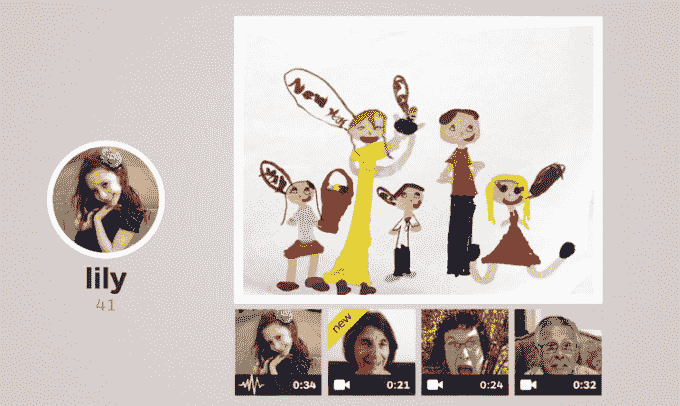

# 一年后，Keepy 的用户达到 50 万，并将视频引入其家庭时间轴 

> 原文：<https://web.archive.org/web/https://techcrunch.com/2014/10/17/one-year-in-keepy-reaches-500k-users-and-introduces-video-to-its-family-timelines/>

# 一年后，Keepy 的用户达到 50 万，并将视频引入其家庭时间轴

在[推出](https://web.archive.org/web/20221208105149/https://beta.techcrunch.com/2013/09/04/keepy-is-an-app-that-wants-to-be-the-refrigerator-door-to-your-kids-macaroni-art/)一年后， [Keepy](https://web.archive.org/web/20221208105149/http://www.keepy.me/) 宣布超过 50 万用户通过其服务与家人分享内容。

在与 TechCrunch 的电话中，Keepy 首席执行官 Offir Gutelzon 表示，该公司在过去几周内达到了 50 万的数字。他还提供了一些数字，说明该公司如何吸引国际用户，并让其家庭转向其高级计划:75%的用户在美国，在每月 31 条帖子(包括照片、任何长度的视频和上述内容之外的无限画外音录音)的家庭中，大约 25%的人转向每月每个家庭 1.99-2.99 美元的高级计划。

Gutelzon 表示，Keepy 转化率的关键在于，这款应用给人的感觉更像是一个装满家庭纪念品的共享盒子，而不是你必须注册的另一个社交网络。家庭成员很难在应用程序中意外地与外界分享一些原本应该是私人的东西，家庭中的超级用户现在可以从他们的 Dropbox 和脸书账户快速上传，而在另一端，那些不够精明不会在手机上使用社交应用程序的人可以通过传统方式将他们存档的照片上传到家人的时间表:通过电子邮件作为附件。

因为一直很好奇一个创业公司在 Android 上做的好不好，所以也问了 Keepy 哪里最强。Gutelzon 告诉我，这家初创公司 60%的用户使用 iPhone，其余的用户使用 Android、亚马逊的 Fire OS 和网络。这可能是 Keepy 发布时间表背后的一个激励因素，因为在最新的 Android 更新之前几周，iOS 就可以上传任意长度的视频。

Keepy 正在寻求扩张，并在帕洛阿尔托开始运营。Gutelzon recenty 从纽约市搬到湾区开设了一个办事处，而其他四名团队成员将继续在纽约的总部工作。