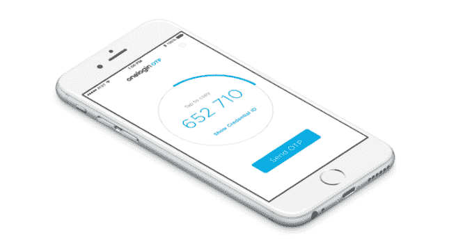

# OneLogin 为多因素身份认证带来了一些智慧 

> 原文：<https://web.archive.org/web/https://techcrunch.com/2017/03/30/onelogin-brings-some-smarts-to-multi-factor-authentication/>

# OneLogin 为多因素身份认证带来了一些智能

多因素身份认证或 MFA 旨在通过强制您输入第二种独立的安全方法来确定您的真实身份，从而保护您的身份。然而，就像所有的安全系统一样，可用性和安全性之间有一条细微的界限。这就是为什么 [OneLogin](https://web.archive.org/web/20221127184029/https://www.onelogin.com/) 今天推出了其移动 MFA 工具的新版本，该工具使用机器学习来确定你的典型使用模式，并且只在它确定绝对必要时才要求你提供第二个因素。

OneLogin 首席执行官 Thomas Pedersen 表示，大多数 MFA 算法都相当死板。如果你在工作时使用网络，你会被要求输入密码。如果不是，你会被问到第二个因素，但他说，应该比这更微妙，了解用户如何访问网络。

名为[自适应认证](https://web.archive.org/web/20221127184029/https://www.onelogin.com/product/multi-factor-authentication)的新产品旨在解决这一问题。如果你经常在家里用同一台笔记本电脑登录，几次之后，系统就会知道这是一个常用的位置和设备，这样你就可以登录网络了，没有第二个因素。

图片:OneLogin

彼得森说，许多用户厌倦了在同一地点定期登录时掏出手机获取第二种形式的身份验证。该工具开始了解什么是高风险，什么不是，方法是查看位置、设备等信息，并指定 1 到 100 之间的风险分值。这样，当风险足够高时(无论客户如何定义)，系统将只询问第二个因素。

在过去的几年里，我们已经通过惨痛的教训认识到，密码本身不足以抵御黑客攻击。MFA 是一种机制，可以确保除了您的密码之外，您是真正的您，而不是某个冒充您的人。这是第二种(甚至是第三种)方法，用偷来的或猜测的密码在黑客面前设置了一个更难对付的障碍。

通常情况下，你可能会通过短信或 OneLogin OTP 等认证应用程序向你的手机发送一个数字代码，你必须输入该代码才能使用应用程序，或者你可能需要点击 USB 安全密钥，如 [Yubikey](https://web.archive.org/web/20221127184029/https://www.yubico.com/) 才能进入。

无论第二个因素是什么，它都比简单的密码安全得多。尽管如此，一些用户发现每次需要登录企业应用程序时拿出手机有点痛苦，这个新工具旨在消除一些在常见情况下识别自己的摩擦。