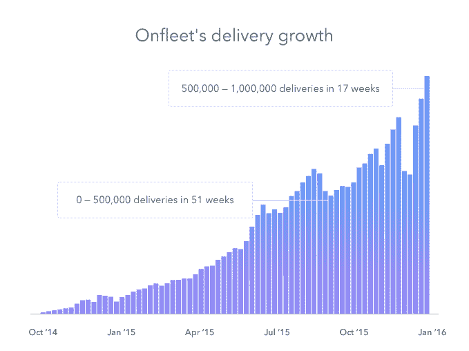

# Onfleet 已经支持了超过 100 万次的按需交付

> 原文：<https://web.archive.org/web/http://techcrunch.com/2016/01/30/onfleet-has-powered-over-1-million-on-demand-deliveries/>

为按需交付提供基础设施的 Onfleet 公司最近为其第一百万次交付提供了动力。Onfleet 首席执行官哈立德·纳伊姆(Khaled Naim)告诉 TechCrunch，超过一半的交付发生在过去四个月内。Onfleet 为 [HelloFresh](https://web.archive.org/web/20230403171701/https://www.hellofresh.com/) 、 [Meadow](https://web.archive.org/web/20230403171701/https://getmeadow.com/) 、 [Doughbies](https://web.archive.org/web/20230403171701/https://www.doughbies.com/) 、 [Lugg](https://web.archive.org/web/20230403171701/http://lugg.com/) 等公司提供送货和物流服务。

需要澄清的是，Onfleet 并不提供驱动程序——它只是提供了一个软件平台，来处理提供送货服务的所有后勤工作。大多数外卖都是食品和饮料，比如食品杂货、熟食、酒和餐馆的食物。2015 年 4 月，[该公司表示，该年仅促成了 10 万次交付](https://web.archive.org/web/20230403171701/https://techcrunch.com/2015/04/21/onfleet-raises-2m-to-provide-infrastructure-for-delivery-apps/)。

以下是 Onfleet 自 2014 年 10 月以来的交付增长情况。

在全国范围内，大约有 7500 家快递和包裹递送公司。根据投资研究和分析公司 Market Realist 的数据，联邦快递是全美范围内最大的快递服务之一，拥有美国快递运输市场约 49%的份额。Naim 说，与此同时，当地快递业务是一个非常分散的领域，该领域的许多服务都是用低技术工具来运营业务和组织交付。这就是为什么我们看到像 Postmates、优步、亚马逊、谷歌、Shyp 和其他公司进入按需本地交付领域。

“很多人确实将我们与 Postmates 和优步相提并论，但真正的问题是，如果[他们]有自己的司机，如果[他们]想在需求高峰期间外包交付，公司如何才能利用技术产品，”奈姆说。“我们可以为此提供便利。”

Onfleet 已经从 CrunchFund、Semil Shah 和文克莱沃斯资本等投资者那里筹集了 230 万美元。去年 12 月，一家名为 Bringg 的类似公司，但重点是更大的企业，最近[筹集了 500 万美元](https://web.archive.org/web/20230403171701/https://techcrunch.com/2015/12/16/bringg-raises-5-million-so-any-business-can-offer-an-uber-like-experience/)，使其资金总额达到 750 万美元。虽然 Onfleet 确实服务于一些企业对企业的需求，但它的面包和黄油是企业对消费者的。