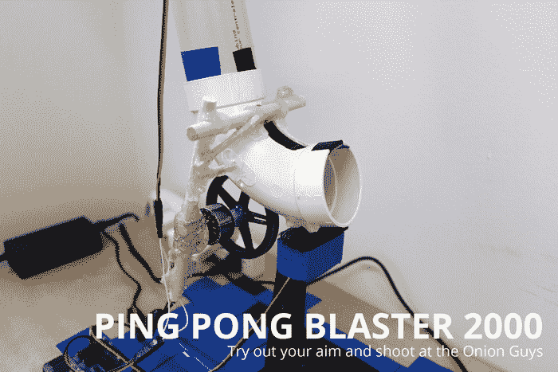

# Onion Omega 为物联网硬件黑客带来网络智慧 

> 原文：<https://web.archive.org/web/https://techcrunch.com/2015/04/06/onion-omega-brings-web-smarts-to-iot-hardware-hacking/>

# Onion Omega 为物联网硬件黑客带来网络智慧

Raspberry Pi 让数百万人更容易接触到计算硬件和软件的实验，现在一个新项目希望通过一个更小的开发板来进一步发展这一概念，该开发板运行完整的 Linux 并内置 Wi-Fi，所有这些都在一个只有 Raspberry Pi 1/4 大小的电路板上。

洋葱欧米茄是一个开发平台，旨在为软件开发人员提供一种简单的方法来创建物联网应用程序，而不必从头开始构建自己的硬件，或修改其他产品来满足自己的需求。Onion Omega 旨在易于添加到现有的硬件项目中，为他们提供 Wi-Fi 功能，以及基于 Linux 的操作系统，16MB 的本地存储和 64MB 的 DDR2 400MHz RAM，以及支持 USB 2.0 和 100Mbps 以太网的引脚。

Onion Omega 的创造者包括位于波士顿、多伦多和深圳的核心团队成员，他们一直在寻找一种方法来轻松构建物联网设备，而无需学习除 web 开发语言核心经验之外的编程，并具有轻松扩展的功能和内置的云功能。Onion Omega 附带了许多扩展模块选项，它还提供了对 REST APIs 和许多其他开箱即用的连接服务的免费访问。甚至还有各种各样的“应用商店”,提供简单的方法来为不同类型的硬件重新编程。

已经有很多使用洋葱欧米茄的项目实例，包括这个[乒乓冲击波](https://web.archive.org/web/20221208093329/https://onion.io/livelab/pingpong-cannon)，任何人都可以使用该公司基于网络的界面排队瞄准和射击。

显然，人们对 Onion Omega 的目标感兴趣:该项目已经在 Kickstarter 上获得了约 55，000 美元的支持，接近其最初目标 15，000 美元的四倍。如果你想预购，你可以承诺 25 美元来获得欧米茄和 Dock，只需多花 10 美元，你就可以获得自己选择的扩展模块。第一批欧米茄产品的目标发货日期是 2015 年 8 月。