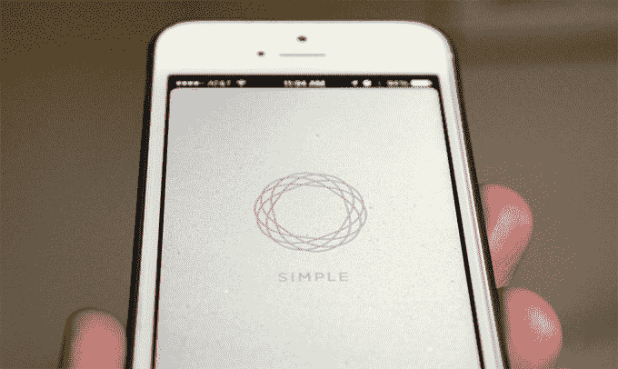
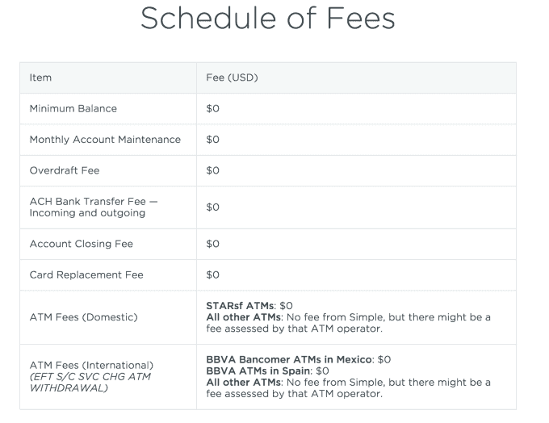

# 网上银行简单收费 

> 原文：<https://web.archive.org/web/https://techcrunch.com/2015/09/11/online-bank-simple-ditches-all-its-fees/>

当在线银行服务 [Simple](https://web.archive.org/web/20221207091558/https://www.simple.com/) 开始时，它对客户的承诺之一是[它将取消传统银行收取的许多过高费用](https://web.archive.org/web/20221207091558/https://beta.techcrunch.com/2010/09/01/banksimple-3-1-million/)，同时还提供改进的和移动优化的银行体验。然而，尽管 Simple 肯定取消了许多最常见的银行费用——比如维护费、透支费或最低余额费——但它仍对其他较少使用的服务收费。但该公司本周宣布将取消所有费用。

以前，Simple 还在收取诸如柜台取现(每笔 1 美元)、国际 ATM 取现(2 美元)、司库支票(每张 8 美元)、不活动(5 美元/月)和换卡费(2 美元；或者如果加急的话 16 美元)。尽管这些费用不是客户必须定期支付的那种费用，但它们仍然对公司的底线做出了贡献。

展望未来，Simple 表示，它将继续从利息和交换费中获得收入，也就是说，它与合作银行分享息差，并分享商户支付给发卡行的服务费。很明显，这和它一直以来的赚钱方式是一样的，但是现在，为了改善整体客户体验，它要承担更多的费用。

Simple 联合创始人兼首席执行官 Josh Reich 解释说:“这种收入模式体现了我们的信念，即您应该在需要时获得您的资金，而无需支付费用。“今天取消所有费用是一个例子，说明我们如何不断努力消除客户因使用无分支机构服务而感到的任何不便，”他补充说。“这也是正确的做法。你不应该担心要花多少钱才能拿到你的钱。”

在某种程度上，Simple 能够做到这一点是因为它不再是一家需要资金才能生存的初创公司——该公司去年被 BBVA 金融服务公司以 1.17 亿美元的价格收购了 T2。当时，Simple 称其拥有超过 10 万名客户。一份泄露的文件称，后来的一份报告[披露了](https://web.archive.org/web/20221207091558/http://qz.com/213192/banking-startup-simple-seems-to-be-struggling-to-sign-up-active-users/)活跃客户的数量较低。(Simple [回应文档使用了占位符数字](https://web.archive.org/web/20221207091558/https://www.simple.com/blog/how-we-measure)，不再准确。)

如今，Simple 告诉我们，它拥有“数十万”客户，但拒绝提供具体数字。该公司还表示，它的增长速度比以往任何时候都快，而且行业内的 CPA(个人零售支票账户)大幅下降。

我们还听说，Simple 目前的增长率大致相当于一家拥有 5600 名分行员工或 850 家分行的银行，尽管它的团队不到 300 人。

通过放弃剩余的费用，Simple 可能会吸引那些厌倦了目前的银行，正在寻找更实惠的替代方案的人。

话虽如此，尽管普通客户可能节省了费用，但他们确实错过了大银行提供的一些选择，比如高收益支票和储蓄账户。(Simple 对客户资金支付 0.01%的利息。)这意味着在某个时候，Simple 的一部分客户可能会考虑其他网上银行选项——例如，可能会选择从透支费用中获利的银行，以换取更高的利率。

提醒一句:虽然 Simple 取消了所有的费用，但这并不意味着你在使用 ATM 时不会额外付费。像大多数银行一样，使用网络外自动取款机是要收费的，Simple 不会报销这些费用。尽管如此，该公司指出，其客户可以使用超过 55，000 台免费自动取款机，是大通银行和美国银行总数的两倍。