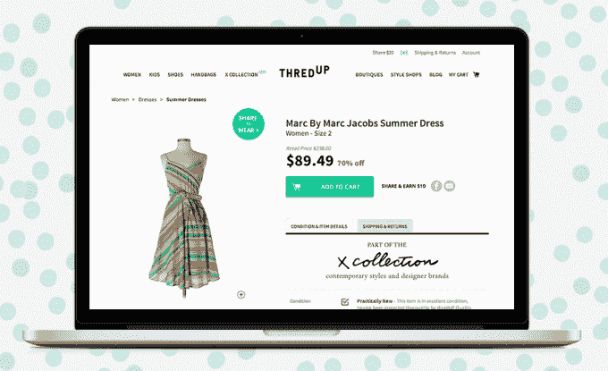

# 随着“X 系列”的推出，在线寄售商店 ThredUp 扩展到高端时尚领域

> 原文：<https://web.archive.org/web/http://techcrunch.com/2014/04/07/online-consignment-shop-thredup-expands-into-high-end-fashion-with-launch-of-x-collection/>

网上服装转售商店 thredUp 已经有超过 100 万的会员，随着今天早上“ [X 系列](https://web.archive.org/web/20230327114204/http://thredup.com/x)的发布，它正在向高端时尚领域扩张新类别将包括托里·伯奇、爱丽丝+奥利维亚、文斯、凯特·斯派德、拉格&波恩、DVF 等顶级设计师，同时还为那些衣服在网上转售的客户引入了不同的补偿模式。

虽然 thredUp 被称为各种在线寄售商店(包括[your truly](https://web.archive.org/web/20230327114204/https://techcrunch.com/2013/04/29/no-longer-just-for-kids-online-consignment-shop-thredup-expands-into-womens-apparel/))，但这项服务实际上在传统寄售模式上略有改变。thredUp 不会等到一件商品售出，而是会为你通过一个大的“清仓”邮资已付袋寄给公司的童装、晚装和女装预付货款。

但是随着“X 系列”的出现，这种情况发生了变化。虽然早期的模式仍然适用于你的日常服装，但新的卖家寄售支付结构为他们提供了高达 80%的品牌商品转售价值，thredUp 指出，这高于 60%的行业平均水平。(尽管在点对点服装转售领域不一定比竞争对手高，比如 Poshmark 或 Threadflip，他们[也](https://web.archive.org/web/20230327114204/https://poshmark.com/faq) [支付](https://web.archive.org/web/20230327114204/https://threadflip.zendesk.com/hc/en-us/articles/200166705-What-is-Threadflip-s-Commission-Rate-) 80%。)

更具体地说，thredUp 上列出的价格为 40 美元或更低的商品有资格获得前期[定价](https://web.archive.org/web/20230327114204/http://support.thredup.com/entries/23395842-How-much-will-I-earn-for-my-clothing-)(支付预期售价的 10%-40%)，而价格为 40 美元或更高的商品有资格托运。

在发布会上，新系列将展示来自 200 多个品牌的 6000 多件商品。与此同时，该网站其他地方更主流的零售商提供的女装选择包括大约 15 万多件单品。

该公司表示，在自己的[转售报告](https://web.archive.org/web/20230327114204/http://www.thredup.com/resalereport)发现高端品牌在其网上商店销售最快后，它采取了这一举措，以更好地满足高端服装消费者的需求。

根据联合创始人兼首席执行官詹姆斯·莱因哈特(James Reinhart)提供的数据，如今 thredUp 每天以 3000 名新成员的速度增长，其移动业务也在加速发展，iOS 和 Android 上每天有 1000 个新应用下载。目前，40%的公司收入来自移动。

自从一年前扩展到女性购物[后，女性类别现在占 thredUp 业务的 60%,该公司预计到今年年底将达到 70%,这要归功于 X Collection 及其下一个垂直系列手袋(即将推出)的推出。](https://web.archive.org/web/20230327114204/https://techcrunch.com/2013/04/29/no-longer-just-for-kids-online-consignment-shop-thredup-expands-into-womens-apparel/)

从今天早上开始, [X 系列](https://web.archive.org/web/20230327114204/http://www.thredup.com/x)将在应用程序和主要网站上提供。