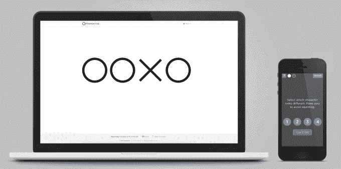
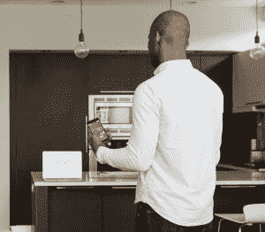
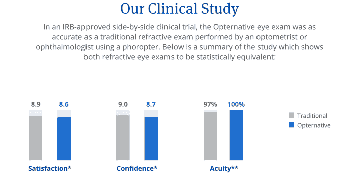

# Opternative 的在线眼科检查让你在家就能拿到眼镜处方 

> 原文：<https://web.archive.org/web/https://techcrunch.com/2015/07/27/online-eye-test/>

去看医生的烦恼让很多人不知道他们是否需要眼镜或者更新他们的处方。但事实证明，你不需要那些巨大的多镜头机器来做眼睛检查。Opternativ 公司已经通过了临床试验，并于今天推出了其[40 美元的在线眼科检查](https://web.archive.org/web/20221108211359/https://www.opternative.com/)。

你只需要一台电脑、智能手机、Wi-Fi 和 25 分钟来测试哪些线条看起来更模糊。在 24 小时内，Opternative 将审核您的结果，并将处方发回给您，您可以使用该处方在任何地方获得眼镜或隐形眼镜，包括 Warby Parker 等在线商店或 meatspace 实体眼镜店。

Opternative 现在是唯一被批准的在线眼科检查。凭借足够的知名度和与大型互联网零售商的合作关系，它可以通过降低标准的 50 至 100 美元的眼科医生出诊费用，让世界看得更清楚，赚一大笔钱。

## 软件吃眼考试

从验光学校毕业后，Steven Lee 博士确信，电脑和手机必须为传统的用于视力测试的自动验光仪提供一个替代品。他与连续创业家亚伦·达莱克合作，在芝加哥创办了 Opternative。

2014 年初，随着来自 Tribeca Venture Partners、Chicago Ventures、Healthbox 等公司的 100 万美元种子资金，它增加了 CTO Ayo Jimoh[披露:他是大学时代的朋友]，并开始完善其技术。由普利兹克集团、Jump Capital 和之前的投资者牵头的一个 200 万美元的项目推动它通过了临床试验。

 Lee 告诉我，试验取得了“巨大的成功”，监管机构认为 Opternative 的在线测试“在统计上等同于在医生办公室进行的屈光检查。”它现在已经在 45 个州获得批准，并开始在其中的 27 个州提供服务。

要进行测试，你只需[登录 Opternative 的网站](https://web.archive.org/web/20221108211359/https://www.opternative.com/)，回答一些关于你最近一次测试的资格问题，以及你是否有任何眼部疾病。您可以通过测量信用卡来校准屏幕，并通过 Wi-Fi 和短信确认将手机同步为电脑的遥控器。

测试大约需要 25 分钟。你按照口述和书写的指示，一次遮住一只眼睛，看着电脑屏幕，在手机上回答相应的视力问题。一个符号有多少行？这些符号中的哪一个与其余的形状不同？周围的点是什么颜色的数字？对于一些测试，你会给出你的鞋码，并被告知在回答之前从脚跟到脚趾离开你的电脑一定的距离。

最后，您可以支付 40 美元让 Opternative 检查您的结果，并发回一份批准的眼镜或隐形眼镜处方。两个都是 60 美元。一个警告:如果你从来没有戴过矫正镜片，你只能得到一个即时的眼镜处方。如果您正在更新处方并提交旧处方，您可以获得通讯录。

我发现远处的街道标志和机场登机口号码有点模糊，所以我自己参加了 Opternative 的测试。说明很清楚，遥控器工作正常。

测试感觉有点长，但这增强了我的感觉，这是一个医学级的考试。我唯一的抱怨是，有时候，就像面对面的测试一样，很难知道是真的有三条线还是四条线，是 X 还是 o。在医生的办公室里，你会有一种信心，即使你搞砸了或猜测了一些问题，结果也会是正确的。虽然 Opternative 在通过其 HIPAA 兼容网站发布处方之前会审查结果，但它需要更多的信心来确保测试不会被一些错误的答案搞糟。

然而，就临床试验而言，Opternative 同样准确。然而，Opternative 不能检测基于眼睛的医疗状况，所以你仍然需要每隔几年去看一次医生进行检查。

## 对未来的展望

到目前为止，进行眼科检查的唯一途径是医生的办公室，使用专业设备的上门服务，或昂贵的智能手机加密狗，如 T2 智能视觉实验室生产的智能手机加密狗。 [Eyenetra](https://web.archive.org/web/20221108211359/https://eyenetra.com/) 正在进行一项基于虚拟现实耳机的测试，但 Opternative 是目前唯一一项你可以在家里自己进行而无需额外设备的测试。

Opternative 可以为在线眼镜零售商解决一个大问题。处方的有效期只有一年，所以如果一个眼镜网站的潜在客户最近没有去看眼科医生，他们就不能得到正确的眼镜。Lee 告诉我，Opternative 正在与这些公司合作，让他们把客户送到初创公司，然后再把处方送回来。

最终，Opternative 希望将其技术用于社会公益，为发展中国家开启廉价的眼科检查。它还建造了一个触摸屏亭，可以安装在实体眼镜店内。

看得清楚可以帮助人们学习、工作和享受生活。随着世界向信息和知识经济转变，价值也在增加。让精确的视觉变得更容易实现只需要一个明亮的眼睛。

Opternative 现已获准在 27 个州进行在线眼科检查。

*【图片鸣谢:阿尔文可信】*