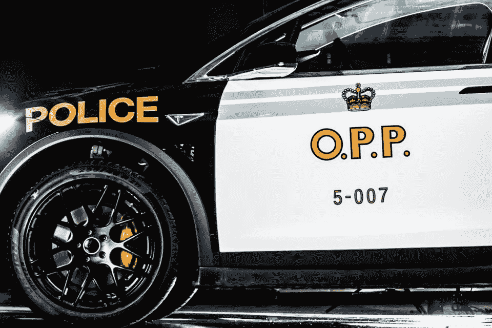

# 安大略省警方展示了一辆特斯拉 Model X 追踪器原型车 

> 原文：<https://web.archive.org/web/https://techcrunch.com/2018/02/16/ontarios-provincial-police-reveal-a-tesla-model-x-pursuit-vehicle-prototype/>

# 安大略省警方展示了一辆特斯拉 X 型追踪器原型车

特斯拉的 Model X 可以说是你能买到的性能最好的 SUV，所以加拿大安大略省警方选择它作为 cruiser 示范车是合适的，这在本周的多伦多国际车展上公布。

特斯拉 Model X 是一款 P90D 车型，具有完整的 OPP 标志和黑白油漆，以及工作灯和警报器，但目前它仍只是一辆展示车，旨在展示“警务的未来”，OPP 警长 Kerry Schmidt 表示，他在直播中展示了该车。

施密特解释说，这里使用的 X 型车实际上是“一个朋友的慷慨捐赠”，而且“可能是未来警务的发展方向”，但它不会被用于服务，“因为现在这辆车还没有在警方评级的追捕车的试验场进行测试，”这位警官解释说。

然而，这并不意味着如果你将来在安大略省的高速公路上超速行驶，你应该排除被这个东西拦下来的可能性。事实上，Schmidt 暗示 OPP 可能会与特斯拉展开对话，以促进未来的潜在部署。

“我们必须告诉特斯拉，让这辆车通过试验场，并确保它是可用的，”施密特说，然后继续演示 Model X 的一些功能。“我们将拭目以待。”

查看下面的完整揭幕和演练:

> 揭开…#未来车展# OPP #特斯拉#特斯拉# CIAS2018 #特斯拉官方国际车展
> 
> 由[中士 Kerry Schmidt](https://web.archive.org/web/20221208004920/https://www.facebook.com/SgtKerrySchmidt/) 于 2018 年 2 月 15 日星期四发布