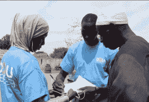
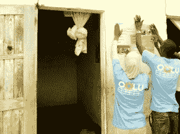

# Oolu 正在将太阳能带给西非的离网人口

> 原文：<https://web.archive.org/web/https://techcrunch.com/2015/07/31/oolu-is-bringing-solar-energy-to-west-africas-off-grid-population/>

在西非的农村地区，目前有 1 . 5 亿人没有电。

一家 Y Combinator 公司今天成立，旨在从塞内加尔开始，通过向西非的电网外人口提供可负担的太阳能来减少这一数字。

尽管太阳能存储和面板技术的创新激增，但 Oolu 创始人丹尼尔·罗萨表示，许多生活在西非农村地区的人仍然要步行数英里到最近的城市给手机充电，并购买灯笼所需的煤油。

根据 Rosa 的说法，普通农村家庭每月在能源相关费用上的支出约为 20 美元。考虑到[塞内加尔的人均 GDP](https://web.archive.org/web/20230222130709/https://data.un.org/CountryProfile.aspx?crName=SENEGAL)在 2012 年刚刚超过 1000 美元，这对许多家庭来说是一笔巨大的开支。

Oolu 的家用太阳能系统由三个可调灯和两个 USB 插头组成，由电池供电，电池可在最大输出下充电长达六个小时。

以低廉的月费，Oolu 将安装系统并执行所有必要的维护，包括免费更换电池和系统升级。

该公司没有透露其确切的价格(预计成本会因地区而略有不同)，但罗莎说，Oolu 已经能够为家庭节省平均 60%的总能源支出。

“这些社区基本上都是种植经济作物的农民，”罗莎说。“塞内加尔的普通家庭非常大——平均家庭规模为 10 人——所以每个家庭都有几部手机，他们需要每周充电两次。”

Oolu 的创新不是他们分发的太阳能产品背后的技术。该系统由一家大型制造商生产，类似的产品已经在东非地区使用。

相反，该公司真正的壮举是建立一个西非家庭和社区领袖感到舒适的分销模式和支付基础设施。Oolu 已经与塞内加尔的一家汇款公司 Orange Money 合作，客户可以通过手机支付月费。

“我们正在与 Orange Money 合作，不仅将太阳能，还将移动支付和移动银行带给数百万农村人口，”Rosa 说。“人们谈论太阳能革命，但实际上这是太阳能移动革命。”

在创办 Oolu 之前，Rosa 的联合创始人 Nilmi Senaratna 通过加拿大国际开发署与塞内加尔农村地区的儿童一起工作。

“我们晚上辅导这些孩子，用手电筒和质量很差的灯笼和蜡烛学习，”塞纳拉特纳说。"我们甚至会在晚上利用手机微弱的光线学习."

塞纳拉特纳开始思考如何将现代技术引入那些不太愿意相信外来者的社区。这就是为什么该公司的名字“Oolu”是当地语言 Wolof 中的一个词，翻译过来就是“信任”。

塞纳拉特纳说:“农村人非常习惯于失望，因为许多组织进来时承诺美好的事物，但后来却没有兑现。“我们的名字证明了我们对自己的要求非常高；当我们说我们将在一周内为您的整个社区带回足够的系统时，我们做到了。”

Oolu 雇佣了一个 10 人的团队，在塞内加尔实地工作，亲自与客户沟通并协助安装系统。

经过一年的试点，该公司已经在塞内加尔签下了 500 名客户。Rosa 和 Senaratna 表示，他们希望在今年夏天结束时达到 1500 名客户，他们计划在不久的将来在另一个讲法语的西非国家推出。

家用太阳能系统仅仅是个开始。Oolu 计划最终利用其移动支付和实地社区支持基础设施的组合，向西非农村家庭提供从农业技术到消费电子产品的各种产品。

“我们最初进入这个行业的原因是与农村社区合作，找到为他们提供他们真正需要的技术的方法，”Rosa 说。“这不仅仅是太阳能，我们真的希望通过为农村人民带来现代服务来影响这些社区。”