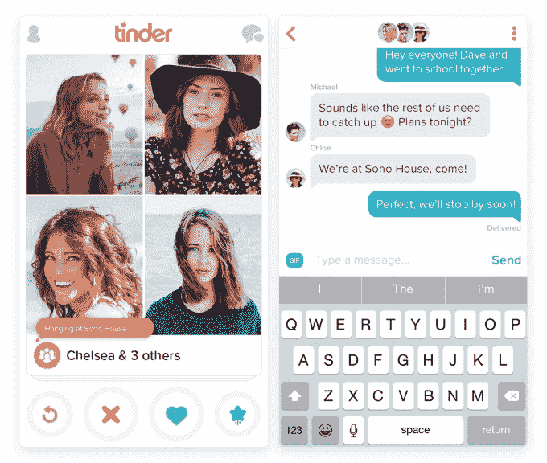

# 哎呀！Tinder 的新交友功能 Tinder Social 可以发现你的哪些朋友在使用 

> 原文：<https://web.archive.org/web/https://techcrunch.com/2016/04/27/oops-tinders-new-friend-finding-feature-tinder-social-is-outing-which-of-your-friends-use-the-app/>

Tinder [今天早上宣布](https://web.archive.org/web/20221207065413/http://blog.gotinder.com/introducing-tinder-social/)它正在测试一个新的交友功能，名为“Tinder Social ”,它是一个流行的约会应用。这个想法是为你和你的朋友们提供一个在现实世界中寻找和联系其他群体的途径。类似于 Tinder 寻找潜在约会对象的工作方式，Tinder Social 允许朋友滑动并匹配他们想认识的其他群体。不幸的是，默认选择了这一功能的 Tinder 用户惊讶地发现，它会自动显示他们的哪些脸书朋友也在使用 Tinder——这不是每个人都希望透露的信息。

当然，在实际使用该应用程序时，你可能会遇到至少一些这样的朋友。但是 Tinder Social 提供了你所有脸书朋友的列表，让你从一个非常容易访问的界面上查看他们的约会资料。*呀呀。*

似乎并不是每个人都对此感到兴奋。尤其是那些可能使用 Tinder 的人…你知道，[另外](https://web.archive.org/web/20221207065413/https://twitter.com/allygory/status/725206408031932416) …

另外，[其他一些人似乎认为](https://web.archive.org/web/20221207065413/https://twitter.com/search?q=tinder%20group%20sex&src=typd)Tinder 上的“团体”选项意味着该应用程序现在想帮助你找到团体性爱。(毕竟，这并不是一个巨大的飞跃——已经有了一个叫做[3 der](https://web.archive.org/web/20221207065413/https://www.3nderapp.com/)的“三人行火种”。)

好消息是，Tinder 目前仍在试验这项新功能，并且只在澳大利亚的一小部分用户中进行测试。所以你可能暂时不会暴露。

Tinder Social 的问题在某种程度上是这款应用程序的一个奇怪的疏忽，它之前一直将隐私功能作为其卖点之一。例如，其应用程序商店的描述宣传这样一个事实，即“没有人知道”你是向左还是向右滑动，除非你匹配，并且该应用程序将*永远不会*向脸书发布任何东西。

但是看到 Tinder 进入“交友”领域并不奇怪。

毕竟，在集体环境中寻找约会的想法并不新鲜。许多约会公司举办本地聚会，一些约会初创公司，例如 [Grouper](https://web.archive.org/web/20221207065413/https://www.joingrouper.com/) ，已经尝试将集体约会的想法产品化。

此外，交友是社交网络应用尚未开发的领域。

多年来，许多初创公司尝试了各种技巧来帮助用户在现实世界中结识新朋友，但没有一家真的成功。几个基于位置的社交应用程序，如 [Highlight](https://web.archive.org/web/20221207065413/https://beta.techcrunch.com/2012/01/24/highlight/) ，在多年前经历了短暂的流行，但它们并没有被证明具有持久力。

与此同时，今天一批新的[创业公司](https://web.archive.org/web/20221207065413/https://beta.techcrunch.com/2016/01/26/hey-vina-is-a-tinder-for-girl-friends/)正在开发他们自己的“交友火绒”

最值得注意的是，Tinder 的主要竞争对手之一 Bumble，由包括 Whitney Wolfe 在内的 Tinder 早期员工创建(是的，她就是性骚扰[诉讼](https://web.archive.org/web/20221207065413/https://beta.techcrunch.com/2014/07/09/whitney-wolfe-vs-tinder/)的当事人)，最近也推出了交友功能。然而，在 Bumble 的情况下，[它是关于连接个人，而不是群体。](https://web.archive.org/web/20221207065413/https://beta.techcrunch.com/2016/03/04/bumble-launches-bff-a-feature-to-find-new-friends/)

然而，Tinder 有足够大的用户基础——估计有 5000 多万用户——使得这样一个功能真正起飞。

(嗯，除非 Tinder 的用户关闭了他们的账户，删除了应用程序，因为他们不希望他们的 Tinder 使用和约会资料被泄露，我想！)

不过，解决这个棘手的社会问题很容易。这是一个调整设置的问题。该功能目前是选择退出而不是选择加入——也就是说，你可以从应用程序的设置屏幕中禁用它。显然，Tinder 需要改变这种方式，否则在更广泛地推广这种方式之前，可能会疏远一部分用户。

该公司没有透露计划何时将 Tinder Social 推向其他市场，只是说它将“很快”在全球推出