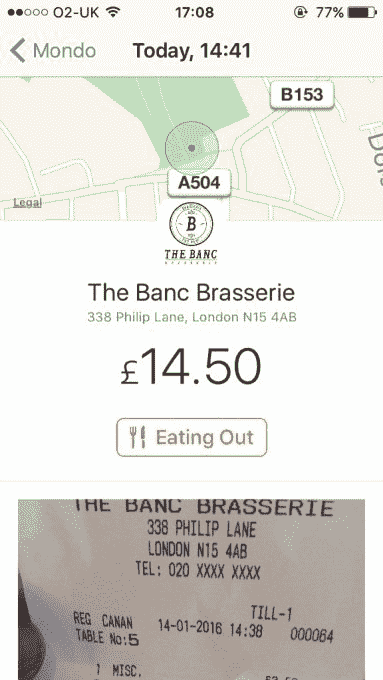
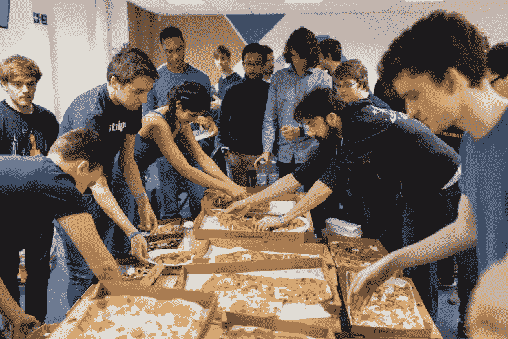

# 英国银行业初创公司 Mondo 公开测试

> 原文：<https://web.archive.org/web/https://techcrunch.com/2016/03/17/open-for-spending/>

尚未推出的英国银行业初创公司 Mondo 在伦敦科技界内外引起了相当大的轰动，它今天向公众开放了测试版——尽管在该公司寻求全面的银行牌照期间，它的功能有限。

在我常去的地方，托特纳姆的 Banc Brasserie 买午餐。

目前，Mondo 提供了一个预付费的万事达卡和一个相当漂亮的 iPhone 应用程序，可以实时跟踪你的支出，在地图上查看地理位置标记的交易，按类别查看支出，并获得你的总体支出的图形时间线。也有选择发送其他 Mondo 成员钱(即点对点付款)。

从今天起，任何从 App Store 下载 Mondo iPhone 应用程序的人都可以注册并看到他们在队列中的位置，而我被告知，这家初创公司将在本周末之前开始向其 52，000 多名等候名单中的人发送 1000 张卡片，未来几周将再发送数千张。

“我觉得我们已经提供了当我们成为一家完整的银行时所能提供的大约 20%的功能，”Mondo 的联合创始人 Tom Blomfield 告诉我。“我们的目标是那些希望尽早参与进来、帮助建立一家他们会自豪地称之为自己的银行的人。在这个阶段，你加入了改善银行业状况的使命。

Mondo 最近还增加了资金，预计将获得监管机构的批准，成为一家完全成熟的银行，我认为这有望在今年夏天晚些时候实现。激情资本(Passion Capital)继伦敦风险投资公司已经投资的 200 万英镑之后，上个月又投资了 500 万英镑[，最近又通过股权众筹融资了 100 万英镑。](https://web.archive.org/web/20230402181306/https://techcrunch.com/2015/06/30/mondo-gets-passionate/)

“与此同时，我们计划在其他欧洲国家推出，集成 Apple Pay 并实现更多有用的功能，如账单拆分，”布洛姆菲尔德补充道。

Mondo 获得如此多关注的部分原因是，除了投资者[艾琳·伯比奇](https://web.archive.org/web/20230402181306/https://techcrunch.com/2015/08/02/interview-eileen-burbidge/)和其他用户[以及我自己](https://web.archive.org/web/20230402181306/https://twitter.com/sohear/status/687683450837549056)这些早早进入测试版的用户发出的[嘈杂的推文](https://web.archive.org/web/20230402181306/https://techcrunch.com/2015/05/24/mondo/)之外，这家初创公司已经举办了几次广受欢迎的黑客马拉松。这是因为 Mondo 从一开始就有一个开放的 API，这是一个更广泛的竞争优势的一部分，即它用自己的内部银行技术建立了一个“全栈”银行，以提供传统银行因依赖过时的软件和基础设施而难以提供的功能。

蒙多黑客马拉松的披萨时间

“数百人参加了我们的黑客马拉松，他们现在是我们最大的支持者。对招聘来说也很棒！”布隆菲尔德说。“人们一直在研究的一些最有趣的想法围绕着零售商忠诚度。我的咖啡店仍然使用一张小卡片来收集 10 张邮票以获得一杯免费饮料。这感觉不像是 21 世纪客户忠诚度的解决方案。

与此同时，我们预计今年将有四家所谓的“挑战者”和数字优先银行在英国开业。除了 Mondo，还有[Starling](https://web.archive.org/web/20230402181306/https://starlingbank.co.uk/)(Blom field and co .对其有[历史](https://web.archive.org/web/20230402181306/http://www.ft.com/cms/s/0/f658ba1a-b5ef-11e4-a577-00144feab7de.html#axzz3b4IYFYN8))[Atom Bank](https://web.archive.org/web/20230402181306/https://techcrunch.com/2016/03/08/atom-bank-grasp/)和 [Tandem](https://web.archive.org/web/20230402181306/http://uk.businessinsider.com/tandem-gets-banking-licence-close-to-multi-million-pound-funding-round-2015-12) 。后两者看得更远，都已经获得了梦寐以求的银行牌照。

为此，当我问布洛姆菲尔德，蒙多打算如何与其他银行业新贵竞争时，他毫不犹豫地说。“我认为，其他一些挑战者正在利用‘移动’作为‘低成本渠道’来获得客户，并向他们销售相当传统的一系列银行产品。这是第一次直接面向 iPhone，”他说。

“Mondo 正试图打造一款‘主屏幕应用’,帮助你过好自己的生活。我们通过提供活期账户、借记卡和透支来做到这一点。然后，我们将生活中影响你财务的所有其他部分联系起来。如果你忘记在管子上开孔，我们可以自动去给你退款。如果您在 Sainsburys 或 Tesco 购物，我们可以自动累积和兑换花蜜或会员卡积分。如果你昨晚为朋友买了晚餐，我们可以自动帮你分摊账单，并提醒人们付钱给你。如果你正在为度假或婚礼存钱，我们可以给你一些小“提示”,让你轻松搞定。