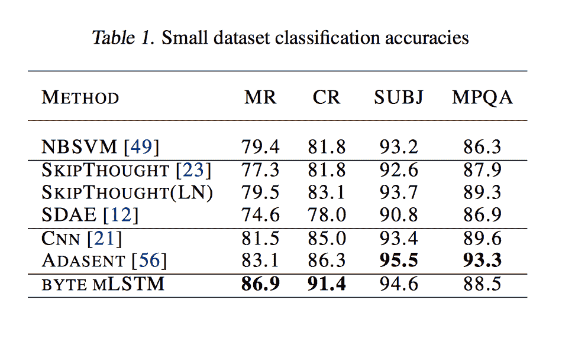
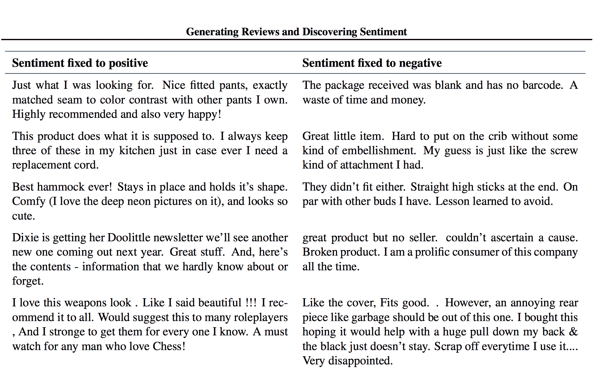

# OpenAI 使用高效的 ml STM TechCrunch 为情感分析设定了基准

> 原文：<https://web.archive.org/web/https://techcrunch.com/2017/04/07/openai-sets-benchmark-for-sentiment-analysis-using-an-efficient-mlstm/>

# OpenAI 使用高效的 mLSTM 为情感分析设定了基准

OpenAI 的研究人员能够使用在亚马逊评论上训练的递归 mLSTM 字符级模型来识别文本块的情感。也许更有趣的是，该团队能够生成带有可定制情感的新文本。

LSTMs 和情感分析都不是新东西，但据报道，以一种打破常用基准数据集情感分析准确性记录的方式结合它们是值得注意的——特别是当你考虑模型的效率时。

该团队的模型仅在四个小型文本分类数据集(MR 和 CR 数据集)中的两个数据集上优于现有方法。这些数据集由烂番茄和亚马逊的产品评论组成。与此同时，OpenAI 无法在 SUBJ 和 MPQA 数据集上击败现有方法。OpenAI 表示，它可以通过少量带标签的训练样本来匹配性能。

因为该模型被训练成可生成的，它也能够输出带有预设情感的评论。下表摘自论文，显示了正面和负面评论的随机分类示例。

这些结果很酷，但是如果你对此完全陌生，让我们后退几步。即使在机器学习之前，对情感分类感兴趣的工程师也会采用相对愚蠢的启发式方法，如关键词搜索来完成工作。

然而，用这些方法，像“我希望你快乐”这样的句子很容易被误解为有积极的含义，仅仅因为它含有“快乐”这个词。背景很重要；之前说的话会直接影响之后说的话的意思。很明显，如果那句话前面有“你杀了他”，解释就会不同。

情感的机器学习方法已经变得很常见，用于在对话界面中解释意图，以及做出适合情绪的产品推荐等。最近，LSTMs，或长短期记忆递归神经网络，已经引起了注意，因为它们能够在更长的时间间隔内跟踪上下文。

安德烈·卡帕西、贾斯廷·约翰逊和费·李非在 2015 年对循环网络的[工作为 OpenAI 的论文奠定了很多基础。该团队表明，LSTMs 可以跟踪可解释单元格中的文本属性，如引号、行长度和括号。](https://web.archive.org/web/20221013193150/https://arxiv.org/pdf/1506.02078.pdf)

撰写 OpenAI 论文的三名研究人员之一亚历克·拉德福德在一封电子邮件中向我解释说，因为他们的模型是在字符级别而不是单词级别运行的，所以文档中可以有 1 万个时间戳。如此大的时间跨度对 LSTMs 来说是一个挑战。一般来说，尽管有这些限制，研究人员已经能够获得很大的结果，但寻求完美是另一回事。

“从功能上来说，LSTM 是‘漏的’”，拉德福德解释道。“它永远不会完美地记住事情，所以即使你的情绪值为 1，并且在每个时间步长都保持 0.999，你在 1000 个时间步长后仍是 0.36。”

在这一点上，很难说这项工作除了情感之外还有什么其他的应用。使用无监督学习，不容易推断出其他用例可能会获得什么结果。