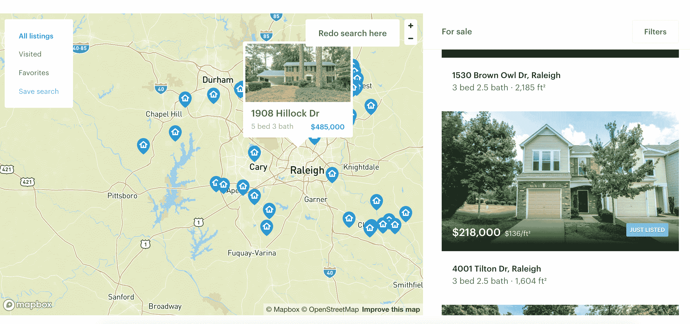

# Opendoor 筹集 3.25 亿美元，使房屋买卖成为一个近乎即时的过程 

> 原文：<https://web.archive.org/web/https://techcrunch.com/2018/06/13/opendoor-raises-325m-to-make-buying-and-selling-homes-a-near-instant-process/>

投资者正在将另一个巨大的赌注压在一家初创公司身上，该公司希望将几十年的旧流程改造成近乎即时的东西，这一次向 [Opendoor](https://web.archive.org/web/20221206153938/https://www.opendoor.com/) 注入了 3.25 亿美元——这家公司希望将买卖房屋的复杂操作简化为类似于呼叫 Lyft 这样简单的事情。

Opendoor 的想法与消费者理论没有太大的不同，消费者理论已经发展成为价值数百亿美元的公司——消费者讨厌复杂的流程，如果他们可以让流程变得更简单，他们愿意将这些流程交给技术公司。房屋买卖可能是其中比较激烈的一项，需要大量的移动部件和协调多个时间表和时间表。Opendoor 的理论是，它可以通过将时间和精力成本降至零来创建一个规模可观的企业，并在这个过程中有效地创建一个新的技术驱动的商业模式，就像优步或 Airbnb 一样。

Opendoor 表示，它希望通过这笔额外的融资，到 2020 年底将市场扩大到 50 个。该公司目前在 10 个市场开展业务，并表示目前年购买量超过 25 亿美元。该公司表示，它已经筹集了 3.25 亿美元的融资，由通用大西洋公司、Access Technology Ventures 和 Lennar Corporation 共同牵头。安德森·霍洛维茨、Coatue Management、10100 Fund 和 Invitation Homes 以及现有投资者 Norwest Venture Partners、Lakestar、GGV 资本、NEA 和科斯拉风险投资公司也参加了会议。Opendoor 总共筹集了 6.45 亿美元的股权和 15 亿美元的债务。

首席执行官巫启贤说:“我意识到，人们希望用移动设备进行交易，这是一个很大的趋势。”。“我们在优步、Lyft 和亚马逊身上看到了这一点。我相信房地产的未来将是按需的，这是 Opendoor 论文的核心，使交易实时和即时。我意识到会有顺风，房地产需要转型。”

Opendoor 还试图扩大其努力，使查看这些房子一样无缝。该公司允许潜在客户通过每周七天使用该应用程序打开房屋来查看房屋。吴说，大部分潜在买家去看房都是七天之内成交，然后七天之后就成交了。考虑到这对任何房主来说都是非常重要的一步，在这个过程中进行大量的计划和考虑是有意义的。下一步是创建一种交易系统，Opendoor 致力于创建一种简化的方式，将现有的房屋转变为新的房屋。

尽管如此，购买(或出售)房屋是消费者可以进行的最大单笔交易之一——尤其是如果他们在主要的大都市地区，那里的房子可以很快达到 100 万美元以上。因此，说服消费者应该按几个按钮来进行几十万美元的交易仍然是一个障碍。吴说，挑战在于与客户建立足够的信任，让他们意识到这个过程应该是无缝的，并由透明的数据驱动。

“这是我们推出这项服务之初就面临的问题，”吴说。“我们要求卖家在网上把他们的房子卖给一家科技公司。我们所做的许多事情，例如降低费用和价格透明，帮助我们建立了信任。由于这是最大的金融交易之一，我们必须建立一个世界级的定价模型，对我们如何获得报价保持透明，使它成为一种低费用的服务，并提供围绕这一过程的确定性。”

为了做到这一切，Opendoor 表示，它已经建立了一个强大的数据集，将有助于最好地模拟房屋的潜在价格，并使这些信息更加透明。吴表示，Opendoor 目前拥有约 650 名员工，并希望到明年年底将员工人数增加一倍，该公司正在投入大量资金来壮大其数据科学团队。挑战在于理解房地产市场的动态——以及任何潜在的混乱——以便最好地评估如何买卖这些房屋。Opendoor 通过购买一些房屋并持有一段时间来获取一些风险，因此确保该公司了解市场的表现将是其最大的挑战之一。

Opendoor 肯定不是这一领域的唯一参与者，因为 Knock 和 OfferPad 等一些竞争对手已经开始筹集额外的资本。Knock [去年 1 月以类似的赌注](https://web.archive.org/web/20221206153938/https://techcrunch.com/2017/01/31/raising-a-32m-series-a-knock-seeks-to-standout-with-new-model-for-selling-homes/)获得了 3200 万美元:简化购房过程并在幕后处理所有细节。如果有什么不同的话，这表明风险社区(特别是一个[，那里的数字越来越大](https://web.archive.org/web/20221206153938/https://techcrunch.com/2018/01/30/on-demand-dog-walking-app-wag-raises-300-million-from-softbank-vision-fund/))对模型有兴趣，这些模型希望利用相同的消费者需求，将过于复杂的流程简化为由数据科学驱动的智能应用程序上的几个输入。