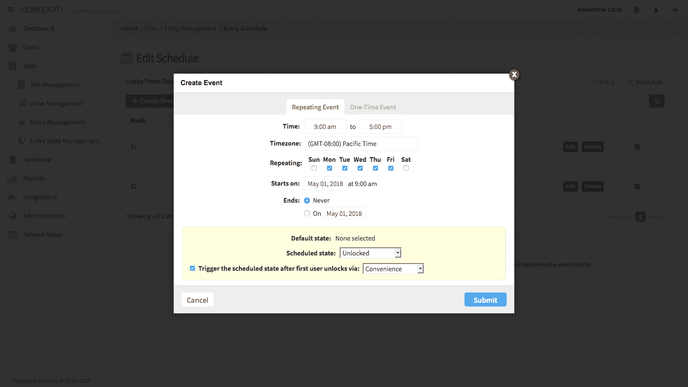
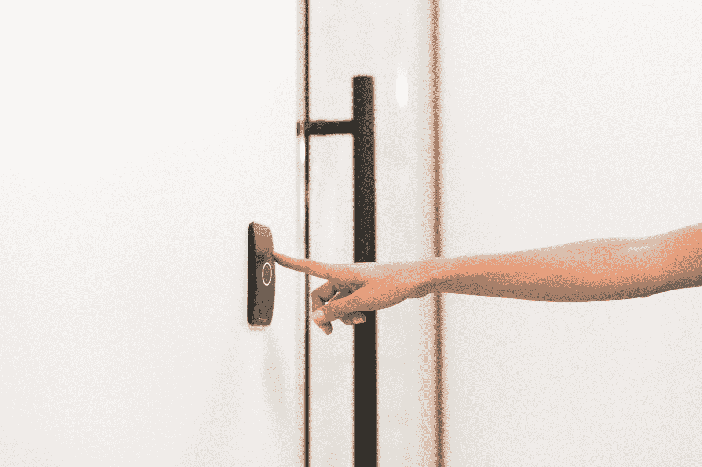

# Openpath 筹集 700 万美元帮助你用手机进入办公室 

> 原文：<https://web.archive.org/web/https://techcrunch.com/2018/05/22/openpath-raises-7m-to-help-you-access-your-office-with-your-phone/>

# Openpath 筹集了 700 万美元，帮助你用手机进入办公室

如果你曾经在办公楼工作过，很有可能有人会发给你一张钥匙卡或支持 NFC 的徽章来打开大楼的大门。这些卡和徽章发挥了它们的作用，但是它们既麻烦又容易出问题。Openpath 希望解决所有这些问题，并通过用您现有的手机替换这些门禁卡，为整个过程增加新的便利性。

Openpath 目前有大约 20 名员工，自 Edgecast 联合创始人亚历克斯·卡泽拉尼(首席执行官)和詹姆斯·塞吉尔(总裁)以及其他一些前 Edgecast 高管创立以来，一直处于隐形模式。创始人将自己的钱投入到这家初创公司，并领导了一轮 700 万美元的种子期。不过，许多机构投资者也参与了这轮投资，包括 Upfront Ventures、Sorenson Ventures、Bonfire Ventures、Pritzker Group Venture Capital 和 Fika Ventures。

在过去的几年中，该团队开发了硬件和软件并申请了专利，使员工能够安全地开门，并使安全团队能够管理他们的访问。该公司所谓的 SurePath 移动技术使用蓝牙、Wi-Fi 和 LTE 来认证用户，而不是 NFC。该系统直接与 G Suite 和 Office 365 集成，因此用户和 IT 团队不必创建多个用户帐户来允许员工访问他们的空间。

塞吉尔认为，员工已经开始期望工作场所有一定程度的便利，虽然我们的家变得越来越智能，但大多数办公室却没有。在我们今天发布之前的谈话中，Kazerani 还强调，该公司的平台必须是企业级的，并准备好每天被使用数千次。

Openpath 团队开发了自己的阅读器硬件，商家必须上门安装。不过，硬件使用与现有服务相同的布线，这使得用这种新的解决方案替换遗留系统变得很容易。

