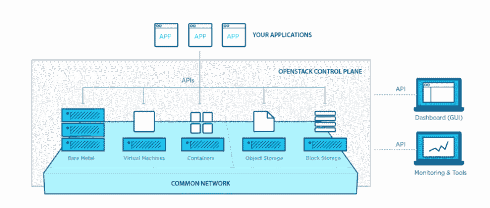

# OpenStack 着眼于下一代私有云 

> 原文：<https://web.archive.org/web/https://techcrunch.com/2017/02/22/openstacks-latest-release-focuses-on-containers/>

今天， [OpenStack Foundation](https://web.archive.org/web/20221004232913/https://www.openstack.org/software/) 发布了其平台的最新版本，允许企业在其数据中心运行类似 AWS 的云计算平台。 [Ocata](https://web.archive.org/web/20221004232913/https://releases.openstack.org/ocata/index.html) 是 OpenStack 的第 15 个版本，仅在四个月的发布周期后发布，这比其通常的六个月周期稍快，将在此次发布后恢复。原因是基金会[在发布周期中组织开发者活动](https://web.archive.org/web/20221004232913/https://www.openstack.org/blog/2016/05/faq-evolving-the-openstack-design-summit/)的方式发生了变化。由于周期更短，这个新版本更关注稳定性而不是新特性，但它仍然设法加入了许多新特性。

在这一点上，OpenStack 是一个庞大的项目，由[近 20 个子项目](https://web.archive.org/web/20221004232913/https://www.openstack.org/software/project-navigator/)组成。当然，所有这些都在更新，但这里突出的是，许多新功能都专注于更好地支持 OpenStack 中的软件容器。正如 OpenStack 首席运营官·马克·科利尔告诉我的那样，容器项目比其他项目发展得更快。他将 OpenStack 与谷歌孵化的 Kubernetes 容器编排系统的结合描述为“云的灯栈”，并将 Kubernetes 的受欢迎程度归因于谷歌愿意放弃对它的控制，并允许一个开放的生态系统围绕它生长，而不是由一家公司主导。

对于 Octa 版本，改进的容器支持意味着将 Kubernetes 更好地集成到 Kolla 中，Kolla 是 Openstack 项目，旨在使 OpenStack 本身更容易部署在容器上。这样做的好处是，这不仅使管理 OpenStack 部署变得更加容易，还使升级变得不那么复杂。其他更新包括 Magnum 中对 Mesosphere 的更好支持，OpenStack 的主要项目是使容器编排服务成为其堆栈的一部分，以及 Docker Swarm 对其 Kuryr 容器网络服务的支持。谈到容器引擎，OpenStack 显然不是在偏心。

谈到容器引擎，OpenStack 显然不是在偏心。甚至在一年前，就有很多关于容器是否真的会给 OpenStack 带来厄运的讨论。在很大程度上，这些担心可能有点言过其实，容器现在是项目不可或缺的一部分。

在讨论 OpenStack 的未来时，Collier 还指出，他看到企业看待私有云的方式发生了重大转变。包括 OpenStack 在内的第一代私有云服务对我们来说并不容易。“这需要一个大得多的团队，而你看到的采用符合这种模式，”他说。“你看到贝宝和沃尔玛采用了它。如果你是这些公司中的一员，那当然很好，但不值得为普通人浪费时间。”现在，我们已经达到了 Collier 所认为的第二代私有云，这不再是一个问题，您不再需要庞大的团队来设置私有云，而且现在有一个强大的公司生态系统也可以帮助您设置它。

在早期的场景中，建立 OpenStack 云所需的人力资源使小型团队很难做到这一点，但 Collier 认为，我们现在看到的是一个转折点，私有云可以再次与 AWS 等大型公共云服务进行价格竞争。在那里，您倾向于为灵活性支付额外费用，但现在使用 OpenStack 之类的产品对于持续的工作负载来说可能是经济高效的。