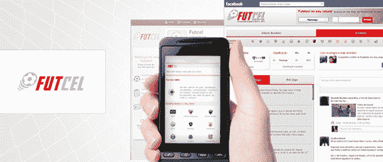
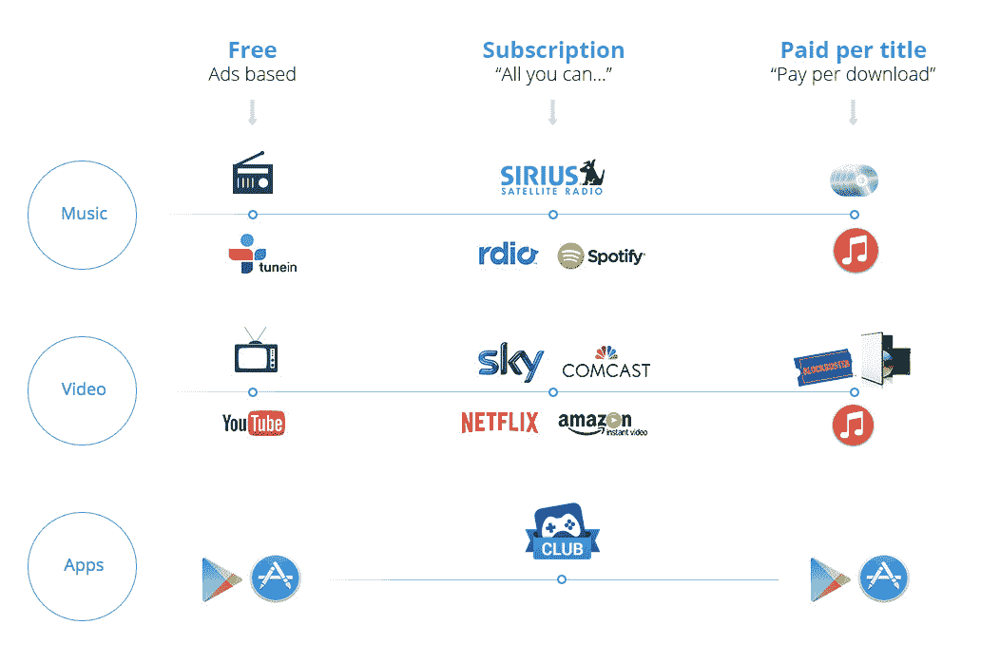

# Opera 收购了 Bemobi，这是一个类似网飞的高级应用订阅服务

> 原文：<https://web.archive.org/web/https://techcrunch.com/2015/08/07/opera-acquires-bemobi-a-netflix-like-subscription-service-for-premium-apps/>

# Opera 收购了 Bemobi，这是一个类似网飞的付费应用订阅服务

浏览器制造商 [Opera](https://web.archive.org/web/20230324072921/http://opera.com/) 今天宣布，它已经收购了[Bemobi](https://web.archive.org/web/20230324072921/http://www.bemobi.com.br/)——[一家基于订阅的移动应用发现服务](https://web.archive.org/web/20230324072921/http://www.appsclub.com/)，专注于拉丁美洲市场。Opera 预计收购将于 2015 年第三季度完成。交易的财务细节没有披露。

你会问什么是“基于订阅的移动应用发现服务”？按照 Opera 的描述，Bemobi 本质上是智能手机应用程序的网飞，让用户每周支付少量费用，就可以无限制地使用付费移动应用程序。用户通过运营商支付这笔费用(在信用卡和借记卡普及率较低的国家，这是一项重要功能)。Bemobi 表示，它目前拥有约 600 万活跃用户。

Opera 最出名的是其桌面和移动浏览器，正因为如此，它与运营商有着广泛的现有关系网络——许多运营商在手机上预装了该公司的浏览器。该公司希望这些现有关系与 Bemobi 的应用程序发现和分发服务的结合将“在全球范围内带来创新的应用程序发现和货币化服务，并将 Opera 定位为该领域的全球领导者。”

“Opera 在移动应用生态系统中迅速扩张，我们的目标是在这个领域进行创新，让所有人受益。在这个方向上，Bemobi 是 Opera 的天然选择，”Opera 首席执行官 Lars Boilesen 在今天的声明中说。“此次收购为我们的应用发现服务带来了新的维度，新的盈利模式已被证明在我们的核心市场运行良好。”

Bemobi 的分销合作伙伴包括克拉罗、西班牙电信、美洲电信、Telcel 和 Oi 等公司。它还与众多开发人员合作。该公司将目录中的应用数量限制在 500 个左右，并在与开发者交谈时将这一点作为卖点，这些开发者往往很难突破苹果应用商店和谷歌播放商店中杂乱的新应用。想要使用其服务的开发者不必对他们的应用程序做任何修改——该公司只需将自己的软件包装在他们周围。

这家成立于 2000 年的公司看起来将继续以自己的名字和首席执行官运营，但计划是向全球扩张(该公司已经提供了一个英语营销网站[。](https://web.archive.org/web/20230324072921/http://www.appsclub.com/)

Bemobi 首席执行官 Pedro Ripper 在今天的公告中表示:“Bemobi 计划在全球扩张，利用 Opera 的战略资产，在拉丁美洲基于订阅的应用程序发现服务的早期成功基础上再接再厉。”

在某种程度上，Opera 通过此次收购获得了进入不断增长的拉丁美洲市场的额外渠道，Bemobi 获得了 Opera 在世界各地广泛的合作伙伴网络。

