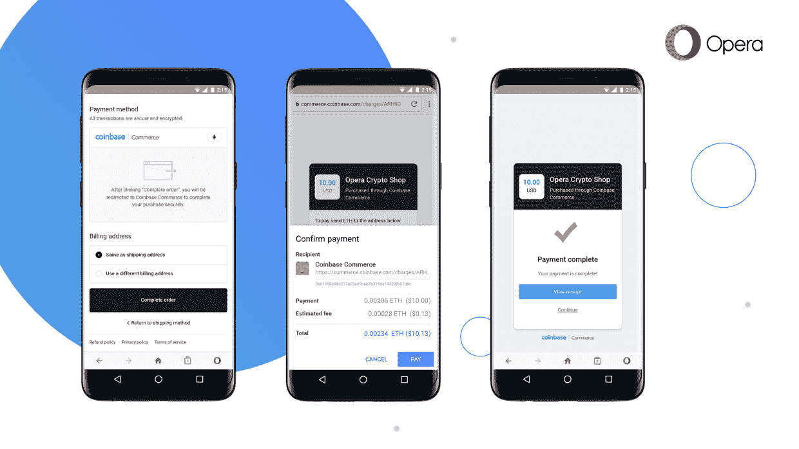

# Opera 在其移动浏览器中添加了加密钱包 

> 原文：<https://web.archive.org/web/https://techcrunch.com/2018/07/11/opera-adds-a-crypto-wallet-to-its-mobile-browser/>

# Opera 在其移动浏览器中添加了一个加密钱包

Opera Android 浏览器很快就能容纳你的加密货币了。该系统现在处于测试阶段，可以让你在浏览器中存储加密和 ERC20 令牌，动态发送和接收加密，并用手机的生物安全或密码保护你的钱包。

你可以[在这里](https://web.archive.org/web/20221025222024/https://www.opera.com/crypto)注册试用测试版。

据该公司称，这项名为加密钱包的功能“使 Opera 成为第一个引入内置加密钱包的主要浏览器”。该功能允许在浏览器中进行小额支付，并为其他浏览器中的类似功能铺平了道路。

从发布:

> 我们相信今天的网络将会成为未来去中心化网络的接口。这就是为什么我们选择使用我们的浏览器来弥合差距。我们认为，通过内置的加密钱包，浏览器有可能更新和扩展其作为工具的重要作用，以一种给予用户更多控制权的方式访问信息、进行在线交易和管理用户的在线身份。
> 
> 除了能够将钱从一个钱包发送到另一个钱包并与 Dapps 交互之外，Opera 现在还支持在有商家支持的地方使用加密货币进行在线支付。选择在支持比特币基地商务的商家上使用加密货币支付订单的用户将会看到一个支付请求对话框，要求他们签名。然后，付款将被签名并直接从浏览器传输。

虽然这种技术仍处于早期阶段，但看到主流浏览器进入这个领域还是很有趣的。在 Safari 或 Edge 中看到 crypto 时不要屏住呼吸，但 Chrome 和其他“开源”浏览器可以很容易地添加这些功能，只要有足够的需求。

【YouTube = https://www . YouTube . com/watch？v=aVE0eHp7QA0]