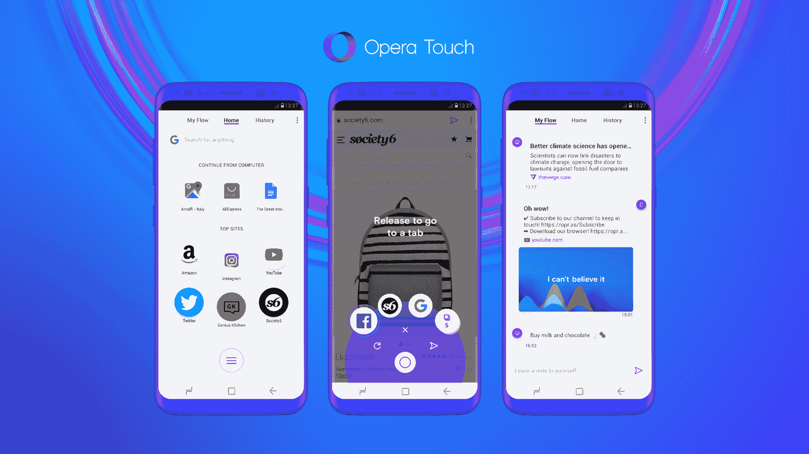

# Opera 推出新的移动浏览器

> 原文：<https://web.archive.org/web/https://techcrunch.com/2018/04/25/opera-launches-a-new-mobile-browser/>

Opera 今天发布了一款新的移动浏览器 Opera Touch，这表明在移动浏览领域，竞争对手仍有很大的空间。Opera Touch 从该公司的实验性 Opera Neon 桌面浏览器中汲取了一些想法，并将其打包成一个适用于 Android 的高度可用的软件包，iOS 版本即将推出。

与其说是 Touch 重新发明了轮子，倒不如说它似乎是本着把用户放在第一位的理念来设计的。这从一些小的接触开始，比如把标签切换器和访问你的书签放在页面的底部，这样你就再也不用做一些手指体操来到达你的屏幕顶部了(或者用两只手，我想这也是一种选择……)。Safari 用户肯定非常熟悉在屏幕底部访问这些功能，但在主要的 Android 浏览器上，却奇怪地没有。

当你按住这个“快速操作”按钮时，你也可以方便地访问你的标签，一个简单的点击就可以让你快速开始搜索或输入网址。

Opera 的产品经理 Maciej Kocemba 在今天的声明中说:“我们已经将浏览器的关键功能移至您的触手可及之处。这意味着，与大多数其他浏览器不同，您可以在旅途中更轻松地浏览和搜索网页

该浏览器还配有 Opera 的广告拦截器(如果你喜欢的话)，以及[密码劫持保护](https://web.archive.org/web/20230328024456/https://techcrunch.com/2018/01/03/opera-now-protects-you-from-cryptojacking-attacks/)。

然而，可能最重要的是，Opera 桌面浏览器(第 52 版今天发布)和 Opera Touch 现在可以轻松地相互共享信息，而不需要登录和密码。你只需用 Opera Touch 扫描桌面版的二维码，就可以开始了。

当我在发布前测试新的移动和桌面浏览器时，这个被称为“Flow”的新功能对我来说并不太适用，但我认为这只是发布前的紧张。不过，当它工作时，它应该会让你不必通过电子邮件向自己发送链接，尽管大多数移动浏览器都支持与桌面浏览器进行某种同步，但很多人仍在这样做。然而，通常这些特征是相当隐蔽的。

当然，并不是一切都可以完美。我非常想念 Opera Touch 的一个功能，那就是管理我的书签。Touch 会自动填充你最常用网站的列表，但没有办法将书签固定在列表中的特定位置。公平地说，大多数人可能只是键入他们想去的网站的前几个字母，这很好，但这里更灵活一点会更好。

如果你有兴趣寻找替代浏览器，Opera Touch 绝对值得一试。它与桌面版结合使用效果最佳，但作为独立的移动浏览器也非常好。

