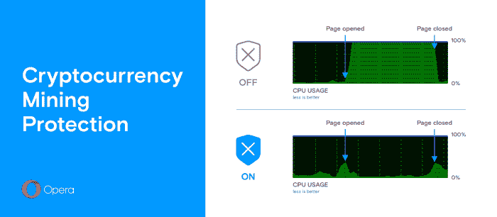

# Opera 现在保护你免受密码劫持攻击

> 原文：<https://web.archive.org/web/https://techcrunch.com/2018/01/03/opera-now-protects-you-from-cryptojacking-attacks/>

# Opera 现在保护你免受密码劫持攻击

Opera 今天推出了其[桌面浏览器](https://web.archive.org/web/20230328034601/http://www.opera.com/computer)的第 50 版。遗憾的是，这个版本没有附带庆祝这一里程碑的蛋糕(甚至没有一个小蛋糕)，但最新版本确实包括一个新功能，确保没有人能够在你的浏览器中[挖掘加密货币](https://web.archive.org/web/20230328034601/https://www.wired.com/story/cryptojacking-cryptocurrency-mining-browser/)。

虽然浏览器和 JavaScript 并不是最有效的挖矿方式，但运行这些脚本的用户数量之多弥补了这一点(而且攻击者不必为电力付费的事实也有所帮助)。不过，在很大程度上，这些网站像 Monero 一样挖掘硬币，使用非常计算繁重的算法，其中 CPU 能够与传统的以 GPU 为中心的方法竞争(据报道，这也是朝鲜黑客部队偶尔用来在被劫持的机器上挖掘硬币的方法)。

值得注意的是，Chrome 和 [Firefox](https://web.archive.org/web/20230328034601/https://addons.mozilla.org/en-US/firefox/addon/nominer-block-coin-miners/) 的[扩展将在这些浏览器上为用户执行相同的服务。在 Opera 中，当你打开浏览器的广告拦截工具时，这个新的加密劫持功能会自动启用。](https://web.archive.org/web/20230328034601/https://chrome.google.com/webstore/detail/no-coin-block-miners-on-t/gojamcfopckidlocpkbelmpjcgmbgjcl?hl=en)

Opera 桌面浏览器主管王南钧·科龙德拉说:“我们是加密货币的粉丝，但我们不能接受网站在人们不知情或未经他们同意的情况下使用他们的电脑来挖掘硬币。”“通过新的 Opera 50，我们希望通过为人们提供一种简单的方法来重新控制他们的电脑，从而开始 2018 年。”

Opera 有多爱加密货币？足以在其浏览器中内置一个用于比特币、以太坊、比特币现金和莱特币的[货币转换器](https://web.archive.org/web/20230328034601/http://www.opera.com/computer/features/currency-converter)。

Opera 50 的其他新功能包括支持将视频流传输到 Chromecast，以及一个内置的虚拟现实播放器，让 Oculus Rift 用户可以在耳机中欣赏 360 度视频。