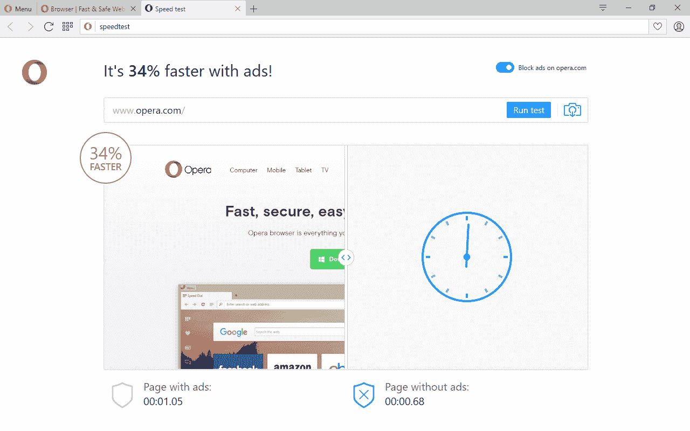
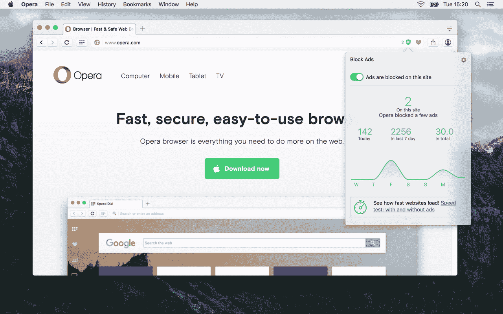

# Opera 的广告拦截器来到其稳定的发布渠道和 Opera Mini for Android 

> 原文：<https://web.archive.org/web/http://techcrunch.com/2016/05/04/operas-graduates-its-ad-blocker-to-its-stable-release-channel-and-opera-mini-for-android/>

# Opera 的广告拦截器来到它的稳定发布渠道和 Android 版 Opera Mini

[Opera](https://web.archive.org/web/20230324062619/https://www.crunchbase.com/organization/opera-software) 今天宣布其内置广告拦截器，这是[以前](https://web.archive.org/web/20230324062619/https://techcrunch.com/2016/03/10/opera-adds-a-built-in-ad-blocker-to-its-desktop-browser/)只在实验性[开发者发布渠道](https://web.archive.org/web/20230324062619/http://www.opera.com/developer)中提供的，现在将面向其所有[桌面用户](https://web.archive.org/web/20230324062619/http://www.opera.com/computer)。此外，它现在也将这一相同的功能引入移动设备，首先是用于 Android 的 Opera Mini。

虽然广告屏蔽并不是完全没有争议，但毫无疑问，它有助于更快的浏览体验——尤其是在移动设备上。

Opera 认为，其内置的广告拦截器也比使用 Chrome 或其他带有第三方广告拦截插件的浏览器更快。事实上，该公司认为其解决方案比使用 Chrome 和 AdBlock Plus 快 45%。

在移动设备上，Opera 表示，支持这项新功能的 Opera Mini for Android 加载网站的速度比不支持这项功能的情况下快了 40%(还可以节省相当多的下载数据)。

此外，Opera 认为其解决方案使用的内存也比同类工具少得多。

在安卓系统上，Opera 提供了常规的全功能 Opera 浏览器和 [Opera Mini](https://web.archive.org/web/20230324062619/http://www.opera.com/mobile/mini/android) 。目前，Mini 是该公司产品线中唯一一款提供内置广告拦截器的移动浏览器，但如果该公司不尽快将这一工具引入非 Mini 版本，我会感到惊讶。与尺寸略大的同类产品不同，Mini 的特点是始终在线压缩服务。该公司的全系统压缩代理 Opera Max 也有可能集成广告拦截功能。

所有这些围绕 Opera 浏览器的活动都发生在 Opera 面临不确定性的时候，因为它提议由一个中国公司财团(其中许多是广告公司)以 12 亿美元收购的交易仍未完成。在 MWC，Opera 首席执行官 Lars Boilesen 告诉我这次收购并不是 T2 的决定，如果交易没有完成，公司会很好。很难不看看该公司目前的决定，其中也包括[在其浏览器](https://web.archive.org/web/20230324062619/https://techcrunch.com/2016/04/20/opera-brings-built-in-vpn-service-to-its-browser/)中建立一个 VPN，而不认为这些决定几乎是为了激怒该公司的潜在收购者(也许是破坏这笔交易)。

**更新** : *Opera 发给我一份关于它与正在收购该公司的中国财团的关系的声明。Opera 告诉我，它对此次收购“实际上非常积极”，并有可能“成为一家雄心勃勃、快速增长的公司中更大生态系统的一部分。”此外，一位发言人告诉我，该公司“与中国财团密切同步，他们支持我们最新的产品开发。”*

