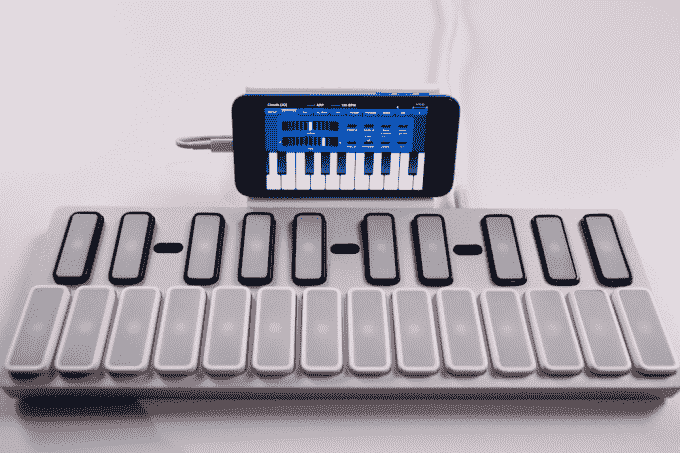
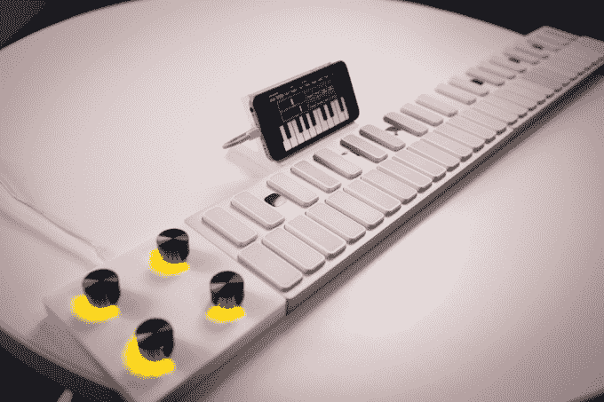

# Opho 的琴键教你如何弹钢琴 

> 原文：<https://web.archive.org/web/https://techcrunch.com/2015/03/05/ophos-keys-teaches-you-how-to-play-the-piano/>

那些想学钢琴的人有了一个新的选择，那就是[键](https://web.archive.org/web/20221208143505/http://www.playkeys.io/)，这是一个智能键盘，你可以连接到你的手机上挑选新歌，或者连接到你的电脑上制作自己的歌曲。

Keys 在大约 13 英寸笔记本电脑大小的铝制机身中提供了 24 个按键。将键盘连接到 iPhone 可以让你使用 Keys 应用程序，它会教你使用类似吉他英雄或摇滚乐队的界面进行演奏。

彩色圆点向下滚动并点击屏幕底部的按键，因为嵌入在按键中的 led 以相同的颜色发光，所以你可以快速选择新歌的模式。当你变得更加自信时，你可以从简化的界面转向类似于乐谱布局的界面。这是一个类似于[gTar](https://web.archive.org/web/20221208143505/https://beta.techcrunch.com/2013/04/25/first-hands-on-with-the-incident-tech-gtar/)的机制，Opho 在[Disrupt 2012 上推出了该技术作为事件技术](https://web.archive.org/web/20221208143505/https://beta.techcrunch.com/2012/05/21/incident-gtar-iphone-teaching-guitar/)。当你想学习更多歌曲时，该应用程序有公共领域的经典作品可供免费下载，还有一个更近的可识别歌曲库，每首 1 美元即可下载。

Opho 通过剥离大部分乐器来简化键盘。如果您想要弹奏不同的八度音阶，接近传感器可以让您左右滑动来上下移动键盘。

如果你喜欢有更多的钥匙，你可以添加另一个钥匙单位的任何一方。Opho 为按键建立了自己的无线技术，允许他们添加任意数量的乐器或控件，如一组旋钮，用于快速调整电子音乐应用程序中的各种设置。

我们在视频演示中使用的按键单元首先需要外部电源，但 Opho 首席执行官 Idan Beck 表示，大约一半的按键高度来自团队包装的大容量电池，这使每个单元的电池寿命延长了几天。

售价 99 美元的 Keys 不仅是学习新乐器的一种不错的方式，它还是一种经济实惠的 MIDI 设备，您可以轻松地将它放入笔记本电脑的背包中，用于音乐制作和表演。在为我们的演示进行设置时，Beck 向我展示了一个 DJ 使用 Keys 的接近传感器来调制他正在播放的歌曲的视频，同时通过在键盘的另一端播放来添加音符。随着 Opho 发布新的按键模块，如转盘和滑块，预计这些用户会有更多的附加功能。

这是一个向两种受众推销的棘手游戏，因为你不想让可能利用它的专业人士认为它是一个针对初学者的动力不足的设备，你也不想因为过于关注它的 MIDI 用途而吓跑那些初学者。贝克说，他们将试图在这些方法之间取得平衡，让知名艺术家在宣传视频中使用它，让它看起来令人印象深刻，但又平易近人。