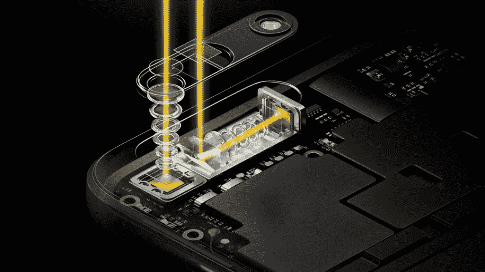

# Oppo 展示了令人印象深刻的新变焦技术，但忘记将其放在真正的手机上 

> 原文：<https://web.archive.org/web/https://techcrunch.com/2017/02/27/oppo-shows-off-impressive-new-zoom-technology-but-forgets-to-put-it-on-a-real-phone/>

# Oppo 展示了令人印象深刻的新变焦技术，但忘记将其放在真正的手机上

Oppo 在世界移动通信大会上发布的声明并不是一款真正的手机。当然，它以一个手机大小和形状的原型出现，但它不是真的。这是概念验证，该公司展示了它花了一年时间研究的想象技术。

这并不是说它不令人印象深刻。该公司显然已经破解了在手机背面实现 5 倍变焦而不增加大规模摄像头的代码。答案似乎是两个不同焦点的两个镜头(专业提示:答案显然总是两个镜头)。

据报道，该系统的灵感来自潜艇潜望镜，将其中一个镜头阵列转向侧面，这是一个 90 度的转变，可以容纳整个设备的长度，而不是像更传统的镜头系统那样面向外。该公司将该系统称为“无损变焦”，提供 5 倍变焦，比大多数手机相机更好地实现了紧密拍摄，而不会大幅降低图像质量。

与此同时，光学图像稳定消除了传统上当你放大得非常紧时的抖动。这是一个聪明的创新，并且在我测试的演示单元中运行良好。

当然，仅凭这个功能不足以在一部新手机上销售太多人。尽管该公司自己也积极申请了这项技术的专利，但看到它在不同设备上得到更广泛的应用还是很好的。见鬼，哪怕一个也不错。目前，它只是原型的东西。

当然，Oppo 似乎知道它最近在做什么。过去一年，该公司在中国本土取得了巨大增长，从 2015 年到 2016 年销售额增长了 122 %,成为全球最大智能手机市场的顶级手机制造商。成像无疑是该剧的一大部分，尽管过去的技术主要集中在拍摄更好的自拍上。

在真正的设备上看到这项技术的时间仍然悬而未决——同样悬而未决的还有它最终是否会到达美国，无论是通过 Oppo 自己的美国分销还是通过第三方许可。