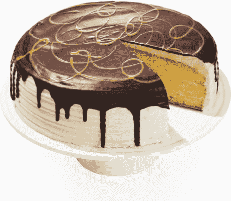

# 奥普拉最喜欢的东西在这里，现在都在亚马逊 TechCrunch 上的一个地方

> 原文：<https://web.archive.org/web/https://techcrunch.com/2015/11/05/oprahs-favorite-things-is-here-and-now-its-all-in-one-place-on-amazon/>

# 奥普拉最喜欢的东西在这里，现在都在亚马逊的一个地方

在过去的 20 年里，奥普拉每个假期都会和我们分享她的“最爱”清单。但是今年这位“电视女王”与亚马逊达成了一项协议，提供了一种在一个地方购买她清单上所有商品的简单方法。

“……今年的名单可能是我有史以来最多才多艺和最有趣的，”奥普拉谈到她的 87 个选择，也是 2015 年 12 月 Oprah 杂志《O》的特色(下周上市)。

对于奥普拉和她今年选择代言的产品来说，[亚马逊](https://web.archive.org/web/20230129100517/http://www.amazon.com/oprahsfavoritethings)的合作也是一个不错的胜利。这位媒体官员的几句神奇的话，就在购买按钮旁边，奥普拉肯定会为她带来健康的收入份额，并为她吹捧的那些人带来利润的增长。

今年名单上的一些有趣的项目包括一些可爱的科技小饰品，如:

*   富士 Instax 智能手机打印机(138 美元)
*   jawbone UP3(180 美元，代码:OPRAH 打八折)
*   亚马逊回声(180 美元)

今年阵容中的其他滑稽项目包括:

*   前门人造毛皮宠物夹克(39 美元)
*   小蜜蜂婴儿家庭睡衣(根据商品不同，价格从 17 美元到 40 美元不等)
*   猫王蛋糕是一种香草蛋糕，里面有香蕉蛋羹，上面有花生酱奶油和巧克力甘纳许(34 美元)

这位亿万富翁媒体大亨可能拥有 30 亿美元，但多一点也无妨。