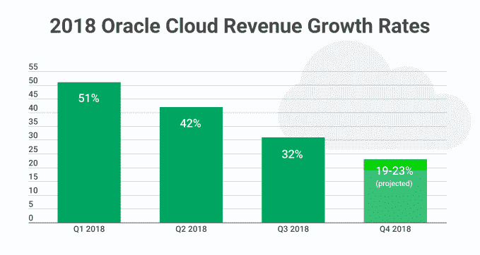
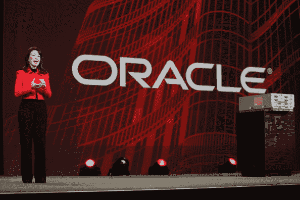

# 甲骨文的云业务现在正走向错误的方向 

> 原文：<https://web.archive.org/web/https://techcrunch.com/2018/03/20/oracles-cloud-biz-heading-in-the-wrong-direction-right-now/>

甲骨文昨晚公布了其季度收益，详细说明其云业务在本季度增长了 32 %,达到 16 亿美元。乍听之下，这听起来不错，但这是[连续三个季度增长放缓的一部分——这一事实让投资者一夜之间紧张不安。今天一整天都没有好转，截至本文撰写时，](https://web.archive.org/web/20221224051145/https://seekingalpha.com/article/4157798-oracle-sinking-deep-value-levels)[甲骨文公司的股票暴跌超过 9%](https://web.archive.org/web/20221224051145/https://www.google.com/search?q=oracle+stock&oq=oracle+sto&aqs=chrome.0.69i59j69i57j69i60l3j0.3531j0j9&sourceid=chrome&ie=UTF-8)。

当您考虑到企业业务正在快速向云转移，并且云业务总体上正在快速增长时，甲骨文的云数据可能是令人担忧的原因。当谈到技术公司的收益时，很难确定“云”意味着什么，因为[它在每个公司如何计算](https://web.archive.org/web/20221224051145/https://techcrunch.com/2017/02/19/wtf-is-cloud-computing/)基础设施、软件或平台方面变化很大；甲骨文的总体趋势似乎与我们从其他公司看到的令人瞠目的增长数字相反。

## 甲骨文对抗世界

甲骨文的云收入细分如下:SaaS 增长 33%，达到 12 亿美元，平台和基础设施收入合计增长 28%，达到 4.15 亿美元。为了将这些数字放入背景中，考虑一下上个季度阿里巴巴报告的整体云收入为 5.33 亿美元，同比增长[104%](https://web.archive.org/web/20221224051145/https://techcrunch.com/2018/02/06/alibaba-cloud-growing-like-gangbusters-but-still-far-behind-aws-and-other-market-leaders/)。

单纯看基础设施服务，[科纳仕公司报告称，2017 年第三季度](https://web.archive.org/web/20221224051145/https://www.canalys.com/newsroom/media-alert-leading-cloud-service-providers-accelerate-q3-2017-fueling-43-growth)，微软同比增长约 90%，而谷歌同比增长约 75%。即使是市场领导者亚马逊，控制了超过 30%的市场，也有大约 40%的增长率，考虑到它的规模，这是相当了不起的。

所有这些都表明，晚于进入云时代的[甲骨文，应该会比目前显示的增长轨迹更快。这是因为从小数量增长通常比从大数量增长到更大数量更容易(就像亚马逊不得不做的那样)。](https://web.archive.org/web/20221224051145/https://blog.barracudamsp.com/bid/oracle-buys-into-cloud-computing)

该公司的内部软件收入持续增长(包括来自现有客户的利润丰厚的许可和维护收入)，并且仍然占其收入的绝大部分。然而，在这一点上，你可能会认为甲骨文希望看到收入增长从内部转移到云业务。

更糟糕的是，联席首席执行官萨弗拉·卡兹在与分析师的电话会议中预测，下一季度云增长可能会进一步下滑。“包括 SaaS、PaaS 和 IaaS(所有云业务的总和)在内的云收入预计将以美元计增长 19%至 23%，以不变货币计增长 17%至 21%，”她本周告诉分析师。

甲骨文联合首席执行官萨弗拉·卡兹图片来源:星野君弘/法新社/盖蒂图片社

## 寻找更光明的未来

董事长 Larry Ellison 试图指出[去年秋天在甲骨文全球大会上宣布的全自动云数据库](https://web.archive.org/web/20221224051145/https://techcrunch.com/2017/10/02/larry-ellison-pokes-aws-while-unveiling-intelligent-database-service-at-oracle-openworld-keynote/)产品是一个更光明的云未来的证据，但迄今为止，数字并没有证明这一点。值得注意的是，他也表示更多的自动化云产品正在开发中。

甲骨文在过去几年中已经将许多云碎片整合在一起，正如 Catz 指出的那样，他们不必进一步投资来处理 SaaS 业务的额外容量，但随着数字朝着错误的方向发展，这可能不是问题。

甲骨文当然有企业信誉，这应该是其云业务的好兆头，但作为市场的后来者，我们应该看到比这更活跃的整体增长。随着时间的推移，这可能会发生，但目前华尔街对甲骨文的业绩并不满意，该公司可能必须从其云产品中展示更多，才能改变投资者的想法。