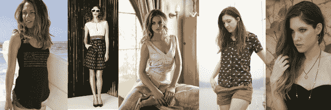

# Orange Harp 将社会意识购物引入 iPhone 

> 原文：<https://web.archive.org/web/https://techcrunch.com/2014/05/20/orange-harp-brings-socially-conscious-shopping-to-iphone/>

一家名为 [Orange Harp](https://web.archive.org/web/20221208005321/https://orangeharp.com/) 的新电子商务初创公司——这个短语参考了联合创始人对旧金山金门大桥的昵称——正在寻求让消费者更容易购买具有社会意识的产品，包括时装、配饰和其他美容护理产品。Orange Harp 是一款适用于 iPhone 和 iPad 的 iOS 应用程序，它让你可以购买各种高质量的商品，这些商品由天然或回收材料制成，对环境友好，来自支持公平工作条件的品牌，等等。

Orange Harp 的联合创始人兼工程师 Anbu Anbalagapandian 解释说，这个想法是要利用这个可持续购物的密集概念，它可以意味着许多事情，并通过使用讲故事来帮助消费者与他们购买的产品、他们解决的问题以及他们背后的公司联系起来，从而将其归结为一种更简单的体验。

“例如，”她解释道，“棉花是世界上最脏的作物，因为人们使用杀虫剂的方式……现代奴隶制正在服装业发生。这些都是严肃的话题，但人们希望以一种更简单的方式来消化它们，”安布说。

在推出时，Orange Harp 推出了 19 个品牌，提供超过 1800 种产品，计划每周增加大约一两个品牌。这些包括从销售有机 t 恤的公司，到不残忍的美容产品等等。许多品牌对他们的公司也有“回馈”的元素。例如，Anbu 最喜欢的公司之一是 [Mitscoots](https://web.archive.org/web/20221208005321/http://www.mitscoots.com/) ，这家公司雇佣奥斯汀的无家可归者来包装他们时髦的袜子，并且每卖一双袜子给有需要的人就捐一双袜子。(有点像买一送一的汤姆鞋模式。)

大多数品牌都位于美国，因为这确保他们无法逃脱海外服装行业普遍存在的劳工虐待，同时也允许联合创始人安布(前 Palm and Lookout 的创始人)和联合创始人卡奇冈萨雷斯(Kacie Gonzalez)在将 Orange Harp 的合作伙伴带到公司之前亲自拜访他们。

该公司从交易中抽取的佣金高于大多数市场，包括狡猾的目的地 Etsy，它可以被视为 Orange Harp 的竞争对手。但 Anbu 表示，品牌很乐意与他们合作，因为他们往往没有资源为自己推出自己的移动产品。这些品牌都有网站，但它们通常不会针对手机进行优化，例如，它们也不会运行自己的手机应用程序。

当一个新的合作伙伴上线时，Orange Harp 现在可以连接到他们的库存系统，并自动索引他们的产品，从而加快入职流程。

当然，社会意识和可持续商品的本质意味着 Orange Harp 的产品可能比你走进大牌零售商时可能买到的东西更贵。但 Anbu 指出，这些商品也是高质量的，这有助于使它们更值得增加的费用。然而，从长远来看，她希望看到公司发展到在更多类别中推出一系列产品，包括目前 Amazon.com 没有的更大品牌(这样就不会变成价格战)，甚至是太阳能电池板之类的产品。

然而今天，Orange Harp 与专注于可持续商品的时尚人士合作，帮助挑选最好的产品，并在应用程序中讲述他们的故事。顾客还会被提醒他们对收入的影响，Orange Harp 本身现在会将销售额的 1%捐赠给“非卖品 T2”，这是一个致力于结束人口贩卖的非营利组织。

旧金山的五人团队仍在从一些投资者那里筹集天使资金，由于安布在科技行业的工作经历以及多年来建立的关系，她与这些投资者有联系。该团队计划在不久的将来正式宣布该轮结束。

在此期间，你可以在这里下载橙竖琴。

[幻灯片 ids =，1004682，1004681，1004680，1004679，1004678，1004677，1004676，1004675，1004674，1004673，1004672，1004671，1004670，1004667，10067