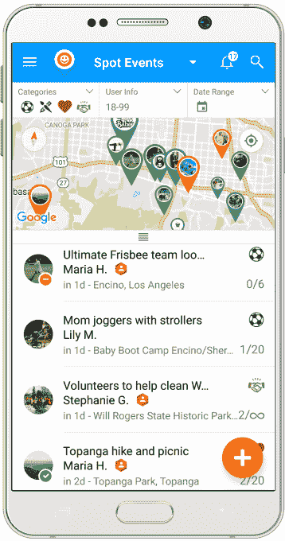

# 《灵异活动》导演奥伦·佩利发布新社交应用 

> 原文：<https://web.archive.org/web/https://techcrunch.com/2017/08/02/oren-peli-launches-spot/>

奥伦·佩利是大获成功的电影《灵异事件》的编剧和导演，他推出了一款新的 iOS 和 Android 应用，旨在帮助用户创建、查找和加入当地活动。

[Spot](https://web.archive.org/web/20230131162033/http://spotapp.io/) 的推出可能会加倍令人惊讶——不仅是 Peli 推出了一款应用程序，而且这似乎是一个奇怪的想法，来自一个以恐怖电影闻名的人(他还制作了*灵异活动*续集和*阴险*电影)。

然而，Peli 告诉我，在进入电影之前，他实际上是以动画软件和视频游戏开发人员的身份开始职业生涯的。所以从某些方面来说，他只是在回归他的老本行。

该应用还解决了 Peli 说他在发现自己再次单身后面临的一个问题，他觉得标准的一对一咖啡约会开始感觉“有点单调”相反，如果有一个应用程序可以帮助人们联系共享的活动和兴趣，会怎么样？

社交、本地和移动领域的交叉领域有很多初创公司，足以让这个行业[产生自己令人讨厌的流行语](https://web.archive.org/web/20230131162033/https://techcrunch.com/2012/03/24/die-solomo-die/)，但 Peli 希望 Spot 能够通过尽可能简单地加入这些活动来超越其他公司。

Spot 应用程序允许人们在四个类别中创建活动:爱好，体育，社区活动和单身活动。您可以通过关键词搜索活动，或者只需调出显示附近活动的地图。活动可以是公开的或私人的，它们可以通过社交媒体分享，参与者可以通过应用程序相互聊天。

“Spot 的技术意味着我可以为少数人或大型活动创建活动，”Peli 说。“这是一种简单的方式来说，‘嘿，我今天下午想去远足，有人想和我一起去吗？’"

当被问及安全性时，Peli 指出，用户通过连接脸书、谷歌或电子邮件创建一个 Spot 帐户，他们还可以通过短信验证他们的电话号码来获得一个验证用户标签。此外，活动组织者可以禁止用户参加他们的活动，并报告不当行为。

不过，Spot 似乎对这个问题采取了相当不干涉的态度。

“我认为，只要有一点点常识，我们就可以拥有一个非常美好和积极的社区，”佩利说。“我们不会允许任何不愉快的事情发生。如果有人骚扰任何人，我们会(通过警告或禁止用户)处理。”

Spot 在全球都可以使用，但 Peli 说最初的重点是在洛杉矶建立一个社区。这款应用是免费的。最终，Peli 说 Spot 可以通过广告和展示当地企业的交易来赚钱。

至于 Peli 在好莱坞的时间是否影响了他对待新公司的方式，他说事实正好相反:“当我进入电影《灵异活动》时，我作为视频游戏程序员的经历让我适应了它的所有技术方面。我不知道好莱坞的经历有类似的效果。”