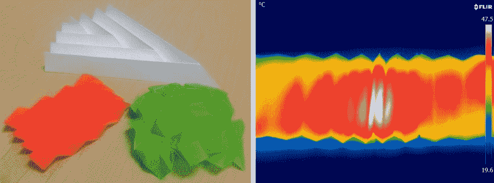

# 来自美国宇航局的折纸启发散热器可以改变形状来温暖或冷却微型卫星 

> 原文：<https://web.archive.org/web/https://techcrunch.com/2017/01/31/origami-inspired-radiator-from-nasa-could-change-shape-to-warm-or-cool-tiny-satellites/>

我们送入太空的设备变得越来越小越来越轻，这意味着体积庞大的静态组件的空间越来越小。灵活性和紧凑性开始流行，这个原型卫星辐射器的灵感来自最紧凑和灵活的艺术:折纸。

当然，普通的散热器有助于散发太阳或车载电子设备产生的热量。但是它的形状和大小，因此在一定程度上它的能力，是在制造时设定的。

戈达德太空飞行中心和杨百翰大学的研究人员正在研究一种散热器，这种散热器可以根据需要折叠或膨胀，以加快或减缓散热速度，因为它的操作者认为合适。

例如，当卫星的传感器在某一基准温度下工作得最好时，这是有好处的；在太阳炙烤的一半轨道上，它可能会努力保持凉爽，而在阴暗的一半轨道上，它可能会降至理想温度以下。散热器可以在热的时候膨胀以迅速散热，在冷的时候收缩以防止散热过多。

其他潜在的褶皱模式，以及显示热量如何在更深的褶皱中被更多吸收的热成像。

辐射器(至少在一个当前设计中，其模型显示在顶部)由镶嵌的 3D 钻石图案形成。如果你下定决心，你可以想象它折叠起来形成一个宽而平的表面，或者收缩成一个厚而窄的平板。这有点像之字形手风琴图案，但材料意味着普通的手工折叠不是一种选择。

BYU 教授 Brian Iverson 和 BYU 研究生 Rydge Mulford 设计了散热器的形状——Iverson 告诉我米乌拉 Ori 或 Barretto Mars folds 也在考虑之列——但它的表面有一种特殊的 Goddard 风格。

Vivek Dwivedi 和马里兰大学的 Raymond Adomaitis 正在研究一种全新的涂层，这种涂层由氧化钒制成，并在原子薄层中加入银和钛。涂层会在极低的温度下从半导体状态转变为金属状态:华氏 154 度，甚至可能更低。在金属状态下，其发射率增加，进一步提高了散热器的散热能力。

现在还为时尚早，但是在这两项进展之间，部署在同一设计上，研究人员希望重新发明小型卫星和航天器如何保持凉爽或温暖。

“这种方法有可能成为热设计的游戏规则改变者，”Dwivedi 在戈达德新闻发布会上说。"我们的目标是用动态散热器取代传统散热器，就这样."