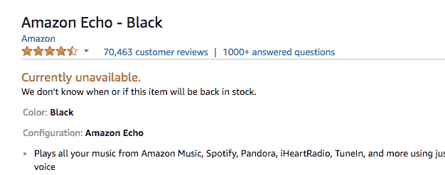

# 原版 Echo 在亚马逊上缺货，有传言称这款新设备将挑战 HomePod 

> 原文：<https://web.archive.org/web/https://techcrunch.com/2017/08/29/original-echo-is-out-of-stock-on-amazon-amid-rumors-of-a-refreshed-device-to-challenge-homepod/>

# 最初的 Echo 在亚马逊上缺货，有传言称将推出一款新设备来挑战 HomePod

Whole Foods 首次亮相[一天后，](https://web.archive.org/web/20221207030425/https://beta.techcrunch.com/2017/08/28/amazon-marks-its-territory-at-whole-foods-by-selling-farm-fresh-echo-devices-in-select-stores/)[最初的 Echo 不再在亚马逊网站上销售](https://web.archive.org/web/20221207030425/https://www.amazon.com/dp/B00X4WHP5E/ref=fs_ods_fs_ha_dr)，这一举动可能表明一种新设备即将到来。时机当然是正确的。原版 Echo 早就该升级了。自从两年前进入市场以来，智能助理几乎无人问津——尽管像 Dot 这样的其他设备已经经历了几代。

亚马逊最近也在积极频繁地对智能音箱打折，在 Prime Day 将其减半，并在昨天的庆祝活动中将标价降低 70 美元。这一时间意味着新的 Echo 可能会在假期及时推出，与最近增加的内容(如体育展示)放在一起。

当然，值得一提的是，过去 Echo 也曾缺货。刚刚过去的假日季有一个巨大的推动，所以有一些可能性是，该公司只是难以跟上其大幅折扣的需求。

上个月，有消息称亚马逊正在开发一款名为的[高级版设备，旨在挑战苹果的 HomePod，拥有更好的声音、布面和更小的占地面积。这种产品是会成为不断壮大的亚马逊大家庭的又一成员，还是会完全取代 Echo，还有待观察。](https://web.archive.org/web/20221207030425/https://beta.techcrunch.com/2017/07/13/amazon-said-to-be-working-on-a-premium-version-of-the-echo/)

尽管如此，便宜得多的 Dot 的出现以及第三方设备完整的 Alexa 功能的加入，使得最初 180 美元的 Alexa 有点多余。也许该公司只是在 Echo 家族中看不到原创的空间，现在有这么多其他选择。

我们已经联系了亚马逊进行评论。