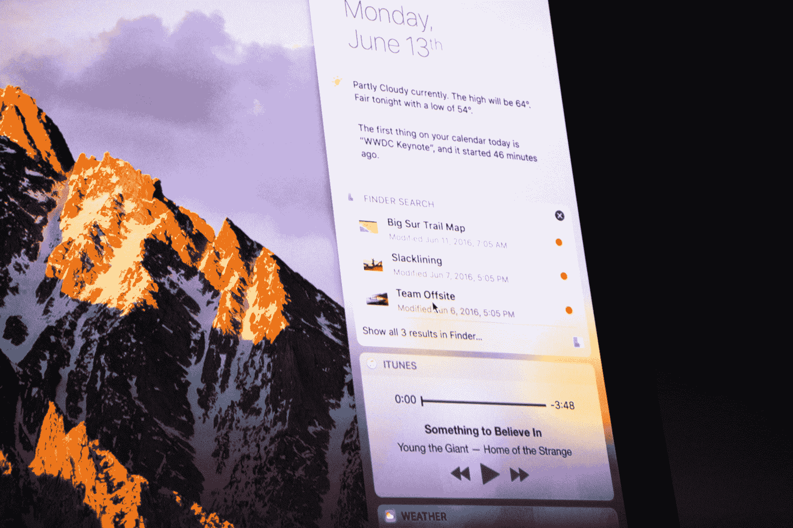
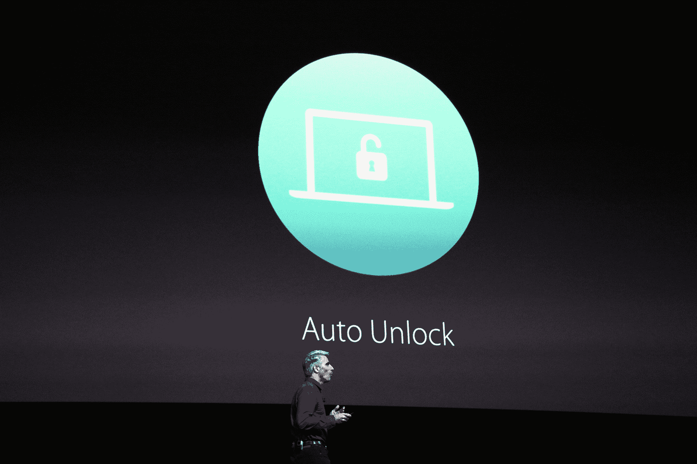
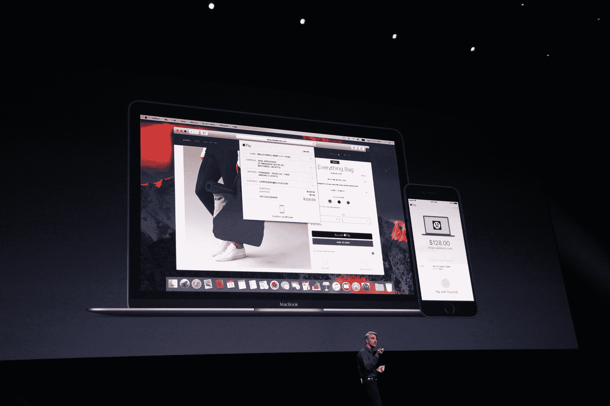

# OS X 现在是 macOS，支持 Siri、自动解锁等技术

> 原文：<https://web.archive.org/web/https://techcrunch.com/2016/06/13/os-x-is-now-macos-and-gets-support-for-siri-auto-unlock-and-more/>

# OS X 现在是 macOS，支持 Siri、自动解锁等等

如果苹果的命名方案开始困扰你(iOS、tvOS 和 watchOS 在 OS X 使用不同的命名规则)，不要再烦恼了。正如苹果公司今天宣布的那样，OS X 将获得一个新名字，这将使苹果公司的命名更加有序。

看看 OS X 的新名字:马科斯。因为这也是 OS X/macOS 的新版本——而且苹果决定坚持使用它在加州的名字——这个新版本的全名是 macOS Sierra。

正如[所料](https://web.archive.org/web/20230127141259/http://www.macrumors.com/2016/05/18/siri-for-mac-os-x-10-12-dock-icon/)，这个新版本的 macOS 终于将对 Siri 的支持带到了桌面上。要启动 Siri，它今天也有自己的改进，你所要做的就是说“嘿 Siri”，苹果适度有用的人工智能助手将随时为你服务。

苹果表示，Siri 将能够帮助你在 Mac 上查找文件和发送信息，而且因为它在后台工作，它还可以帮助你在全屏模式下使用其他应用程序时执行任务。

【T2

macOS 中的另一个新功能是当你的 iPhone 或 Apple Watch 靠近它时，可以自动解锁你的 Mac(类似于谷歌在 ChromeOS 上的[智能锁](https://web.archive.org/web/20230127141259/https://support.google.com/chromebook/answer/6070209?hl=en))。苹果将这一功能称为“自动解锁”。

苹果公司称之为通用剪贴板也是新的。这使得用户可以访问一个可以在 iOS 和 macOS 上运行的剪贴板。此外，苹果正在增加对 iCloud Drive 的改进支持，现在可以让文件更容易在各种设备上使用。通过此次更新，苹果现在还允许你轻松地将旧文件转移到云中，以便释放本地机器上的空间。

此外，如果你使用多台 macOS 电脑，苹果现在也会在它们之间同步你的桌面。其他新功能包括在浏览器中支持 Apple Pay。要进行身份验证，您可以在 iPhone 上使用 TouchID。该公司今天宣布的次要但有用的功能还包括在 macOS 上的几乎每个应用程序中添加类似 Safari 的标签。

该更新将于 7 月向测试用户推出，并将于秋季向所有 OS X/macOS 用户免费提供。

