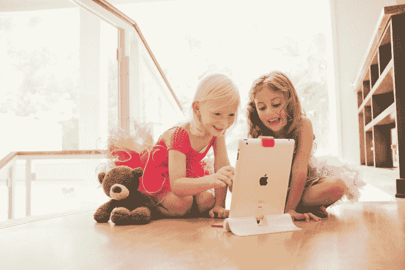

# Osmo 为其基于硬件的儿童 iPad 游戏筹集了 1200 万美元

> 原文：<https://web.archive.org/web/https://techcrunch.com/2014/10/16/osmo-raises-12-million-for-its-hardware-based-ipad-game-for-kids/>

该公司今天宣布，由前谷歌员工(和爸爸们)制造的 iPad 驱动的游戏设备 Osmo 已经筹集了 1200 万美元的首轮融资，旨在将平板电脑变成更具“动手能力”的玩具。这轮融资由 Accel Partners 的 Rich Wong 领投，包括来自 prehand Ventures 和 K9 Ventures 的投资。该公司还宣布，其产品目前在网上销售，也将在美国和加拿大的 284 家苹果商店销售。

该游戏套装也将在美国的[弹珠玩具店](https://web.archive.org/web/20230403091404/http://www.marblesthebrainstore.com/)出售，该店在[有许多分店](https://web.archive.org/web/20230403091404/http://www.marblesthebrainstore.com/locationeventmapping.aspx)，主要位于加州东北部和南部。

就在一个月前，Osmo [宣布其基于硬件的 iPad 游戏已经远远超过了销售目标，销售了 200 万美元的预订单，其中包括来自 2000 多所学校的订单。](https://web.archive.org/web/20230403091404/https://techcrunch.com/2014/09/18/after-2m-in-pre-orders-osmo-starts-shipping/)

该公司于 2013 年初由 Pramod Sharma(T8)和 jérme Scholler(T11)创立，Pramod Sharma 曾帮助构建谷歌的图书扫描机，jérme Scholler 曾在谷歌工作，负责 Android 版 Chrome。其游戏套件中的硬件包括一个可以扣在 iPad 顶部的反光摄像头，一个支架，以及字母拼图和拼图形状等物理游戏部件。相机看到放在它面前的物体，然后利用这种能力将现实世界的游戏和虚拟游戏结合起来。

例如，Osmo 的文字游戏在屏幕上显示一个混乱的单词，然后玩家比他们的朋友更快地排列他们的字母瓷砖来拼出这个单词。在另一个游戏中，玩家排列拼图块以匹配屏幕上的形状。

Accel 在教育、移动和游戏领域有大量投资，这使得它非常适合领投 Osmo 的 A 轮投资。这种经历包括 Lynda.com、Educreations 和 Wyzant 等教育公司，以及 Supercell、Rovio、Playfish、MoPub、AdMob、Tune 和 SwiftKey 等移动和游戏公司。

Wong 告诉 TechCrunch:“Osmo 技术整合了物理和数字空间，我们对此感到兴奋，并相信这可以应用于教育、游戏和其他形式的娱乐。”“我们当然相信这超越了 Osmo 到目前为止的第一阶段体验，”他补充道。

Osmo 的首批游戏包括上面提到的益智游戏(Tangram)和文字游戏(Words)以及一个创意绘图游戏(Newton)。但该公司还计划开放其平台，以允许新的标题和定制。它已经在[my.playosmo.com](https://web.archive.org/web/20230403091404/http://my.playosmo.com/)推出了一个网站，允许任何人上传自己的图片和单词表来定制 Osmo 目前的游戏，首席执行官 Pramod Sharma 此前表示，允许第三方开发者为 Osmo 开发游戏也是其长期路线图的一部分。

Osmo 的游戏套装在预购时售价为 49 美元，零售价格为 99 美元。目前是 79 美元。来自 150 多所学校的数百名教师已经在他们的教室里使用这款游戏，其中许多都在该队的大本营帕洛阿尔托。

然而，对于 Accel 来说，鼓励其投资的是这样一个事实，即 Osmo 似乎找到了一种不仅引起消费者兴趣的产品，而且观众也热切地购买了该产品，甚至在预订时也是如此。

“在这么短的时间内吸引了 200 多万美元的资金，苹果公司对分销的兴趣是一个很好的迹象，表明了人们对这一第一阶段产品的兴奋和产品/市场的适应性，”Wong 说。