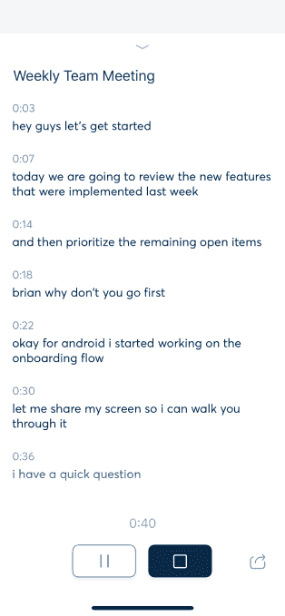
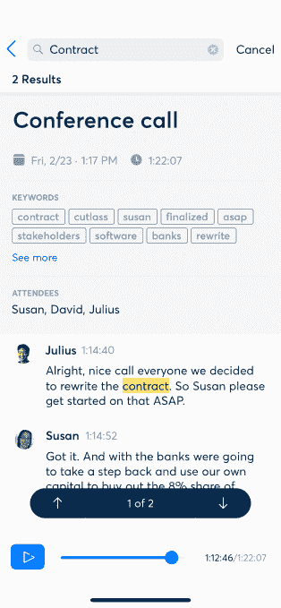
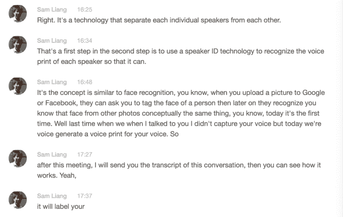
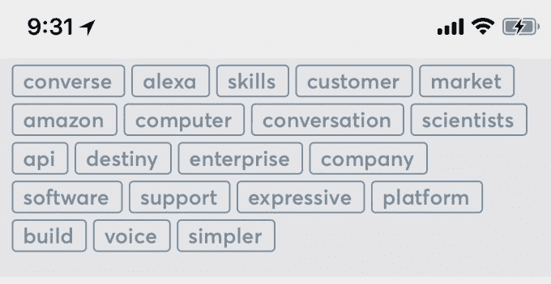

# Otter 的新应用可以让你记录、转录、搜索和分享你的语音对话 

> 原文：<https://web.archive.org/web/https://techcrunch.com/2018/02/26/otters-new-app-lets-you-record-transcribe-search-and-share-your-voice-conversations/>

今天发布的一款名为 [Otter](https://web.archive.org/web/20221006184108/https://otter.ai/) 的应用希望让搜索你的语音对话像搜索你的电子邮件和短信一样简单。创建一个新的语音助手，专注于记录日常对话——如会议和采访——的想法来自前谷歌架构师 Sam Liang，他在谷歌地图上放置了蓝点，后来将他的下一家公司位置平台 [Alohar Mobile](https://web.archive.org/web/20221006184108/https://www.crunchbase.com/organization/alohar-mobile#section-overview) 出售给阿里巴巴。

梁的新公司 [AISense](https://web.archive.org/web/20221006184108/http://aisense.com/) 与来自谷歌、、Nuance、雅虎以及斯坦福大学、杜克大学、麻省理工学院和剑桥大学的团队一起，在过去两年中一直在开发支撑 Otter 的技术。

本质上，一个提供自动转录的录音机，Otter 被设计成能够理解和捕捉多人之间的长形式对话。

这是一种不同于今天为语音助手开发的语音技术——就像 Alexa 或谷歌助手一样。

“现有的技术还不足以进行人与人之间的对话，”梁解释道。“谷歌的语音 API 已经被训练来优化语音搜索，”他说，并补充说，当人们与语音助手交谈时，通常只有一个人在说话，他们往往比平时说得更慢更清楚。他们也经常问一些简短的问题，比如“天气如何？，“不要进行冗长的谈话。

“人际交往要复杂得多，”梁说。“它通常涉及至少两个人，而这些人可能会谈上一个小时。这是一次长谈。”

Otter 的目标是捕捉这些对话——会议、采访、讲座等。–并将它们转化为可搜索的档案，在这里，所有的内容都可以立即被 AISense 的软件转录下来。

如今，通过 Otter 面向 iOS 和 Android 的新移动应用，以及支持文件上传以进行即时转录的网络界面，这一切都成为可能。

要使用该应用程序，除了按下“录制”按钮之外，你什么都不需要做。语音对话被录制下来，然后可以播放与转录文本同步的音频。你也可以从应用程序中与他人分享录音。奥特创建的数据以加密格式存储在云中。

包括语音识别在内的整个技术体系都是内部构建的。梁说，该公司没有使用现有的语音识别 API，因为他们希望提高准确性，并为多个说话者进行优化。

为了识别其他人何时开始说话，AISense 使用了一种称为二进制化的技术来分隔每个单独的说话者；然后它会为每个人的声音生成一个声纹。从广义上讲，这就像声音相当于面部识别，声纹被用来识别说话者。

梁说，建立一个像水獭的系统是不可能的。

“四年前，深度学习和人工智能取得了巨大的进步，突然间，准确率变得更高了，”他指出。“它还需要大量的 CPU 能力、GPU 能力和大量存储…与五年或十年前相比，这些在今天变得更加经济实惠，”梁补充道。

该系统在推出时并不完美，但显示出很大的潜力。

从我在有限测试中看到的情况来看，人工智能技术能够像承诺的那样区分说话者，但它无法捕捉到对话的每个词。它有时也会漏掉确切的单词——例如，将“helps”这样的单词的“s”去掉，而将其记录为“help”。

回读转录让我想起了在 iPhone 上阅读转录的语音邮件——你得到了所说内容的要点，但你必须回放才能真正理解信息。

也就是说，Otter 能够在现实环境中工作。我对它进行了测试，例如，在一家播放音乐的咖啡店里，它仍然能够在一定程度上捕捉到所说的内容。

然而，由此产生的文字记录奇怪地打断了演讲。句子在正中间被截断，抄本中的下一行在新的一行继续句子。这使得我们更难从头到尾读一遍，因为我们的大脑被训练成把新的一行看作新的一段——或者至少是停顿。

但是这个系统对于找到长录音的正确部分很有用，所以你可以更仔细地转录关键部分或引用。

我喜欢的是抄本顶部的标签云，在那里奥特找出了在对话中经常使用的词。你可以点击这些单词跳到转录的那一部分。

梁设想了 AISense 技术的许多潜在使用案例，包括在企业、医疗保健、教育等领域。

该公司已经将其转录技术授权给网络会议平台 [Zoom](https://web.archive.org/web/20221006184108/https://www.crunchbase.com/organization/zoom-video-communications) ，但目前的目标不是通过授权业务来创收，而是一个企业版的 Otter，它将提供更多的控制，以及目前免费版本的消费者应用程序的高级版本。

未来的版本将允许记录电话，但目前，该应用程序专注于面对面的对话。

到目前为止，AISense 已经筹集了 1300 万美元的资金。Horizons Ventures 是 Viv、DeepMind、Siri、Slack 和其他公司的支持者，领投了 1000 万美元的首轮融资。参与的还有 Bridgewater Associates、i-Hatch Ventures、MetaLab、Jay Markley 和波士顿投资者 Jim Pallotta 和 Stu Porter。

种子投资者包括 Tim Draper through Draper Associates 和 Draper Dragon 戴夫·莫兰通过慢冒险；[大卫·谢瑞登；](https://web.archive.org/web/20221006184108/https://www.forbes.com/sites/ryanmac/2012/08/01/professor-billionaire-david-cheriton/#70111e8c15de) SV Tech Ventures、丹华资本、500 Startups。

Otter 今天在 iOS 、 [Android](https://web.archive.org/web/20221006184108/https://play.google.com/store/apps/details?id=com.aisense.otter) 和 [web](https://web.archive.org/web/20221006184108/https://otter.ai/) 上直播。