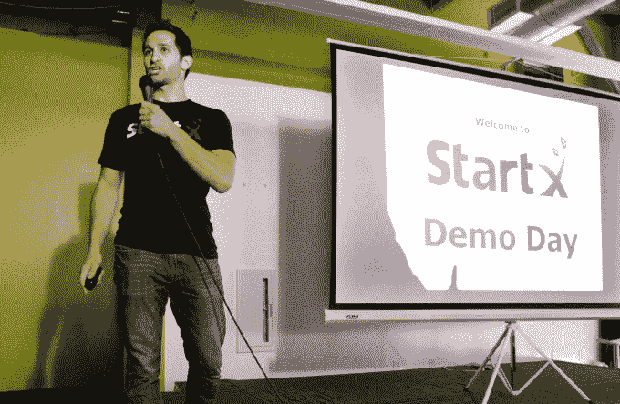

# 来自 StartX 2014 夏季演示日的四家最受欢迎的初创公司 

> 原文：<https://web.archive.org/web/https://techcrunch.com/2014/09/16/our-four-favorite-startups-from-the-startx-summer-2014-demo-day/>

# StartX 2014 夏季演示日我们最喜欢的四家初创公司

由斯坦福资助的附属孵化器 StartX 刚刚在其位于帕洛阿尔托的新办公场所举行了第一次展示日。在一个小时内，12 家初创公司向投资者和媒体推销他们的产品，展示从为中国侨民提供约会服务到新一代智能手机变焦镜头的产品和服务。

排名不分先后，这四家初创公司让我们在演讲时竖起了耳朵:

[near pod](https://web.archive.org/web/20221006140711/http://nearpod.com/)–教师在课堂上使用的移动平台。Nearpod 可以轻松地将演示分发到学生碰巧可以使用的任何平台上，而不是要求教师将一堆工具混合在一起以配合学校的 IT 设置。这家初创公司指出，该平台上有超过 2000 份演示文稿，教师们已经在使用它向超过 500 万名学生展示这些演示文稿。

[Gridspace](https://web.archive.org/web/20221006140711/http://www.gridspace.com/)–捕捉业务语音交流，高保真转录，并提取重要事实。对于任何看过谷歌语音试图转录语音邮件的人来说，这将是非常令人印象深刻的，因为大型企业可以信任它来保存记录。

[野餐健康](https://web.archive.org/web/20221006140711/https://picnichealth.com/)——为癌症患者整理医疗记录:给他们你的医生的名字，他们收集记录，组织并整理成一个时间表，并为每个医生处理当天的最新情况。从美国有 1400 万癌症患者开始，该公司希望推动医疗记录从简单地在每个医生的计算机上数字化到真正可供需要的人在需要时查看。

[Eko 设备](https://web.archive.org/web/20221006140711/http://ekodevices.com/)–捕捉听诊器读数作为音频数据，可以存储并在医生之间发送。他们甚至为传统的听诊器创建了一个附件，允许医生使他们的模拟设备能够发送数据。