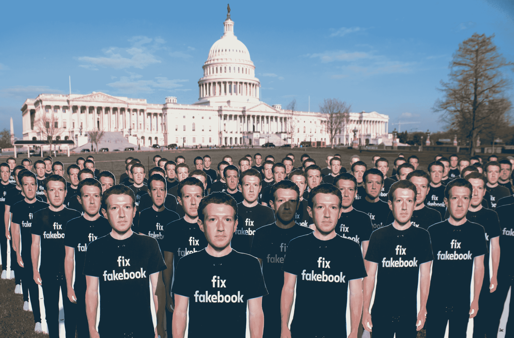

# 我们的“现代”国会不了解 21 世纪的技术

> 原文：<https://web.archive.org/web/https://techcrunch.com/2018/05/06/our-modern-congress-doesnt-understand-21st-century-technology/>

罗蕾莱·凯利撰稿人

More posts by this contributor

罗伯特·比雅纳松撰稿人

本月早些时候，当脸书创始人兼首席执行官马克·扎克伯格在众议院和参议院小组面前作证时，他解释了他的公司如何使用数百万美国人的数据。这一系列听证会非常紧急，因为我们的当选领导人已经意识到脸书隐藏的网络知识宝库中的力量——它侵犯隐私的潜力以及它对我们民主制度的完整性构成的威胁。

脸书是一家出售社交关系的公司；它的算法是为定向广告设计的。用户通过朋友、喜欢和分享提供的数据使该公司的模式有利可图。但是把一个人和一双鞋联系起来不能是我们用来建立一个有凝聚力的民主社会的同样的参与算法。关注国会山的任何听证会。

这是领导人和公民之间的一座持久而古老的桥梁。知情的深思熟虑可能会更有说服力，但它永远无法与有趣的 gif 和有针对性的视频在同一领域竞争。为商业参与而优化的算法不会像民主话语那样保护公共产品。它们是为股东而非公民建造的。相反，他们可以利用和破坏民主最宝贵的资源——公民信任。

2018 年 4 月 10 日，脸书创始人兼首席执行官马克·扎克伯格的一百个纸板剪影站在 DC 华盛顿的美国国会大厦外。倡导组织 Avaaz 呼吁关注该组织所说的仍在传播脸书虚假信息的数亿虚假账户。(图片:索尔·勒布/法新社/盖蒂图片社)

国会是世界上最强大的代表大会。然而，像美国政府的许多部门一样，它没有足够的 21 世纪技术知识或现代的数字基础设施供公民输入，更不用说互动了。在我们找到保护公民参与数据的替代方案之前，依赖于出售社交关系的主流商业模式将继续等同于露天开采民主。

如果我们认为可以将公司盈利模式用于公民生活，我们将会得到越来越粗糙和不稳定的公共生活。恶意是廉价的，而阴谋规模迅速扩大。与可信的新闻相比，垃圾新闻花费很少。当点击成为货币时，达成销售的最短路径就是粗俗或大喊大叫，这通常会完全阻止包容性参与。的确，人群有时会很吵闹。但是我们的民主机构理应对这种行为进行节制，而且他们比私营部门落后几十年，这其中还纠结于 [【网上文明礼貌标准】](https://web.archive.org/web/20221127132502/https://www.newyorker.com/magazine/2018/03/19/reddit-and-the-struggle-to-detoxify-the-internet) 。

另一个挑战是我们的民主体制缺乏应对数字世界的能力。几十年来， [国会一直在整肃自己的专长，尤其是在技术上。](https://web.archive.org/web/20221127132502/https://www.princeton.edu/~ota/) 结果就是在政策上比不上白宫，比以往更依赖说客们狭隘的视角。国会确实提供了大量信息，但就像香蕉共和国的数据一样，它缺乏资源来为自己的工作流程购买分析产品或为自己创建一个有竞争力的版本。

我们为民主建设现代参与能力的时间拖得越久，越多的公民将为此付出代价。在一个充斥着 匿名资金的政治体系中，国会没有建立一个完整的引擎来审计数据转化为政策的供应链。这并没有优化国会山未被充分利用的公众服务能力。其实是 [远超](https://web.archive.org/web/20221127132502/https://xml.house.gov/resources/TechTimeline.htm) 热铅型。即使是计算机科学实习生仍然带着三个活页夹，里面装满了要签名的硬拷贝信件。

国会因为脸书听证会受到了很多关注——大部分是负面的。但是，美国人不应该关注对马克·扎克伯格的不当审讯，而应该考虑丰富民主话语的创造性可能性。

如果三分之一的委员会听证问题对来自众议院或参议院任何一方的具有专业知识的同事开放，会怎么样？向委员会成员地区的经过核实的公民提出一个预备性的“问题挑战”怎么样？一个在听证会上审查和整合观众反馈的策展平台怎么样？不如来个新问题的堆叠交换，这样我们这些在远处看的人就可以对它们进行排序了。此外，为什么国会还没有为每个委员会提供计算智能能力——一种可以实时或异步地帮助人类工作人员处理复杂输入的能力？

这个未来梦想是一座陡峭的山，但并非不可能。在我们的管理机构开发出公共服务标准和系统之前，让我们跟随真正现代民主国家的领导，将我们国家的公民参与数据放在安全而不出售的地方——放在我们的集体手中。国会和我们其他人的当务之急是恢复公民信任。关于谁应该成为 21 世纪民主的信息中介的一系列后续听证会怎么样？

鉴于当前的国际政治气候，多边谈判是另一座需要攀登的陡峭山峰。但我们过去曾在国外寻找共同的良好规范。我们现在可以从认识到开放的民主标准是权力和影响力的现代来源开始。冰岛创建了一个 [公民非营利组织](https://web.archive.org/web/20221127132502/https://www.citizens.is/) 来吸引公民并保护他们的数据。 爱沙尼亚已经给 [网上商家赋予了数字身份。](https://web.archive.org/web/20221127132502/http://links.newsletters.wired.com/ctt?kn=10&ms=MTMyNjc3MzkS1&r=MjM5Njc3NDYxOTk1S0&b=0&j=MTM4MDU0MTQyNQS2&mt=1&rt=0) 从下个月开始，脸书将遵守 [欧盟的隐私规则](https://web.archive.org/web/20221127132502/https://www.eugdpr.org/) 适用于美国、欧洲和加拿大。在这个民主的声誉岌岌可危的世界里，确定并坚持这些有希望的做法至关重要。

不幸的是，脸书听证会让我们回到了熟悉的俄国与西方对抗的旧框架。但值得记住的是，在上个世纪，民主是如何因为离岸规范而赢得冷战的。

43 年前，35 个国家的领导人聚集在芬兰，合作缓和与当时由苏联主导的东方集团的紧张关系。由此产生的 [赫尔辛基协议](https://web.archive.org/web/20221127132502/https://history.state.gov/milestones/1969-1976/helsinki) 倡导法治和人权。这些西方民主规范成了东欧持不同政见者的路标。在当时的捷克斯洛伐克， [宪章 77](https://web.archive.org/web/20221127132502/http://chnm.gmu.edu/1989/items/show/628) 运动从揭露他们的政府——协议的签署者——的虚伪中汲取力量。随着 1989 年柏林墙的倒塌，这些规范最终获得了成功。

为了生存，民主社会需要信任的关系。他们还需要可信、有能力的机构。如果我们美国人想要重建我们的国家信心，我们将需要一个为人类尊严而不是公司金钱优化的数字参与系统。第一步是国会——我们最民主的机构——为自己的数字能力提供资金。即便如此，它也需要值得信赖的、保护隐私的合作伙伴。

没有让积极参与的公民赚钱的首次公开募股，只有一个足够团结的社会来继续对话，即使很多人已经厌倦和愤怒。一旦我们决定保护公众的信任，我们就能成功，甚至再次领导。但是要谨慎地抱有希望，套用本杰明·富兰克林 的话，让我们将民主的公民数据规范离岸，直到我们自己能够保持它们。