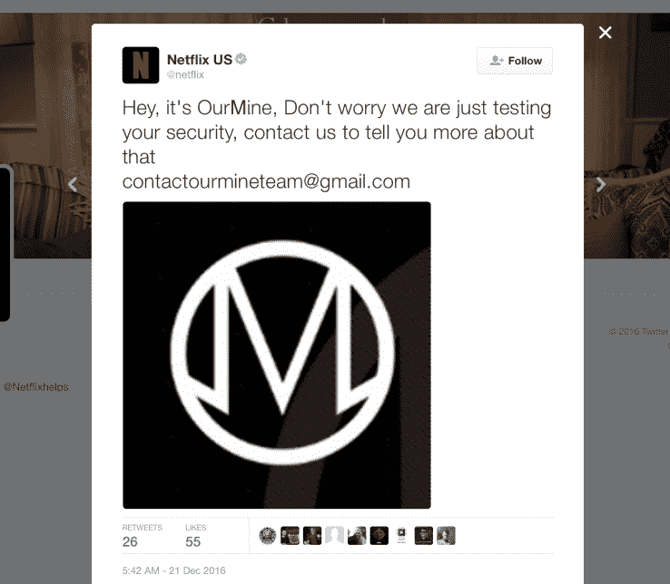

# OurMine 黑了网飞、漫威的推特账户

> 原文：<https://web.archive.org/web/https://techcrunch.com/2016/12/21/ourmine-hacks-netflixs-u-s-twitter-account/>

# 我们的矿黑了网飞，漫威的推特账户

OurMine 又故技重施，对网飞的美国官方 Twitter 账户发起了攻击。黑客团队在过去一年左右的时间里接管了许多备受瞩目的 Twitter 账户，包括谷歌的桑德尔·皮帅、演员查宁·塔图姆以及我们。

根据我们自己的 Kate Conger 在[的调查，该团队由一小群年轻人组成(其中一人可能是](https://web.archive.org/web/20230315011536/https://techcrunch.com/2016/06/27/our-mine-hacks-sundar-pichai/)[沙特少年](https://web.archive.org/web/20230315011536/https://www.buzzfeed.com/josephbernstein/this-saudi-teen-is-probably-behind-the-hacks-of-dozens-of-te?utm_term=.auJ2q41YW#.mb33qEgp9)),他们声称的任务是测试拥有大量追随者和潜在影响力的账户的密码强度。OurMine 通常在获得一个帐户的访问权限后不会做太多事情，只是发布消息，建议帐户所有者通过电子邮件地址联系他们，以获得更多关于如何实施更好的安全措施的信息。

OurMine 似乎是通过测试属于这些高调漏洞的各种帐户来使用弱密码的，这些弱密码可能在今年早些时候 LinkedIn 密码泄露等黑客攻击导致的以前的凭据转储中泄露。黑客组织可能会直接控制目标的 Twitter 账户或网站，或者利用相关应用和服务将内容间接推送到这些目的地。

截至今天早上，网飞的 Twitter 账户已经发布了一些我们的矿创建的消息，其实际的社交团队显然正在尽快删除它们。在这种情况下，即使改变你的主要密码也可能无法阻止访问，因为之前有授权的应用程序连接到 Twitter——偶尔检查一下[哪些应用程序被授权访问你的帐户并关闭不必要的应用程序是个好主意](https://web.archive.org/web/20230315011536/https://support.twitter.com/articles/76052)。

**更新:** Marvels 的 Twitter 账户也在周三晚些时候被 OurMine 接管，并发布了一条类似的信息，内容是就他们的安全寻求帮助。同样，这很可能是由于泄露的凭证中重复使用了密码——因此，如果您认为自己可能处于同一条船上，请更改这些密码。