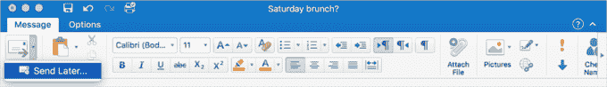
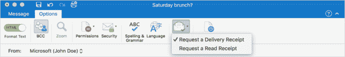

# Outlook 2016 for Mac 现在允许您稍后发送电子邮件、跟踪消息等 

> 原文：<https://web.archive.org/web/https://techcrunch.com/2017/06/19/outlook-2016-for-mac-now-lets-you-send-emails-later-track-messages-more/>

微软今天早上[宣布](https://web.archive.org/web/20221208233157/https://blogs.office.com/2017/06/19/outlook-2016-for-mac-is-adding-your-most-requested-features/)为 Office 365 用户推出的 Outlook for Mac 2016 软件将推出一系列新功能，包括允许你安排电子邮件、跟踪邮件发送、查看邮件是否被阅读等。一些变化首先向那些通过微软的 Office Insider Fast 计划接收早期更新的人推出，而其他新添加的内容，如电子邮件模板，将于今天发布。

一段时间以来，Outlook 一直支持跨平台的其他版本的软件，包括 Outlook 2007、2010、2013 和 2016，通过邮件选项菜单中的[“延迟交付](https://web.archive.org/web/20221208233157/https://support.office.com/en-us/article/Delay-or-schedule-sending-email-messages-026af69f-c287-490a-a72f-6c65793744ba)”功能来安排交付。

然而，Office for Mac 2016 中新的“稍后发送”功能在发送按钮本身旁边添加了一个下拉菜单。点击此选项后，您可以选择发送电子邮件的日期和时间，该日期和时间会保存在您的草稿文件夹中。

Outlook 2016 for Mac 的另一个新功能是支持发送邮件时的送达和已读(已打开)回执。

不过，微软指出，电子邮件收件人可以选择拒绝发送已读回执。这意味着该功能不会取代市场上更先进的电子邮件跟踪解决方案，后者倾向于使用跟踪像素等更隐蔽的策略来确定邮件何时被打开。

更新后的软件也将支持电子邮件模板，以及将电子邮件转换为日历事件的能力，只需将电子邮件拖放到日历上即可。这将把电子邮件主题转换为日历主题，而电子邮件的正文则填充到事件的注释字段中。如果你愿意，同样的拖放操作也可以将电子邮件转换成任务。

设置新帐户现在也更容易了，因为你不再需要知道你有什么类型的帐户(如 Office 365、Exchange、IMAP 或 POP)，如果你在使用 Outlook 之前登录了其他 Office 应用程序，软件只会提示你添加现有帐户。

该公司表示，它根据用户反馈优先考虑首先推出哪些产品，这些新增功能代表了四个最受欢迎的功能。

大多数功能现在都可以使用。

微软表示，今天，15.35 版本(170610)的所有 Office 365 订阅者都可以使用请求发送和阅读回执、电子邮件模板以及从电子邮件创建日历事件和任务等附加功能。15.34 版本的所有 Outlook Mac 用户都可以使用改进的帐户设置体验(170515)。

然而，“稍后发送”首先在 15.36 版本(170606)上向 Office Insider Fast 用户提供，但要到 7 月份才会向所有 Office 365 订户提供。