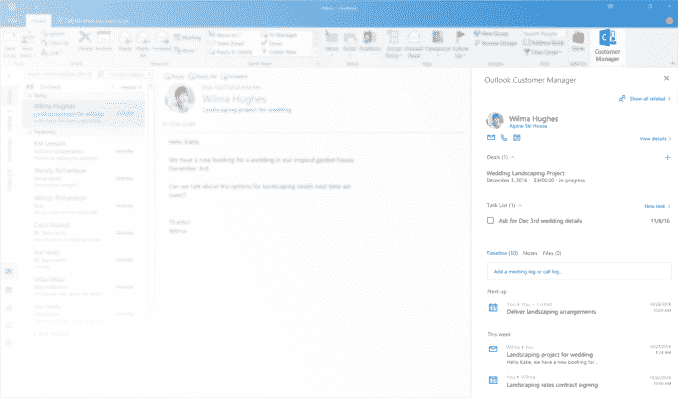

# Outlook 拥有自己的轻量级 CRM——Outlook 客户经理 

> 原文：<https://web.archive.org/web/https://techcrunch.com/2016/11/14/outlook-gets-its-own-lightweight-crm-outlook-customer-manager/>

微软今天正在为使用 Office 365 和 Outlook 的企业主推出一款名为 Outlook Customer Manager 的新工具，这是一款轻量级 CRM，适用于需要跟踪客户互动和历史记录，但尚未准备好使用 Dynamics 365 等更强大平台的公司。该公司表示，新工具让企业可以直接在 Outlook 中跟踪任务和交易的进展，并将弹出提醒，旨在帮助他们掌握客户关系。

启用后，Outlook 客户管理器将自动组织客户信息，包括电子邮件、会议、电话、笔记、文件、任务、交易和截止日期。这些信息是从电子邮件、日历和通话记录数据中收集的，以时间轴的形式显示在收件箱旁边。

为了利用该系统，企业可以将某些任务与联系人、公司或交易相关联，以便他们能够以更及时的方式与客户互动。它还能按阶段、截止日期、优先级和金额列出交易清单。此外，该技术能够区分哪些客户和交易是最重要的，然后以“聚焦”列表的形式呈现，以帮助进行时间管理。

聚焦功能在某种程度上类似于 Outlook 的聚焦收件箱，它有助于优先考虑需要首先阅读的电子邮件。

除了通过 Outlook 熟悉的界面更方便快捷地与客户保持联系之外，该系统的另一个优势是，它可以帮助团队处理客户来电和查询，即使客户的原始联系人生病或休假。公司中任何能够使用新客户经理软件的人都可以访问所有电话记录、会议日期和交易阶段细节。

该功能将在桌面和移动设备上提供，首先从 iOS 开始，然后再扩展到其他移动平台。它可以从 Outlook 收件箱的“主页”选项卡中获得，跟踪的数据仍保留在 Office 365 中。

如果在某个时候，如果公司变得更大，他们可以升级到 Dynamics 365，它可以提供增强的客户信息以及更深入的见解。但是许多较小的组织不需要——或者可能永远不需要——这样的解决方案，这使得他们转向其他第三方提供商寻求轻量级 CRM。

在此之前，今年早些时候又推出了另一项服务，也是针对小企业的预订服务。该软件补充了这一新版本，帮助企业安排与客户的约会，并自动提醒约会。

Outlook Customer Manager 今天将免费为 Office 365 Business Premium 计划的用户添加，首先是第一个发布计划中的用户，几个月后将在全球推出。