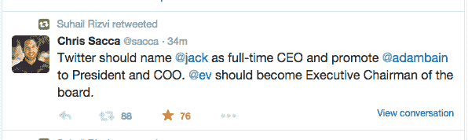

# 直言不讳的投资者 Chris Sacca 支持杰克·多西成为下一任 Twitter 首席执行官 

> 原文：<https://web.archive.org/web/https://techcrunch.com/2015/08/07/outspoken-investor-chris-sacca-backs-jack-dorsey-as-next-twitter-ceo/>

# 直言不讳的投资者克里斯·萨卡支持杰克·多西成为下一任 Twitter 首席执行官

随着 Twitter 接近选择下一任首席执行官，直言不讳的公司早期投资者克里斯·萨卡(Chris Sacca)宣布了他的个人选择。

当然是通过推特:

在一个由多个部分组成的推特风暴中，萨卡支持他希望多尔西重新掌权的理由。首当其冲的是他的产品愿景。Twitter 的前任首席执行官迪克·科斯特罗在六月宣布离职后于七月辞职。

他的“【Twitter 可以成为什么”博客帖子被分析师广泛引用，他们试图找出该公司在聘用下一任首席执行官时可能会走的方向。

Sacca 的“创始人看到未来”是许多人碰巧同意的一句话，因为随着更多在 Twitter 推出时不在身边的人的加入，关于 Twitter 是什么的困惑越来越多。

虽然 Sacca 支持 Dorsey 担任其永久首席执行官，但他对该职位的另一位候选人 Adam Bain 有很大的评价:

总而言之，听起来似乎 Sacca 觉得搜索已经成为一种干扰，是时候让未来的团队就位并开始工作了。他可能不是唯一同意的人，因为 Square 和 Twitter 的投资者[苏海尔·里兹维](https://web.archive.org/web/20230207060821/https://twitter.com/suhailrizvi)通过转发支持了萨卡任命多西的建议。

在上一次财报电话会议上，该公司没有提供寻找永久首席执行官的最新进展。Twitter 也显示出严重的增长乏力。两者都把投资者吓得屁滚尿流。

多尔西仍然是 Square 的首席执行官，据传该公司将于今年某个时候上市。萨卡觉得多尔西[能够也应该处理好这两项工作。听起来 Square 可能不会完全同意，因为今天](https://web.archive.org/web/20230207060821/https://twitter.com/sacca/status/629706676971573249)[彭博的一份报告](https://web.archive.org/web/20230207060821/http://www.bloomberg.com/news/articles/2015-08-07/dorsey-s-dilemma-running-twitter-seen-complicating-square-ipo)指出，该公司正在准备 B 计划，在没有多尔西掌舵的情况下继续前进。