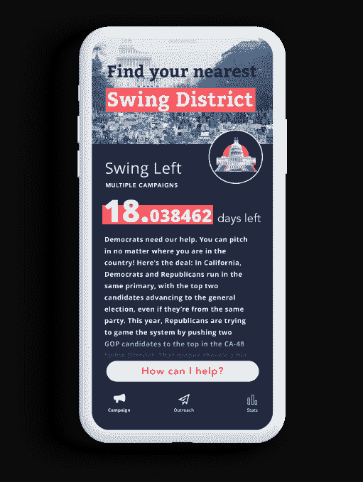

# Outvote 希望通过让民主党人给他们的朋友发短信来扭转选举

> 原文：<https://web.archive.org/web/https://techcrunch.com/2018/07/25/outvote-hopes-to-flip-elections-by-getting-democrats-to-text-their-friends/>

Y Combinator 支持的初创公司 Outvote 希望让草根风格的竞选活动变得更加简单和个性化，推出了一款应用程序，允许人们给朋友发短信提醒投票。这个想法是利用人们愿意使用社交分享来交流政治问题的意愿，同时利用在脸书发推特或发帖带来的简单性，并将其转化为可操作的提醒，实际上可以在关键时刻驱使人们去投票。

这家初创公司的创始人是[纳西姆·马基亚](https://web.archive.org/web/20230315095316/https://www.linkedin.com/in/naseem-makiya-36522a31/)，他是一名哈佛毕业的软件工程师，拥有初创公司的背景，包括总部位于旧金山的 Moovweb 和剑桥地区的 DataCamp 与[一起的还有 Nadeem Mazen](https://web.archive.org/web/20230315095316/https://www.linkedin.com/in/nadeemtron/) ，一位麻省理工学院的毕业生和交互设计师，他曾经[与 OK GO](https://web.archive.org/web/20230315095316/http://www.mtv.com/news/2296751/ok-go-last-leaf-video/) 合作过它的一个病毒音乐视频，现在拥有剑桥的创意机构 Nimblebot。

Mazen 后来以压倒性票数进入顾问职位，他也有更直接的政治经验，因为他自己竞选过公职。事实上，他亲身体验了每一张选票的重要性，他在 2013 年仅以六票之差赢得了剑桥市议会的席位。

他还将他的第二次选举胜利归功于组织低倾向、少数族裔和年轻选民——加上“真的通过我的朋友网络发了很多短信，做了很多外联工作，”Mazen 说。

当马赞的政治生涯结束时，他用类似的手段帮助其他人当选。后来，他和 Makiya 召集了一群哈佛和麻省理工的人，围绕他们正在使用的技术正式成立了一家公司。这变成了投票否决。

虽然今天有很多选民外展工具，但许多由知名组织运营的工具，例如 MoveOn，涉及人们选择接收来自相关群体的文本。Outvote 是不同的，因为它是一个工具，帮助个人选民接触他们自己的熟人、家人和朋友。

Makiya 解释说:“目前竞选活动的运作方式是，大部分预算都花在了投资回报率很低的广告上——它们在说服选民方面有一些效果，但对实际投票率的影响较小。“通过这种努力，我们正试图将政治带回更多的口耳相传和朋友之间的对话，”他说。

该团队去年夏天开始研究 Outvote 的技术，并于今年年初正式成立了该公司。

虽然个人是该应用的最终用户，但他们是通过活动被带入该应用的。

用户允许该应用程序上传他们手机上的联系人，这些联系人与注册选民数据库相匹配。这样的话，你只会给那些能在你的选区投票的人发短信。当匹配完成后，该应用程序有脚本，允许用户只需点击就可以用你自己的电话号码给你的朋友发信息。

换句话说，它不再是一个政治运动或组织通过短信来烦扰人们去投票——它是一个朋友。如果你的朋友对不请自来的短信有意见，他们必须告诉你。

该应用程序还使用某种基本模型来计算谁最适合发短信，基于过去的选民历史，此人是否倾向于在初选中投票，他们是否是注册的民主党人等等。

哦，是的，没错——这款应用只为民主党竞选而设计。

Outvote 毫无疑问是一种工具，旨在帮助民主党在美国各地赢回席位，无论是在地方还是国家层面。

“我们认为，民主党人开始投资和推广技术是非常关键的。“右翼在投资一些利基技术方面做得更好，”Mazen 说。“而且，很明显，像剑桥分析公司和人们这样的团体，我会说，在使用技术方面是不光明正大的，”他补充道。"因此，我们必须加倍努力，以加倍的决心."

该公司表示，它已经拒绝了希望使用其技术的右倾独立人士和共和党竞选活动，目前正在与大约 50 个民主党竞选活动进行试点。竞选活动将收取较低的月费来使用 Outvote，费用将根据竞选活动的规模而有所不同。然而，目前许多试点客户正在免费使用 Outvote。

目标是让 Outvote 比现有的群发短信服务更实惠，现有的群发短信服务每人每月收费高达 30 美分，这可能会在大规模竞选中花费数十万美元。它说，Outvote 的目标是每条短信 2-5 美分。

目前，它的重点是提高对候选人及其问题的认识，并让人们去投票。它不提供你在其他一些政治应用中可以找到的那种“给你的国会议员打电话”式的外联活动。

Outvote 还与运动合作社代表合作。美国，Flippable，民主党全国委员会，Vote.org 和左摇摆，根据其网站。

这家初创公司已经报告了一些早期的成功。去年 11 月使用时，它发现通过 Outvote 联系的千禧一代投票的可能性是两倍，而非千禧一代投票的可能性高出 50%。该公司还没有初选中的数据，但表示从参与的竞选活动中得到了很好的反馈。

除了 Y Combinator 的支持，Outvote 还在演示日之前从 [2enable Partners](https://web.archive.org/web/20230315095316/https://www.crunchbase.com/organization/2enable-partners) 筹集了 30 万美元的种子资金。

Outvote 的应用在 [iOS](https://web.archive.org/web/20230315095316/https://itunes.apple.com/us/app/outvote/id1302881906?mt=8) 和 [Android](https://web.archive.org/web/20230315095316/https://play.google.com/store/apps/details?id=org.codeforcommunity.Outvote&hl=en_US) 上都有。

**运动合作社要求从文章中删除。我们被告知，他们的标志出现在 Outvote 的网站上是因为合作悬而未决。鉴于这一要求，目前还不清楚他们的参与情况。Outvote 表示，如果合作关系最终确定，他们将向我们提供最新信息。*