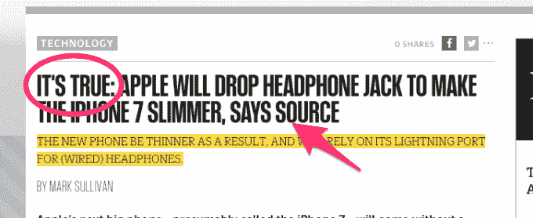

# 超过 200，000 人签署了一份请愿书，以阻止苹果公司杀死 iPhone 的耳机插孔 

> 原文：<https://web.archive.org/web/https://techcrunch.com/2016/01/08/over-200000-people-have-signed-a-petition-to-stop-apple-from-killing-the-iphones-headphone-jack/>

# 超过 20 万人签署了一份请愿书，以阻止苹果公司取消 iPhone 的耳机插孔

你可能听说过传言，苹果可能会取消 iPhone 上的耳机插孔，以推进无线收听的美好世界。太棒了，对吧？

好吧，等一下。

首先，像往常一样，苹果公司没有对此做出任何确认或否认，所以这只是一个谣言。尽管如此，我们还是会遇到这样令人困惑的头条新闻:

这种混乱[引起了一些人的骚动](https://web.archive.org/web/20230101113430/https://www.macstories.net/linked/petition-for-apple-to-keep-headphone-jack-reaches-200000-signatures/),他们不想为下一代苹果手机购买新的耳机和硬件。有一份超过 200，000 个数字签名的请愿书[要求苹果保持插孔不变:](https://web.archive.org/web/20230101113430/https://action.sumofus.org/a/iphone-headphone-jack/)

> 苹果公司将要敲诈它的每一个顾客。又来了。
> 
> 福布斯和 FastCompany 报道称，苹果计划在今年晚些时候发布 iPhone 7 时放弃标准的 3.5 毫米耳机插孔。现在只有大规模的国际运动才能迫使苹果公司改变路线。
> 
> 这不仅会迫使 iPhone 用户支付额外的现金来更换他们的高保真耳机，还会独自产生大量的电子垃圾——这些垃圾可能无法回收。根据联合国的数据，每年全球高达 90%的电子垃圾被非法交易或倾倒。
> 
> 告诉苹果尊重它的顾客和我们的星球。保留标准耳机插孔。
> 
> 这完全出自苹果公司的剧本。几年前，它用新的 iPod-dock 连接器替换了原来的连接器，淘汰了无数的电线、电缆和充电器。
> 
> 苹果公司大肆宣扬其绿色证书，但事实是，苹果公司只投资于可再生能源，并在公众压力变得强大到无法忽视时开始逐步淘汰有毒化学品。人民力量以前做到了，我们可以再次做到。
> 
> 告诉苹果保留标准耳机插孔，放弃计划淘汰！

还是那句话，这些只是谣言。它们甚至可能是正确的，但在苹果采取行动之前，我们什么都不知道。嗯，互联网喜欢戏剧，人们喜欢签署请愿书。我怀疑这是否会引起母舰的回应，但是这些人肯定希望他们的呼喊被听到。

个人？干掉[所有电线](https://web.archive.org/web/20230101113430/https://techcrunch.com/2009/07/08/long-live-35mm-htc-makes-the-switch/)，我受不了了。但是，嘿，如果你喜欢，试着#SaveJack。