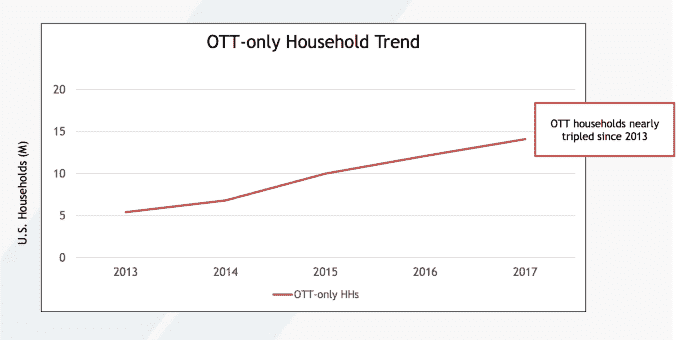
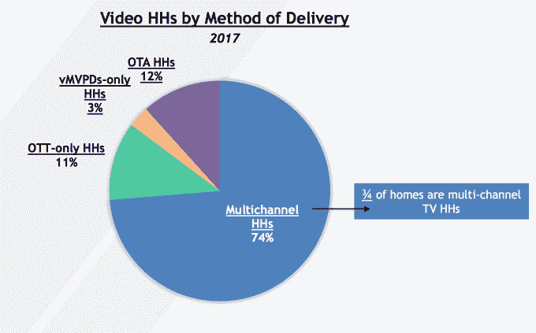
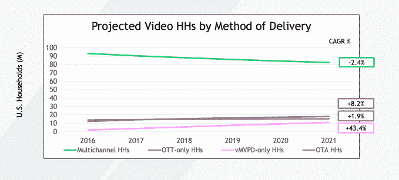
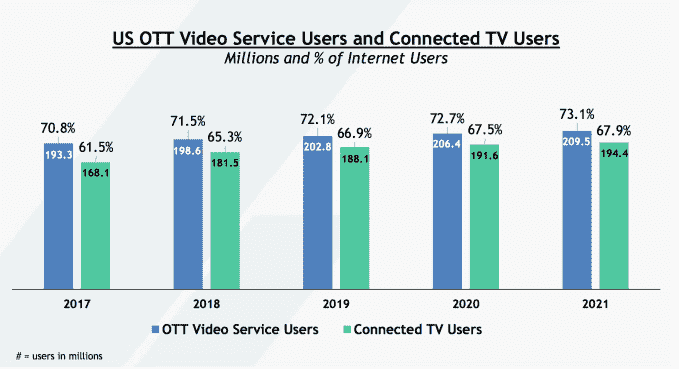
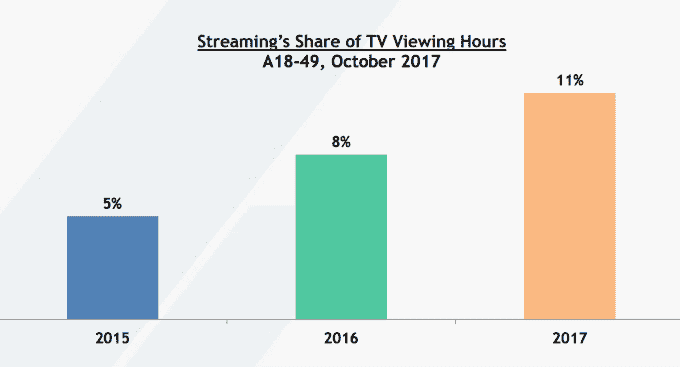
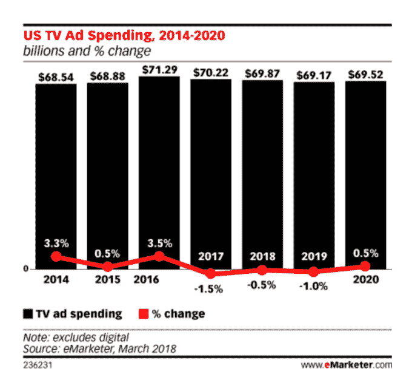
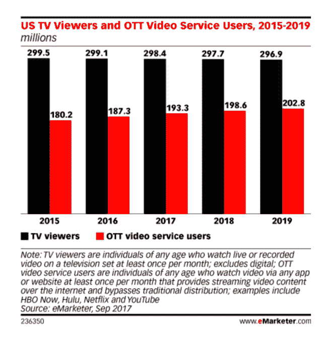

# 自 2013 年以来，美国家庭数量增加了近两倍，影响了电视广告收入 

> 原文：<https://web.archive.org/web/https://techcrunch.com/2018/03/28/over-the-top-only-u-s-households-nearly-tripled-since-2013-impacting-tv-ad-dollars/>

根据视频广告局今天发布的一份新的[报告](https://web.archive.org/web/20221127015001/http://www.thevab.com/wp-content/uploads/2018/03/OTT-Ecosystem-Overview-Final.pdf) (PDF)显示，在过去五年中，仅使用免费流媒体服务来观看电视节目和电影的美国家庭数量增加了近两倍。虽然就其本身而言，这个数字听起来令人印象深刻，但该报告指出，脐带切割者的份额仍然相当小——有 1410 万个超顶家庭，仅占美国所有电视家庭的 11%。

这低于使用电视天线接收空中广播的家庭的 12 %,也远远低于通过有线电视、卫星电视或电信订阅收看电视的多频道家庭的 74 %,即 9030 万。

此外，该报告发现，超额服务通常与传统的付费电视订阅一起使用，而不是取代它们。事实上，70%的顶层家庭还拥有有线、卫星或电信电视订阅。

然而，越来越多的人开始采用这种服务。VAB 报告预测，到 2021 年，仅顶层家庭将增长 8.2%，达到 1790 万个家庭，而多渠道家庭将下降 2.4%。

这种持续的增长意味着这些过度消费的消费者今后看传统电视的时间可能也会减少。

首先，近三分之一的 over-the-top 流媒体服务用户有三种或更多方式来访问 over-top 内容，这意味着仅在过去两年中就增加了八倍。

70.8%，即 1.933 亿美国消费者。如今，美国消费者每月至少访问一次顶级视频服务，到 2021 年，这一数字将增长到 2 亿。

但 VAB 的报告指出，流媒体仍然只是电视观看时间的一小部分，占 2017 年 10 月 18 至 49 岁人群电视观看时间的 11%。这一比例高于 2016 年的 8%和前年的 5%。

尽管如此，向过度流媒体的转变开始对电视广告行业产生影响。

在今天上午发布的 eMarketer 的一份相关报告中，分析师发现，继 2017 年首次下降后，2018 年电视广告支出将继续下降。具体而言，2018 年电视广告支出将下降 0.5%，至 698.7 亿美元，导致电视在美国媒体广告支出总额中的份额从 2017 年的 33.9%降至今年的 31.6%。

随着 2020 年美国总统大选和东京夏季奥运会的举行，广告支出将会回升，但随后将再次下降，到 2022 年仅占广告总支出的四分之一。

eMarketer 高级预测主管莫妮卡·皮尔特在一份声明中说:“观众转向(过度)观看正在改变电视广告市场的氛围。”“随着电视节目收视率的持续下降，广告支出也将继续下降，尤其是在没有总统选举和奥运会等重大事件的年份。”

eMarketer 表示，随着电视广告支出的下降，数字广告将会攀升，而高端平台将在这方面发挥重要作用。

例如，Roku 的广告收入，包括视频和显示广告，将超过 2.93 亿美元，比 2017 年增长 93.0%。Hulu 的广告收入将增长超过 13%，达到 11.2 亿美元。

Emarketer 的超额观众数据与视频广告委员会的数据大致一致。该公司表示，超顶观众的数量今年将增长到 1.986 亿，而 VAB 的计算是，目前有 1.933 亿美国消费者每月至少通过超顶服务观看一次。

eMarketer 首席分析师保罗·武诗源说:“免费平台的数量和规模都在增长，许多平台通过以有吸引力的价格提供大量直播频道来直接与付费电视竞争。”“想要切断或剃掉脐带的消费者现在有了大量的选择，而这在几年前是不存在的。我们预计，随着更多的玩家进入市场，这些产品将变得更加强大。