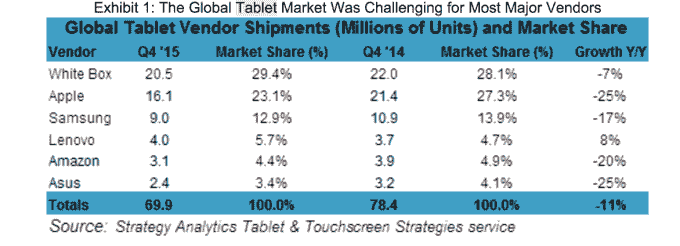
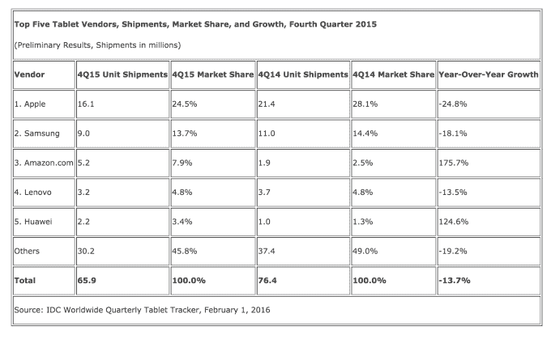
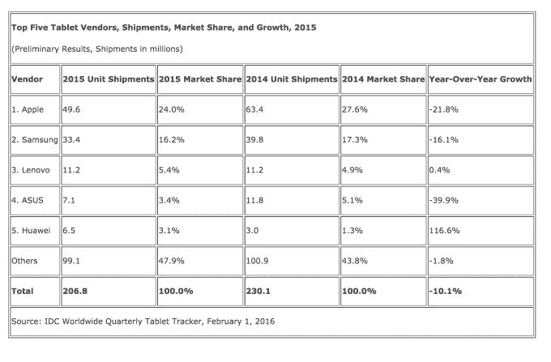

# 2015 年整体平板电脑市场下降了 10% 

> 原文：<https://web.archive.org/web/https://techcrunch.com/2016/02/01/overall-tablet-market-declined-by-as-much-as-10-percent-in-2015/>

数字出来了，这对平板电脑销售来说不是好消息。两份新的市场份额报告显示，2015 年平板电脑出货量下降。根据 Strategy Analytics 的一份报告,去年平板电脑的出货量为 2.243 亿台，比 2014 年下降了 8%。[然而，IDC 的数据](https://web.archive.org/web/20221007233007/http://www.idc.com/getdoc.jsp?containerId=prUS40990116)更加糟糕——据估计，2015 年平板电脑出货量为 2.068 亿台，同比下降 10.1%。

原始发货量的差异可以归因于公司如何估计市场规模和销售趋势。然而，两家公司可能在一些更大的趋势上达成一致:首先，苹果在平板电脑市场份额方面继续领先，尽管这种领先优势正在下滑。

根据 IDC 的数据，苹果的平板电脑出货量同比下降了 24.8%，但它能够通过专注于价格更高的平板电脑，如新推出的 iPad Pro，来遏制收入的下降。与此同时，Strategy Analytics 对 iPad Pro 更加不满，称尽管它在企业和垂直市场具有长期潜力，但在 2015 年第四季度未能达到预期。

两家公司还一致认为，尽管三星也在下滑，但仍被列为第二大平板电脑制造商(IDC 称下降了 18.1%)。然而，IDC 声称亚马逊在 2015 年第四季度进入了第三名，而 Strategy Analytics 将这一位置让给了联想，亚马逊紧随其后。

无论是哪种情况，亚马逊的排名都相当不错，这可以归因于对其[超便宜](https://web.archive.org/web/20221007233007/https://beta.techcrunch.com/2015/09/17/amazon-releases-jolly-candy-kindle-fire-hds-in-tangerine-and-blue-along-with-a-cheaper-fire/?ncid=rss)50 美元平板电脑的需求，这是一个假日季节的惊喜。联想和华为也都将重点放在低端平板电脑上，同时在中国以外进行扩张。

也就是说，IDC 表示，今天的平板电脑消费者不仅考虑价格，他们还对性能感兴趣，并使用平板电脑代替 PC。

IDC 平板电脑研究主管让·菲利普·布沙尔(Jean Philippe Bouchard)表示:“可拆卸设备增长如此迅速的最大原因之一是，终端用户将这些设备视为 PC 的替代品。“我们认为苹果售出了 200 多万台 iPad Pros，而微软售出了约 160 万台 Surface 设备，其中大部分是 Surface Pro，而不是更实惠的 Surface 3。从这些结果来看，很明显，在购买可拆卸设备时，价格不是最重要的考虑因素，性能才是最重要的。”

Strategy Analytics 也同意这个更大的观点，指出 2 合 1 可拆卸平板电脑在 2015 年达到了一个“拐点”。该公司一致认为，微软的 Windows 10 看起来有能力在高端和高端领域与 iOS 竞争，并在中低价位领域与 Android 竞争。

分析师埃里克·史密斯说，不同价位的各种平板电脑将推动 Windows 平板电脑的发展势头。

事实上，可拆卸性是平板电脑整体下滑中为数不多的亮点之一。

IDC 指出，虽然纯石板平板电脑出现了有史以来最大的年度跌幅，下降了 21.1%，但自 2014 年第四季度以来，可拆卸平板电脑的出货量增加了一倍多。

Strategy Analytics 声称，2015 年二合一平板电脑的出货量同比增长了 379%。

IDC 的高级研究分析师 Jitesh Ubrani 补充说:“尽管评论不冷不热，但 iPad Pro 是本季度的明显赢家，因为它是最畅销的可拆卸产品，超过了微软和其他个人电脑供应商的知名产品。”“同样值得注意的是，向可拆卸平板电脑的过渡为苹果和微软都带来了积极的机遇。”

“然而，谷歌最近对这一领域的涉足一直相当平淡，因为 Android 平台需要更多的改进才能取得任何可衡量的成功，”他说。

谷歌的 iPad Pro 竞争对手 Pixel C 当然也是如此，其[半生不熟的软件](https://web.archive.org/web/20221007233007/http://arstechnica.com/gadgets/2015/12/the-pixel-cs-bumpy-road-from-chrome-os-concept-to-android-adoptee/)被几个评论者[称为 ou](https://web.archive.org/web/20221007233007/http://www.extremetech.com/computing/219099-googles-pixel-c-review-round-up-gorgeous-hardware-half-baked-software)t[该设备的主要问题之一](https://web.archive.org/web/20221007233007/http://www.theverge.com/2015/12/8/9869980/google-pixel-c-tablet-review-android)。

两家公司都提到了 2015 年第四季度的糟糕增长。IDC 表示，本季度出货量为 6590 万台，同比下降 13.7%。Strategy Analytics 认为这一数字为 6990 万部，下降了 11%。

报告全文可在网上查阅。( [IDC](https://web.archive.org/web/20221007233007/http://www.idc.com/getdoc.jsp?containerId=prUS40990116) ，[策略分析](https://web.archive.org/web/20221007233007/https://www.strategyanalytics.com/access-services/devices/tablets/tablets/market-data/report-detail/preliminary-global-tablet-shipments-and-market-share-by-operating-system-q4-2015#.Vq-KllMrLUo))。)下表汇总了他们的数据。

