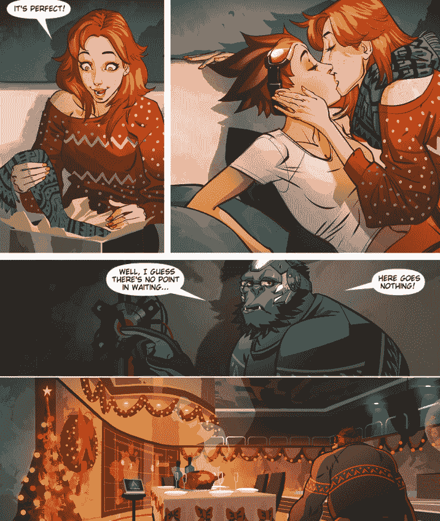
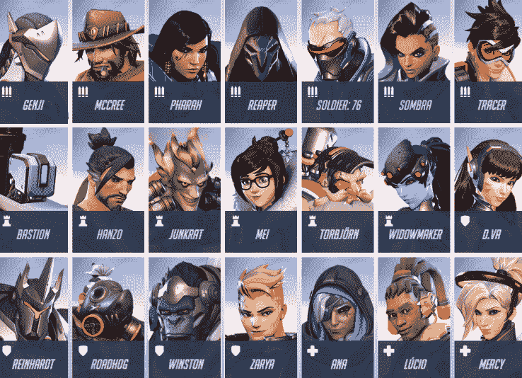
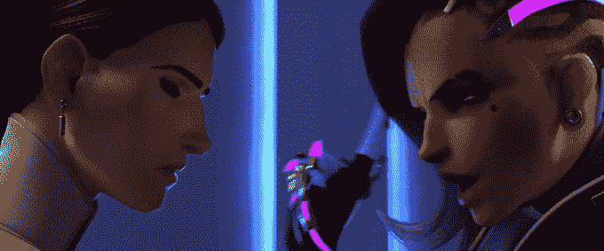

# 凭借对多样性的押注，暴雪揭示了 Overwatch 的古怪性格 

> 原文：<https://web.archive.org/web/https://techcrunch.com/2016/12/20/overwatch-is-tracer-gay-yesss/>

在几个月的暗示之后，暴雪最终公布了《守望先锋》中的哪个角色认为自己是 LGBTQ 社区的一员。备受期待的披露出现在一部以 Tracer 为中心的[季节性数字漫画](https://web.archive.org/web/20230205125018/http://comic.playoverwatch.com/en-us/tracer-reflections)中，Tracer 是一个精神抖擞的伦敦人，有着反重力的头发，是早期粉丝的最爱，也是游戏的真实形象。

该漫画“反思”是正在进行的系列的第 10 期。每一期都揭示了 23 个可玩英雄角色的更多背景故事。暴雪在《倒影》中打出了自己的牌，避免了一个严厉的出柜故事，而是在最后一分钟进行了一场有益健康的假日购物闪电战，最终以一个敏捷的角色和一个穿着不算难看的圣诞毛衣的可爱红发女人之间的奇怪吻结束。

值得称道的是，暴雪甚至在影片中加入了一个家庭时刻，颠覆了以往描述酷儿们独自沉浸在被遗弃的状态中等待假期的尴尬叙事。当然，这种非常有益于健康的说法在俄罗斯已经被禁止了，因为同性恋者是坏人，绝对不应该被描绘成交换经过深思熟虑的圣诞礼物。

watch 的玩家热衷于此，理由很充分:暴雪显然投入了大量资源来开发大量免费的、高质量的伴侣内容，而这最终也只是给忠实粉丝的一项额外津贴。哪怕只是粗略地浏览一下 Tumblr，通常也足以揭示出那几周英雄配对粉丝带来了什么，以及粉丝艺术为这些广受喜爱的角色塑造出另类现实的巨大暗流。对不起，[鳏夫 Tracer 的粉丝们——看起来她上当了。](https://web.archive.org/web/20230205125018/http://fuckyeahwidowtracer.tumblr.com/)

传说和粉丝服务是暴雪做得最好的两件事，如果你想让一个角色驱动的游戏在 T4 存活十多年，这一点非常必要。凭借出色的表现和充满希望的第一年表现，暴雪正在全力打造下一个大型体育电商品牌 Overwatch。不过，这个玩家群体只是整体中的一小部分，尽管利润丰厚。

在《瞭望》(Overwatch)中，暴雪显然比一般的军事射手更看重更大的一块蛋糕。对于一款有意识地包容一切的游戏来说，围绕边缘化身份选择角色有利于提高公关效果。作为一名偶然的同性恋 Overwatch 玩家(既包括偶然玩家，也包括偶然的同性恋)，我认为这出戏几乎避开了所有糟糕的同性恋比喻，而且唱对了调子。虽然它们对更广泛人群的吸引力符合暴雪的要求，但我不得不勉强承认，在我的心脏恢复到固态冰的正常状态之前，它确实短暂地温暖了一下。

为了留住那些不经意的玩家，同时将游戏的吸引力远远扩展到《使命召唤》那种第一人称射击游戏之外，暴雪特意为一众来自各种(有时只有 T8)文化背景的各色各样的玩家建立了一个国际化的平行故事世界。在 23 个字符中，9 个为非白色。

除了《有色英雄》,《守望先锋》还在向另一个经常被忽视的人群进行营销:游戏中有 10 个英雄是女性，只有一个是白人女祭司/天使女士这种老套的游戏角色。向酷儿群体致敬也不会有什么坏处——毕竟，LGBTQ 群体在 2015 年的个人可支配收入达到了 9170 亿美元(T2)。

尽管[的出现引起了](https://web.archive.org/web/20230205125018/https://twitter.com/search?q=tracer%20gay&src=typd)的普遍兴奋，Overwatch 社区的一个直言不讳的横截面——很像(/eyeroll) [任何在线游戏社区](https://web.archive.org/web/20230205125018/https://www.theguardian.com/technology/2015/feb/04/pro-gaming-tournament-attempts-to-limit-gay-and-transgender-players)——仍然不高兴地反对非异性恋白人在他们的游戏中出现。但是，这太蠢了。处理好它。

当然，你可以打比赛，不关注绝杀；毕竟是第一人称射击游戏。无论你是 Tumblr 粉丝艺术大师还是精英电子竞技机械大师，暴雪都很乐意继续打造你一直想要的游戏——只要你继续回来寻求更多。