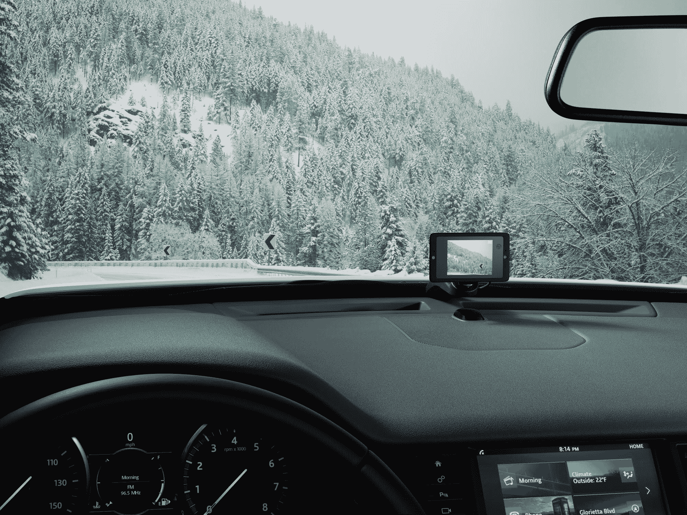

# Owl 为双向汽车仪表盘摄像头筹集了 1000 万美元 

> 原文：<https://web.archive.org/web/https://techcrunch.com/2018/08/14/owl-raises-10-million-for-two-way-car-dashboard-camera/>

由前苹果和 Dropcam 高管团队创建的双向 dash cam 已获得 Canvas Ventures 领投的 1000 万美元 A1 轮融资。这使得 Owl 的资金总额达到 2800 万美元。

Canvas Ventures 普通合伙人丽贝卡·林恩(Rebecca Lynn)在一份声明中表示:“我们已经看到了对汽车安全的大量被压抑的需求，Owl 正在开发一种易于安装和使用的产品来满足这种需求。”“这证明了该团队几十年来打造 iPod、iPhone 和 Dropcam 等热门产品的经验，并让他们在创造人们每天都会兴奋地使用的设备和服务方面获得了巨大的帮助。”

猫头鹰摄像机是设计来监控你的车的闯入，碰撞和警察停止。Owl 还可以用来捕捉路上有趣的瞬间(见上图)或美丽的风景，只需简单地说，“好的，很快。”

[Owl 于二月份推出，为您的汽车提供一个永远在线的](https://web.archive.org/web/20221206081420/https://techcrunch.com/2018/02/01/owl-car-security-camera-launch/)、LTE 安全摄像头。因为 Owl 一直开着，所以它能够捕捉车祸、入室盗窃和人们在停车场砸你的车。如果 Owl 检测到车祸，它会自动将视频保存到你的手机上，包括事故发生前后的 10 秒钟。在推出的时候，它只适用于 iOS，但 Owl 现在正在为拥有 Android 手机的人提供它。

双向摄像头插入汽车的车载诊断端口(1996 年后生产的每辆汽车都有一个)，只需几分钟即可设置完毕。摄像机就藏在仪表板和挡风玻璃之间。一旦它被连接上，你就可以通过 Owl 手机应用程序随时访问你汽车的摄像头。

市场上的另一个竞争对手是 [Raven](https://web.archive.org/web/20221206081420/https://raven.is/) 。虽然它的首要任务是安全，但摄像头也旨在让您与亲人保持联系，并让您安心。Raven 的零售价为 299 美元，包括三个月的连接。Owl 售价 349 美元，包括一年的 LTE 即时视频。

你可以在我下面的评论中了解更多关于 Owl 的内容。