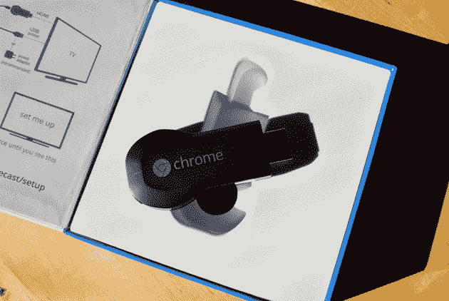

# 拥有 Chromecast？谷歌想给你 60 美元 

> 原文：<https://web.archive.org/web/https://techcrunch.com/2015/02/06/own-a-chromecast-google-wants-to-give-you-6/>

# 拥有 Chromecast？谷歌想给你 6 美元

Chromecast 已经是一款非常棒的小设备了。几乎唯一能让事情变得更好的是，如果谷歌随机给你免费的钱让你拥有一个。

*(*除了 5ghz WiFi 支持，那也不错。)*

你知道什么啊这就是他们今天所做的。

正如 Android 权威人士所指出的，谷歌将向 Chromecast 用户发放 6 美元的 Google Play 积分。有一个问题:据我所知，这似乎是美国。

这个想法是，你会在情人节的周末用这 6 美元租一些伤感的爱情电影…但你也可以自由地用它来增强你的部落冲突村，如果那更适合你的话。

**兑现优惠非常简单:**

*   确保您与 Chromecast 连接到同一个网络。
*   打开 Chromecast iOS/Android 应用程序
*   轻按您的设备，然后找到“查看优惠”按钮(它应该隐藏在右上角的三点按钮后面)
*   向 Google 确认您的 Chromecast 序列号
*   Tada！

你也可以从你的笔记本电脑[点击这里的链接](https://web.archive.org/web/20221209100021/https://cast.google.com/chromecast/offers/)来做这件事。

一些拥有多个 Chromecasts 的人报告说，在使用移动应用程序时，他们可以为每台设备兑换一次优惠。