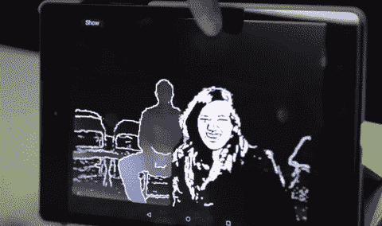
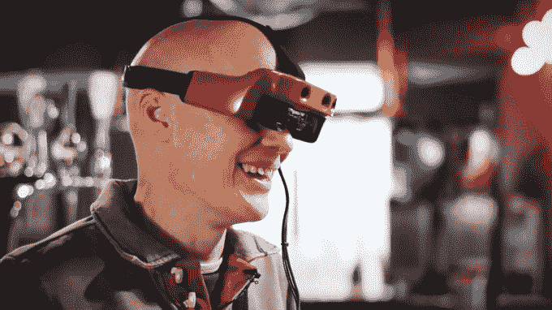
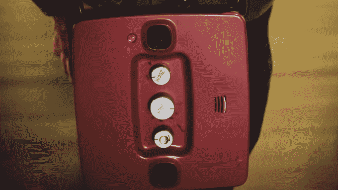

# OxSight 使用增强现实来帮助视障人士 

> 原文：<https://web.archive.org/web/https://techcrunch.com/2017/02/16/oxsight-uses-augmented-reality-to-aide-the-visually-impaired/>

世界人口的百分之一，大约 7000 万人是盲人。

当你考虑消费产品的潜在使用基础时，这并不是一个巨大的数字，但当你考虑到目前几乎没有辅助技术可以帮助视觉障碍者的生活变得更容易时，这就是一个巨大的数字。

去年从牛津大学分离出来的一家新的创业公司，OxSight，正在寻求改变这种状况。该公司制造并测试了增强现实眼镜，以帮助视力障碍者识别和导航他们环境中的物体。把它想象成盲人的助听器。

OxSight 是手杖和导盲犬的潜在替代品。这些能让你立即定位你附近的障碍物，但不能让你意识到你所处的环境。

> OxSight 是手杖和导盲犬的潜在替代品。

大多数测试过 OxSight 的人都有一定程度的视力退化。该产品使用他们仍然拥有的视力，无论是对光线、运动还是少量形状的检测，并在一副增强现实眼镜内放大它。

没有任何东西连接到大脑，硬件也不会与眼球互动。相反，OxSight 智能眼镜依赖于透明显示器、相机系统和计算机视觉技术等技术，这些技术是为增强现实开发的，以了解环境。

OxSight 分层不同的棱镜式模式，可以使用手动控制进行调整。

“一旦你开始失明，就很难区分前景物体和背景物体，”创始人[Stephen Hicks](https://web.archive.org/web/20221008043702/http://www.ox.ac.uk/news-and-events/find-an-expert/dr-stephen-hicks)博士说，他是一位专门研究身体控制的神经科学家。“它们有点模糊不清。但是在我们的项目中，我们能做的是识别某一类物体，并使它们突出。因此，它使他们在处理世界的方式上更直观，更具互动性，并真正利用大多数盲人仍然拥有的少量视力。”

大脑处理三维空间的方式类似于现代游戏相机如何映射和定义地板、沙发和墙壁之间的差异。他们识别较大的物体，并找出它们与用户之间的关系。利用这种映射的概念和大脑已经开始工作的方式，OxSight 为用户的周围环境添加了卡通般的层。

对于视力最低的人来说，该软件可以投影一个人的纸板剪影。失明但视力仍然有限的用户可以通过增强颜色或放大或缩小来自定义他们的体验。由于每个被认为是盲人的人受到的影响不同，OxSight 开发了一种可以调整和定制的产品，让每个独特的用户都可以了解他们在哪里以及他们周围有什么。

一名研究参与者在打保龄球时戴着 OxSight。

希克斯说:“所以这个人可以像平常一样看世界，但在某种意义上，你会在某些类型的物体上获得一种光环，这种光环在黑暗中非常便于识别门口或障碍，或者说出你想避免的事情。”“所以我们可以突出它的边缘，让它们真正突出来，这样你就可以快速直观地找到它。许多帮助盲人的技术需要大量的学习，比如试图通过声音来理解他们周围的世界。那只是一件复杂的事情，真的很难。”

在第一次尝试 OxSight 的眼镜后，大多数人都评论说，它给了他们行动的自由，让他们能够更自信地出门，去黑暗的地方，如酒吧和餐馆，在那里视力会受到限制。对许多人来说，再次看到家人的面孔并与他们互动的能力特别强大，尤其是对那些从未想过自己能够再次拥有这种经历的人来说。

附带的电池组可以挂在肩上，并有手控装置，可根据不同的照明和设置进行调节。

关于如何将产品推向市场或其价格有很多未知因素，因为从来没有人试图销售这样的设备。OxSight 已经获得了私人和公共来源的资助，并找到了愿意承担慈善风险的投资者。“如果我们没有赚到很多钱，这仍然很有趣。希克斯说:“我们还有很多技术需要开发，有很多人可以从中受益。”。

目前，该公司最大的障碍是弄清楚什么是最低可行的产品，并将其推向市场。医疗器械有很多规定。该产品必须解决特定的需求，如物体识别、外形和持久的电池寿命，这些在消费领域都没有提供。OxSight 专注于帮助视障人士，计划建立一个平台来满足这些需求，并随着未来硬件的进步而发展。希克斯相信，最终他们可以使用相同的底层 AR 技术来探索痴呆症、自闭症甚至阅读障碍。